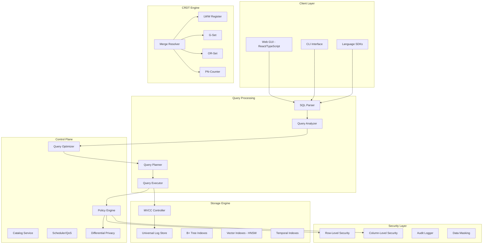
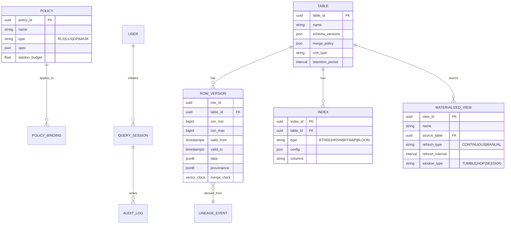
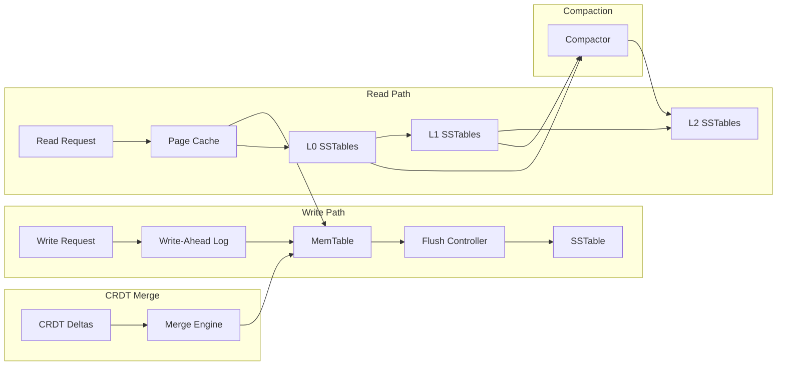
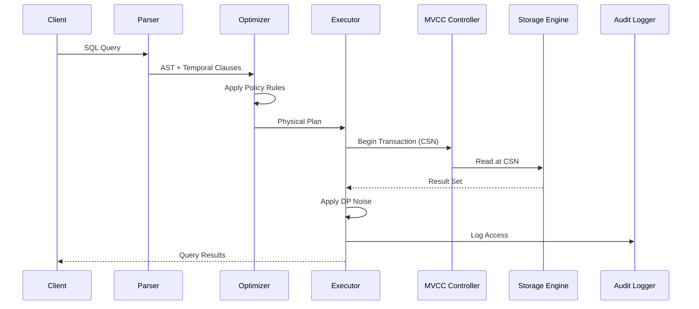
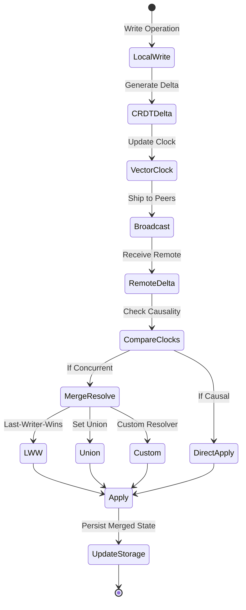
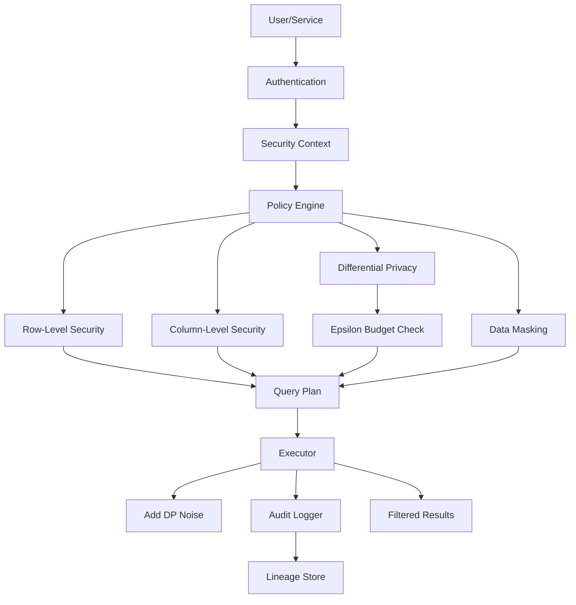
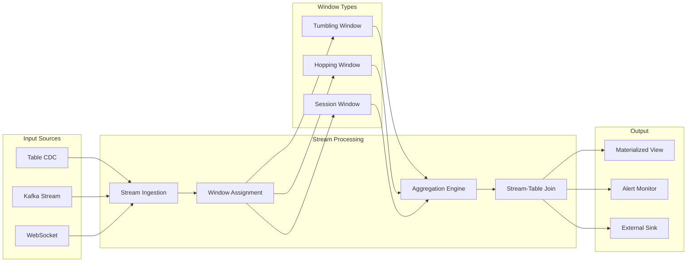

# LatticeDB: A Next-Generation Mergeable Relational DBMS

**Version:** 1.0 Design Document

**Audience:** architects, DB kernel engineers, platform SREs, security & governance teams

**Identity & Mission:** LatticeDB is a **mergeable, temporal, policy-aware relational database** that unifies OLTP, streaming, and vector search—with **first-class provenance, differential privacy, and offline-tolerant active-active replication**. It keeps the rigor of SQL and ACID while adding capabilities the big three (PostgreSQL, MySQL, SQL Server) don’t natively provide.

---

## 1) Why LatticeDB (Key Differentiators)

1. **Mergeable Relational Tables (MRT):** native CRDT-backed row semantics for **conflict-free, active-active** replication and **offline-first** apps. You choose per-table merge policies (e.g., last-writer-wins, add-wins set, bounded counters, per-column merge).
2. **Bitemporal + Lineage by Default:** every row carries **transaction time** and **valid time** plus **provenance** (source, transform, policy), enabling time travel, “as-of” analytics, audit, and explainability without retrofitting.
3. **Policy-as-Data with Budgeted Privacy:** declarative **row/column-level privacy** + **query-level differential privacy** (ε-budgets, per subject/domain) enforced by the engine, not middleware.
4. **Unified Polyform Storage:** one table can expose **row-store** (OLTP), **columnar projections** (OLAP), **stream tails** (CDC/streaming SQL), and **vector indexes** for ANN—managed by the optimizer.
5. **WASM Sandbox for Extensibility:** UDF/UDTF/UDA and custom codecs/indexes run in a **capability-scoped WebAssembly sandbox** with deterministic resource limits.
6. **Hybrid Concurrency:** **MVCC** for classic OLTP + an optional **deterministic lane** (batch ordering for high-conflict workloads) with **causal+ snapshots** and bounded staleness hints per query.
7. **Zero-Downtime Schema Evolution:** versioned schemas, online backfills as **declarative migrations**, query rewrite across versions, and data contracts that fail fast on incompatible changes.
8. **Streaming Materialized Views (MVs):** exactly-once incremental MVs with **retention windows**, backfill, and recovery; views can consume **external logs** (Kafka/Pulsar) or table CDC.
9. **QoS Scheduling & Multi-Tenant SLAs:** resource groups with **workload classes** (latency vs. throughput), query admission control, and plan shaping under pressure.
10. **Confidential Compute Option:** sensitive policy evaluators and UDFs can run inside **TEE enclaves** (SGX/SEV-SNP) with remote attestation.

---

## 2) Architecture Overview



---

## 3) Logical Data Model

* **Relational core** with ANSI SQL compatibility.
* **Bitemporal rows:** columns `_tx_from`, `_tx_to`, `_valid_from`, `_valid_to`.
* **Provenance:** `_src`, `_op`, `_pipeline_id`, `_policy_refs[]`, `_merge_policy`.
* **MRT (Mergeable Relational Table):** per-table and per-column merge specs.
* **Vector columns:** `VECTOR<float, D>` with ANN index options (HNSW/IVF/ScaNN plugin).
* **Stream tails:** every table exposes an ordered change stream (typed).

**ER: governance & provenance**



---

## 4) Storage Layer

### 4.1 Layout

* **Unified Log-Structured Storage (ULS):** append-friendly segments with **columnar projections** generated asynchronously; **row pages** for OLTP.
* **Indexing:** B+Tree & ART for point/range; **learned index plugin** optional; **inverted index** for JSON; **ANN** for vectors.
* **Compression:** block-level (ZSTD/LZ4) + dictionary; page checksum; **transparent encryption at rest**.
* **Temporal pruning:** segment min/max + validity intervals for fast **AS OF** queries.
* **CRDT registers/sets/counters** embedded per column when MRT enabled.



### 4.2 Mergeable Relational Tables (MRT)

* **Per-column merge types:** `lww`, `max|min`, `sum_bounded`, `gset`/`2p-set`, `mvreg` (multi-value register with resolver), `custom_wasm`.
* **Causal context** stored to guarantee **convergence** across geo sites.

---

## 5) Transactions & Consistency

* **Default:** **Snapshot-isolated MVCC** with **read-committed** and **serializable** modes.
* **Deterministic lane:** coordinator batches high-conflict txns into ordered slots (Calvin-style), removing deadlocks; read/write sets captured by planning.
* **Causal+ snapshots:** per query, request **bounded staleness** (e.g., “≤ 200ms behind global stable time”).
* **Active-active replication:** MRT applies CRDT merges; non-MRT tables use Paxos/Raft per shard.
* **Temporal correctness:** time-travel reads (`AS OF TX/VALID TIME`) with **index support**.

**Write path sequence**



**CRDT merge state**



---

## 6) Query Processing & Optimizer

* **Vectorized, pipelined execution** with late materialization.
* **Adaptive optimizer** blends static costing + **runtime feedback** and **small learned components** (cardinality estimation, layout choice).
* **Compilation:** LLVM or WASM JIT for tight loops; interpretable fallback.
* **Cross-form rewrites:** pushdowns to columnar/ANN/stream operators; **temporal/lineage predicates** normalized early; **privacy policy** folded into plans.

---

## 7) LatticeSQL (SQL Extensions)

### 7.1 MRT & Temporal Syntax

```sql
-- Create a mergeable table with per-column policies
CREATE TABLE ledger (
  acct_id     UUID PRIMARY KEY,
  balance     DECIMAL(18,2) MERGE sum_bounded(0, 1e12),
  tags        SET<TEXT>      MERGE gset,
  note        TEXT           MERGE lww,
  _valid_from TIMESTAMPTZ,
  _valid_to   TIMESTAMPTZ
) WITH (merge = 'mrt', retention = INTERVAL '365 days');

-- Time-travel query by transaction time
SELECT * FROM ledger FOR SYSTEM_TIME AS OF '2025-08-01T12:00:00Z';

-- Valid-time correction
UPDATE ledger VALID PERIOD ['2025-07-01','2025-07-31') 
SET balance = balance + 100 WHERE acct_id = '...';
```

### 7.2 Lineage & Policy

```sql
-- Attach a policy that masks SSN unless role 'auditor'
CREATE POLICY ssn_mask
ON people
AS COLUMN (ssn)
USING MASK WITH (expr => 'CASE WHEN has_role(''auditor'') THEN ssn ELSE sha2(ssn) END');

-- Differential privacy (Laplace, epsilon budget)
CREATE POLICY dp_count_sales
ON sales
AS DP USING (epsilon => 0.5, sensitivity => 1);

-- Query with explicit lineage
SELECT p.*, lineage(p) FROM people p WHERE p.country = 'US';
```

### 7.3 Vectors & ANN Joins

```sql
CREATE TABLE items(
  id UUID PRIMARY KEY,
  title TEXT,
  embedding VECTOR<FLOAT,768> INDEX HNSW (M=32, ef_search=64)
);

-- Semantic join: limit via ANN then relational filter
SELECT o.id, i.title
FROM orders o
JOIN ANN items ON distance(o.query_vec, items.embedding) < 0.25
WHERE o.status = 'open';
```

### 7.4 Streaming SQL

```sql
-- Continuous view with exactly-once semantics
CREATE MATERIALIZED VIEW top_skus_5m
WITH (refresh = 'continuous', window = INTERVAL '5 minutes')
AS SELECT sku, count(*) AS c
   FROM STREAM OF sales
   GROUP BY TUMBLE(ts, INTERVAL '5 minutes'), sku
   ORDER BY c DESC LIMIT 100;
```

---

## 8) Security, Privacy, Governance

* **Authentication:** OIDC/OAuth2, service principals, mTLS.
* **Authorization:** RBAC + attribute-based conditions; **policy DSL** is stored & versioned.
* **Differential Privacy:** per-policy ε-budget tracked; composition rules; noisy result provenance recorded.
* **Row/Column Level Security:** compiled into plans; **explain** shows policy pushdowns.
* **Audit & Lineage:** immutable store; **who-did-what-when-to-which-row** queries are first-class.

**Policy evaluation flow**



---

## 9) Streaming & MVs

* **Exactly-once** via idempotent sinks + **log sequence fences**.
* **Backfill & catch-up** integrated with temporal indexes.
* **Windowing**: Tumble/Hop/Session; outputs feed tables or external buses.

**Pipeline**



---

## 10) Extensibility via WASM

* **UDF/UDA/UDTF** compiled to WASM, capability-scoped (no filesystem/net unless granted).
* **Custom merge resolvers** and **codecs** as WASM modules.
* Deterministic fuel limits + memory quotas; sandboxed perf counters exported to observability.

---

## 11) Deployment & Scale

* **Compute/Storage separation** with **locality-aware caches**.
* **Sharding:** automatic, with **co-location hints**; **online rebalancing** guided by workload heat.
* **HA:** quorum logs per shard; fast follower reads; **geo multi-master** for MRT tables.
* **Disaster Recovery:** async remote logs; point-in-time restore using bitemporal indexes.

---

## 12) Concurrency Control Details

* **MVCC:** append-only versions with index-visible commit timestamps.
* **Serializable:** SSI or ordered lane; **deterministic batches** eliminate deadlocks.
* **Locking:** predicate locks for range anomalies when needed; **hot-key parking**.
* **Bounded staleness:** per query SLA (`READ AT MOST 150ms STALE`) honored via stable time.

---

## 13) Optimizer & Runtime Smarts

* **Plan space:** bushy joins, ANN prefilters, pushdown of **temporal & policy predicates**.
* **Adaptive re-optimization:** mid-query stats triggers re-plan for long runners.
* **Cost model:** includes **privacy noise**, **policy evaluation**, **vector distance ops**.

---

## 14) Observability

* **End-to-end tracing** (spans for parse → plan → exec → IO).
* **Workload dashboards:** tail latency per group, plan regressions, ε-budget burn-down.
* **Data lineage explorer** with row-level drill-down across time.

---

## 15) Schema Evolution & Data Contracts

* **Versioned DDL:** `CREATE TYPE v2 OF customer ...` with compatibility checks.
* **Online backfill engine** with throttling; **dual-write bridges** for rolling cutovers.
* **Contract enforcement:** producers must satisfy declared schema; violations are rejected with actionable errors.

---

## 16) Multi-Tenant & QoS

* **Resource groups:** CPU/mem/IO quotas; queueing with **SLO aware** admission.
* **Workload classes:** OLTP (low latency), Analytics (throughput), Vector (cache-heavy), Streaming (deadline).
* **Plan shaping:** join reordering or spill strategies change under pressure; “**graceful degradation**” mode.

**Scheduler overview**


---

## 17) Security Hardening

* **Keys in HSM/Cloud KMS**, per-tenant key hierarchy; envelope encryption.
* **Optional TEEs** for policy/DP; remote attestation recorded in audit.
* **Row-level MACs** (optional) for tamper-evident archival segments.

---

## 18) Administration & Operations

* **Declarative cluster config** (YAML) with compatibility checks.
* **Online upgrades** via rolling restarts; binary & catalog version gates.
* **Backup/restore:** incremental, log-aware, **time-travel restore** by tx time.
* **Chaos hooks** (fault injection) to validate merge & recovery semantics.

---

## 19) Compatibility & Ecosystem

* **Wire protocols:** PostgreSQL v3 protocol compatibility for simple clients + native Lattice protocol for advanced features.
* **Connectors:** Kafka/Pulsar, S3/GCS/Azure Blob, Spark, Arrow Flight, dbt adapter.
* **Drivers:** Java, Go, Rust, Python; ORM shims.

---

## 20) Reference Workflows

### 20.1 Offline-First Merge

```sql
-- Edge site writes while disconnected
INSERT INTO inv_mrt(acct_id, balance, tags) VALUES ($1, +50, {'promo'});

-- Later, sites replicate; conflicts auto-resolve via merge policies
CALL lattice.sync('region-eu','region-us');
```

### 20.2 Differentially Private Analytics

```sql
APPLY POLICY dp_count_sales ON (SELECT COUNT(*) FROM sales WHERE region='NA');
-- Engine injects calibrated noise; deducts epsilon from caller budget
```

### 20.3 Temporal Debugging

```sql
-- What did the row look like when a bug occurred on Aug 10?
SELECT * FROM orders FOR SYSTEM_TIME AS OF '2025-08-10T13:37:00Z' WHERE id=42;

-- Why? Show lineage
SELECT lineage_explain(orders, 42, '2025-08-10T13:37:00Z');
```

### 20.4 Streaming MV with Backfill

```sql
CREATE MATERIALIZED VIEW revenue_daily
WITH (refresh='continuous', watermark = INTERVAL '1 minute')
AS SELECT DATE_TRUNC('day', ts) d, SUM(amount) amt
   FROM STREAM OF payments
   GROUP BY d;

-- Backfill from historical table
CALL mv.backfill('revenue_daily', source => 'payments_archive', from => '2025-01-01');
```

---

## 21) Failure & Recovery Scenarios

* **Crash during commit:** WAL guarantees atomicity; MVCC readers unaffected.
* **Network partitions across regions:** MRT tables continue; non-MRT read-only in minority.
* **Compactor crash:** idempotent; segment manifests are transactional.

---

## 22) Performance Envelope (Targets)

* OLTP p95 **< 5 ms** for key-lookups at moderate concurrency.
* Deterministic lane: throughput **2–4×** higher on hot-key workloads vs. pure MVCC.
* ANN top-k at **< 20 ms** for 768-D over 50M vectors (HNSW nodes cached).
* Streaming MV end-to-end latency **< 1s** with exactly-once.

*(Targets are design goals; actual results depend on hardware & data.)*

---

## 23) Current Implementation Status

### Completed Components (Header-Only C++17)

#### Storage Layer (`src/storage/`)
- **`disk_manager.h`**: Page-based disk I/O with 4KB pages, allocation tracking
- **`page.h`**: Page abstraction with guards for safe access
- **`table_page.h`**: Slotted page layout for table data

#### Buffer Management (`src/buffer/`)
- **`buffer_pool_manager.h`**: LRU eviction policy, page pinning/unpinning
- **`replacer.h`**: Clock replacement algorithm implementation

#### Index Structures (`src/index/`)
- **`b_plus_tree.h`**: Template-based B+ tree with configurable fanout
- **`b_plus_tree_page.h`**: Internal and leaf page layouts
- **`index_iterator.h`**: Range scan support

#### Query Processing (`src/query/`)
- **`sql_parser.h`**: Recursive descent parser for LatticeSQL
  - Supports CRDT merge syntax (`MERGE lww`, `MERGE sum_bounded`)
  - Temporal queries (`FOR SYSTEM_TIME AS OF`)
  - Vector operations (`DISTANCE`, `VECTOR<D>`)
  - Differential privacy (`DP_COUNT`, `SET DP_EPSILON`)
- **`query_planner.h`**: Cost-based optimizer with rule transformations
- **`query_executor.h`**: Volcano-style iterator model

#### Type System (`src/types/`)
- **`value.h`**: Universal value container supporting:
  - Basic types (INT, TEXT, DECIMAL, TIMESTAMP)
  - Collections (SET<T>, MAP<K,V>)
  - Vectors (VECTOR<D>)
- **`tuple.h`**: Row representation with schema
- **`schema.h`**: Table metadata and column definitions

#### Transaction Management (`src/transaction/`)
- **`transaction.h`**: MVCC with isolation levels
- **`lock_manager.h`**: 2PL with deadlock detection

#### Advanced Features
- **`src/ml/vector_search.h`**: HNSW and IVF implementations
- **`src/stream/stream_processor.h`**: Windowing functions
- **`src/security/security_manager.h`**: RLS/CLS policies

### Executable Components

#### REPL (`main.cpp`)
- 288 lines of functional CLI interface
- Supports all LatticeSQL extensions
- In-memory storage with persistence (`SAVE DATABASE`)

#### HTTP Server (`server_main.cpp`)
- 118 lines REST API bridge
- JSON request/response format
- Connects GUI to database engine

### Web GUI (`gui/`)

#### Technology Stack
- **React 18** with TypeScript
- **Vite** for fast HMR development
- **TailwindCSS** for responsive design
- **Zustand** for state management with localStorage persistence
- **Monaco Editor** for SQL editing

#### Features
- Dark/light mode with system preference detection
- SQL syntax highlighting and auto-completion
- Query history with success/failure tracking
- Favorites management
- Schema browser with table exploration
- Mock mode with comprehensive sample data
- Results export (CSV/TSV)
- Differential privacy controls
- Temporal query support

### Test Suite (`tests/cases/`)

#### Core Feature Tests
- `temporal.sql`: Time-travel queries
- `merge.sql`: CRDT conflict resolution
- `vector.sql`: Similarity search
- `dp.sql`: Differential privacy
- `agg.sql`: Aggregate functions

#### Advanced Tests (New)
- `transactions.sql`: ACID properties, isolation levels
- `joins.sql`: All join types, lateral joins
- `indexes.sql`: B+ tree, vector indexes
- `schema_evolution.sql`: Online DDL
- `advanced_merge.sql`: Complex CRDT scenarios
- `streaming.sql`: Materialized views, windowing
- `security.sql`: RLS, audit logging

## 24) Roadmap Highlights

* **Phase 1** ✅: Core MVCC, ULS storage, temporal/lineage, RLS/CLS policies, streaming MVs.
* **Phase 2** 🚧: MRT CRDT layer + geo multi-master; DP framework; vector indexes.
* **Phase 3** 📋: TEE policy execution; learned index plugin GA; advanced workload QoS.

---

## 25) Risks & Mitigations

* **Complexity of merge semantics:** ship safe defaults; formal specs; verifier tests.
* **DP usability:** budget tooling + guardrails; templates for common stats.
* **Optimizer cost for new operators:** staged rollout + telemetry-driven tuning.

---

## 26) Glossary

* **MRT:** Mergeable Relational Table (CRDT-backed).
* **Bitemporal:** transaction & valid time tracked.
* **Causal+:** causal consistency with convergence guarantees.
* **TEE:** Trusted Execution Environment.

---

## 28) Appendix: Mini Spec Snippets

### A) Table DDL with Policies & Vector

```sql
CREATE TABLE people (
  id UUID PRIMARY KEY,
  name TEXT,
  ssn TEXT,
  profile_vec VECTOR<FLOAT,768> INDEX HNSW
);

CREATE POLICY rls_us_only ON people AS ROW
USING (country = 'US');

CREATE POLICY dp_people_count ON people AS DP USING (epsilon => 1.0);
```

### B) Custom Merge Resolver (WASM)

```sql
CREATE MERGE RESOLVER rev_note
LANGUAGE wasm
AS 'wasm://org.example.merges/resolve_rev_note@1.0';
ALTER TABLE tickets ALTER COLUMN note SET MERGE USING rev_note;
```

### C) Deterministic Transaction Group

```sql
BEGIN DETERMINISTIC GROUP 'hot-accounts';
  UPDATE ledger SET balance = balance - 10 WHERE acct_id='A';
  UPDATE ledger SET balance = balance + 10 WHERE acct_id='B';
COMMIT;
```

---

## 29) Additional Diagrams

**Bitemporal query planning**


**Geo topology for MRT**


---

### Final Notes

LatticeDB’s core bet is that **mergeability, temporality, and policy** must be *native* to a modern relational system—not bolted on. This design makes conflict resolution, time travel, privacy, streaming, and vectors first-class citizens while preserving the discipline and portability of SQL.
