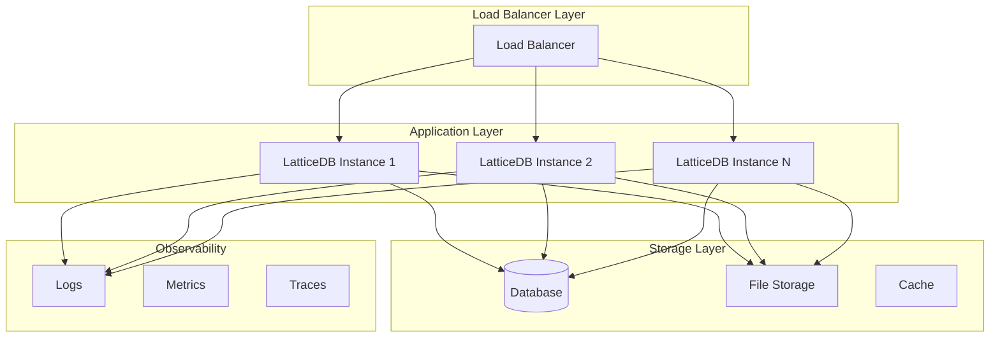
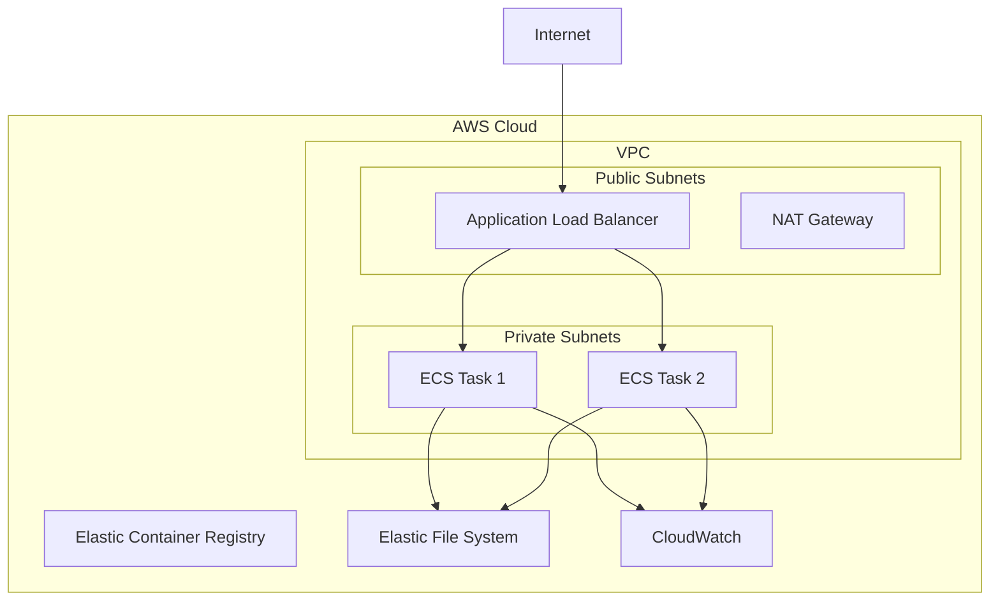
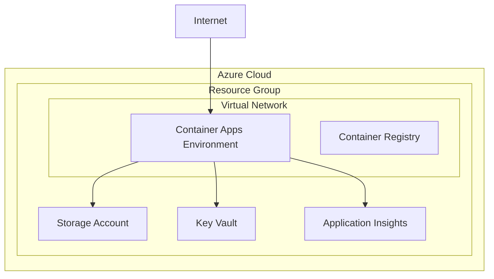
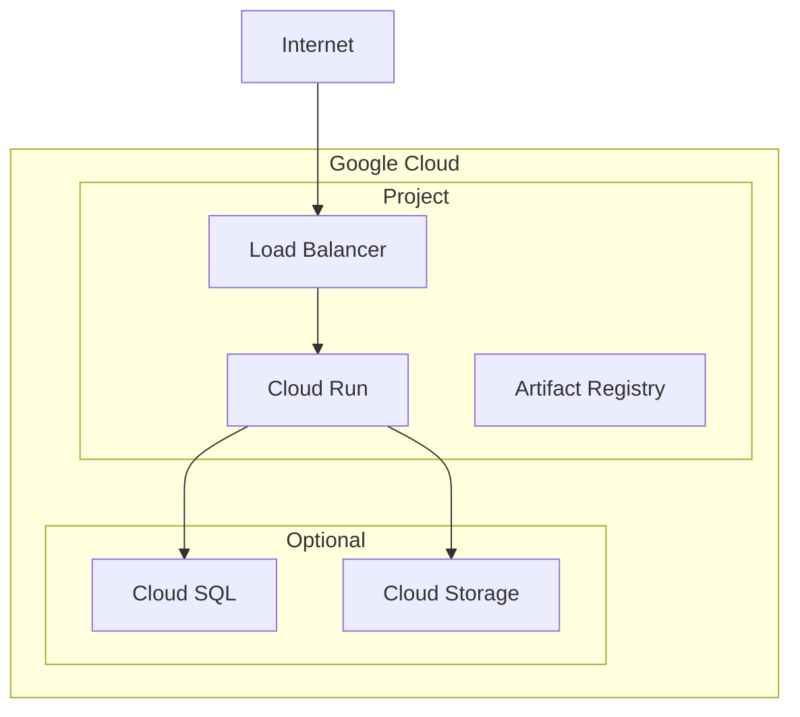
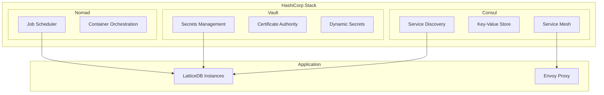
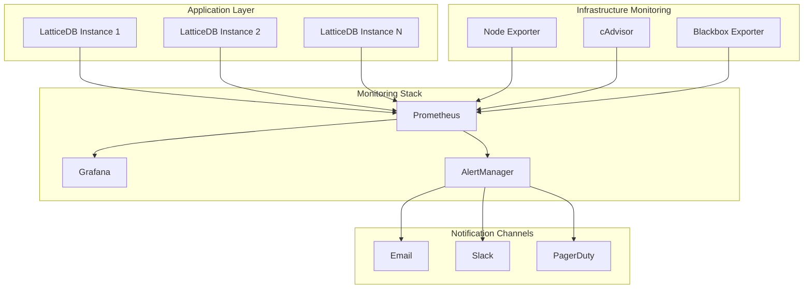

# LatticeDB Deployment Guide

*Complete guide for deploying LatticeDB to AWS, Azure, GCP, and HashiCorp stack environments*

## Table of Contents

- [Overview](#overview)
- [Prerequisites](#prerequisites)
- [Quick Start](#quick-start)
- [AWS Deployment](#aws-deployment)
- [Azure Deployment](#azure-deployment)
- [GCP Deployment](#gcp-deployment)
- [HashiCorp Stack Deployment](#hashicorp-stack-deployment)
- [CI/CD Integration](#cicd-integration)
- [Monitoring and Troubleshooting](#monitoring-and-troubleshooting)
- [Security Considerations](#security-considerations)
- [Cost Optimization](#cost-optimization)
- [FAQ](#faq)

## Overview

LatticeDB provides production-ready deployment configurations for major cloud providers and HashiCorp stack. Each deployment option is designed for high availability, security, and scalability.

### Supported Platforms

| Platform      | Service                | Features                              | Best For                 |
|---------------|------------------------|---------------------------------------|--------------------------|
| **AWS**       | ECS Fargate + ALB      | Auto-scaling, EFS storage, CloudWatch | Enterprise workloads     |
| **Azure**     | Container Apps         | Serverless, Auto-scaling, Azure Files | Modern cloud-native apps |
| **GCP**       | Cloud Run + Cloud SQL  | Serverless, Global load balancer      | Global applications      |
| **HashiCorp** | Nomad + Consul + Vault | Service mesh, Secret management       | On-premises/hybrid       |

### Architecture Overview



## Prerequisites

### Common Requirements

- **Docker**: Latest version for building container images
- **Terraform**: v1.6+ for infrastructure provisioning
- **Git**: For version control and deployment tracking
- **jq**: For JSON processing in scripts

### Cloud-Specific Requirements

#### AWS
- AWS CLI configured with appropriate permissions
- IAM user/role with deployment permissions
- S3 bucket for Terraform state (optional but recommended)

#### Azure
- Azure CLI installed and authenticated
- Service Principal with Contributor role
- Storage account for Terraform state (optional)

#### GCP
- Google Cloud SDK installed
- Service account with required permissions
- Cloud Storage bucket for Terraform state (optional)

#### HashiCorp Stack
- Consul cluster running and accessible
- Vault cluster initialized and unsealed
- Nomad cluster running
- Docker registry for images

## Quick Start

### 1. Clone and Prepare

```bash
git clone https://github.com/your-org/LatticeDB-DBMS.git
cd LatticeDB-DBMS

# Build the application first
mkdir build && cd build
cmake .. -DCMAKE_BUILD_TYPE=Release
make -j$(nproc)
cd ..
```

### 2. Choose Your Platform

```bash
# AWS
cd aws && ./deploy.sh

# Azure
cd azure && ./deploy.sh

# GCP
export GCP_PROJECT=your-project-id
cd gcp && ./deploy.sh

# HashiCorp Stack
cd hashicorp && ./deploy.sh
```

### 3. Verify Deployment

Each deployment script will output connection information and management commands.

## AWS Deployment

### Architecture



### Quick Deployment

```bash
cd aws

# Copy and customize configuration
cp terraform.tfvars.example terraform.tfvars
# Edit terraform.tfvars with your settings

# Deploy
./deploy.sh
```

### Configuration Options

#### Basic Configuration (`terraform.tfvars`)

```hcl
# AWS Configuration
aws_region = "us-west-2"
project_name = "latticedb"
environment = "production"

# Container Configuration
container_cpu    = 1024  # 1 vCPU
container_memory = 2048  # 2GB
desired_count    = 2
min_capacity     = 1
max_capacity     = 10

# Storage
enable_efs = true

# Domain (optional)
domain_name     = "latticedb.example.com"
certificate_arn = "arn:aws:acm:us-west-2:123456789012:certificate/..."
```

#### Advanced Configuration

```hcl
# Network Security
allowed_cidr_blocks = ["10.0.0.0/8", "172.16.0.0/12"]

# Monitoring
enable_monitoring   = true
notification_email  = "admin@example.com"

# Backup
enable_backup           = true
backup_retention_days   = 30
```

### Deployment Process

1. **Infrastructure Setup**: Creates VPC, subnets, security groups
2. **Container Registry**: Sets up ECR repository with lifecycle policies
3. **Application Deployment**: Deploys ECS service with auto-scaling
4. **Load Balancer**: Configures ALB with health checks
5. **Storage**: Sets up EFS for persistent data
6. **Monitoring**: Configures CloudWatch logs and metrics

### Management Commands

```bash
# View service status
aws ecs describe-services --cluster latticedb-production --services latticedb-production

# Scale service
aws ecs update-service --cluster latticedb-production --service latticedb-production --desired-count 5

# View logs
aws logs tail /ecs/latticedb-production --follow

# Update deployment
./deploy.sh update
```

## Azure Deployment

### Architecture



### Quick Deployment

```bash
cd azure

# Authenticate with Azure
az login

# Copy and customize configuration
cp terraform.tfvars.example terraform.tfvars
# Edit terraform.tfvars with your settings

# Deploy
./deploy.sh
```

### Configuration Options

#### Basic Configuration (`terraform.tfvars`)

```hcl
# Azure Configuration
azure_location = "East US"
project_name   = "latticedb"
environment    = "production"

# Container Configuration
container_cpu    = 1.0
container_memory = "2Gi"
min_replicas     = 1
max_replicas     = 10

# Storage
enable_persistent_storage = true
storage_replication_type  = "LRS"

# Monitoring
enable_monitoring   = true
notification_email  = "admin@example.com"
```

### Deployment Process

1. **Resource Group**: Creates resource group for all resources
2. **Networking**: Sets up VNet with private subnets
3. **Container Registry**: Creates Azure Container Registry
4. **Storage**: Sets up Azure Files for persistence
5. **Container Apps**: Deploys to Container Apps with auto-scaling
6. **Monitoring**: Configures Application Insights and Log Analytics

### Management Commands

```bash
# View app status
az containerapp show --name latticedb-production --resource-group latticedb-production-rg

# Scale app
az containerapp update --name latticedb-production --resource-group latticedb-production-rg --min-replicas 2 --max-replicas 15

# View logs
az containerapp logs show --name latticedb-production --resource-group latticedb-production-rg --follow

# Update deployment
./deploy.sh update
```

## GCP Deployment

### Architecture



### Quick Deployment

```bash
cd gcp

# Set up GCP authentication
gcloud auth login
gcloud config set project YOUR_PROJECT_ID

# Copy and customize configuration
cp terraform.tfvars.example terraform.tfvars
# Edit terraform.tfvars with your settings

# Deploy
export GCP_PROJECT=your-project-id
./deploy.sh
```

### Configuration Options

#### Basic Configuration (`terraform.tfvars`)

```hcl
# GCP Configuration
project_id = "your-gcp-project-id"
gcp_region = "us-central1"
project_name = "latticedb"
environment = "production"

# Container Configuration
cpu_limit    = "2000m"
memory_limit = "2Gi"
min_instances = 0
max_instances = 10

# Database (optional)
enable_cloud_sql = false

# Domain (optional)
custom_domain = "latticedb.example.com"
enable_cdn = true
```

### Deployment Process

1. **API Enablement**: Enables required Google Cloud APIs
2. **Networking**: Creates VPC and subnets
3. **Container Registry**: Sets up Artifact Registry
4. **Cloud Run**: Deploys serverless container service
5. **Load Balancer**: Sets up Global Load Balancer (if custom domain)
6. **Monitoring**: Configures Cloud Monitoring and Logging

### Management Commands

```bash
# View service status
gcloud run services describe latticedb-production --region=us-central1

# Update service
gcloud run services update latticedb-production --image=gcr.io/project/latticedb:v2.0.0 --region=us-central1

# View logs
gcloud logging read 'resource.type=cloud_run_revision resource.labels.service_name=latticedb-production' --limit=50

# Scale service
gcloud run services update latticedb-production --region=us-central1 --min-instances=2 --max-instances=20
```

## HashiCorp Stack Deployment

### Architecture



### Quick Deployment

```bash
cd hashicorp

# Ensure HashiCorp stack is running
export CONSUL_HTTP_ADDR=http://127.0.0.1:8500
export VAULT_ADDR=http://127.0.0.1:8200
export NOMAD_ADDR=http://127.0.0.1:4646

# Authenticate with Vault
vault auth

# Copy and customize configuration
cp terraform.tfvars.example terraform.tfvars
# Edit terraform.tfvars with your settings

# Deploy
./deploy.sh
```

### Configuration Options

#### Basic Configuration (`terraform.tfvars`)

```hcl
# HashiCorp Stack
consul_address    = "http://127.0.0.1:8500"
vault_address     = "http://127.0.0.1:8200"
nomad_address     = "http://127.0.0.1:4646"
consul_datacenter = "dc1"

# Service Mesh
enable_consul_connect = true
enable_consul_acl     = true

# Vault Features
enable_vault_database_secrets = true
enable_vault_pki             = true

# Application
instance_count = 2
cpu_limit      = 1000  # MHz
memory_limit   = 2048  # MB
```

### Deployment Process

1. **Vault Setup**: Creates secret mounts and policies
2. **Consul Registration**: Registers service with health checks
3. **Nomad Job**: Deploys containerized application
4. **Service Mesh**: Configures Consul Connect (if enabled)
5. **Secrets Integration**: Sets up Vault secrets integration

### Management Commands

```bash
# View service status
consul catalog service latticedb-production

# View job status
nomad job status latticedb-production

# Scale job
nomad job scale latticedb-production 5

# View logs
nomad logs -f latticedb-production

# Vault operations
vault kv get latticedb/production/config
```

## CI/CD Integration

### Travis CI

The `.travis.yml` file provides multi-stage pipeline with:

- Build and test stages
- Docker image building
- Multi-cloud deployment
- Security scanning

#### Key Features

- **Parallel Deployments**: Deploys to multiple clouds simultaneously
- **Environment-based Deployment**: Different configurations for staging/production
- **Security Scanning**: Integrated vulnerability scanning
- **Notifications**: Slack and email notifications

### Jenkins

The `Jenkinsfile` provides comprehensive pipeline with:

- Parallel build stages
- Comprehensive testing
- Security analysis
- Multi-cloud deployment options

#### Key Features

- **Parameterized Builds**: Choose deployment targets and environments
- **Parallel Execution**: Faster build and test cycles
- **Comprehensive Testing**: Unit, integration, and security tests
- **Rich Notifications**: Detailed Slack notifications with status

### GitHub Actions (Optional)

Create `.github/workflows/deploy.yml`:

```yaml
name: Deploy LatticeDB

on:
  push:
    branches: [main, develop]
  pull_request:
    branches: [main]

jobs:
  deploy:
    runs-on: ubuntu-latest
    strategy:
      matrix:
        target: [aws, azure, gcp, hashicorp]

    steps:
    - uses: actions/checkout@v3

    - name: Deploy to ${{ matrix.target }}
      run: |
        cd ${{ matrix.target }}
        ./deploy.sh
      env:
        # Add your secrets here
        AWS_ACCESS_KEY_ID: ${{ secrets.AWS_ACCESS_KEY_ID }}
        AZURE_CLIENT_ID: ${{ secrets.AZURE_CLIENT_ID }}
        GOOGLE_PROJECT_ID: ${{ secrets.GOOGLE_PROJECT_ID }}
```

## Monitoring and Observability

### Built-in Monitoring Stack

All LatticeDB deployments include integrated **Prometheus** and **Grafana** monitoring:

#### Prometheus Features
- **Metrics Collection**: Automatic collection of application and infrastructure metrics
- **Service Discovery**: Dynamic discovery of services across all platforms
- **Alert Rules**: Pre-configured alerting rules for critical events
- **Multi-tenant**: Separate monitoring per environment (dev/staging/prod)

#### Grafana Features
- **Pre-built Dashboards**: Ready-to-use dashboards for LatticeDB metrics
- **Multi-platform Support**: Unified dashboards across AWS, Azure, GCP, HashiCorp
- **Alerting**: Visual alerts with notification channels (email, Slack, PagerDuty)
- **User Management**: Role-based access control for different teams

### Monitoring Architecture



### Platform-Specific Monitoring

#### AWS Monitoring
- **CloudWatch Integration**: Seamless integration with AWS CloudWatch
- **ECS Service Discovery**: Automatic discovery of ECS tasks
- **ALB Metrics**: Load balancer performance monitoring
- **EFS Metrics**: File system usage and performance

```bash
# Access Prometheus (AWS)
kubectl port-forward svc/prometheus 9090:9090
# Access Grafana (AWS)
kubectl port-forward svc/grafana 3000:3000
```

#### Azure Monitoring
- **Application Insights Integration**: Native Azure monitoring integration
- **Container Apps Metrics**: Auto-scaling and performance metrics
- **Key Vault Monitoring**: Secrets access and usage tracking
- **VNet Flow Logs**: Network traffic analysis

```bash
# Access Prometheus (Azure)
az containerapp exec --name prometheus --command "curl localhost:9090"
# Access Grafana (Azure)
az containerapp browse --name grafana
```

#### GCP Monitoring
- **Cloud Monitoring Integration**: Google Cloud native monitoring
- **Cloud Run Metrics**: Serverless function performance
- **Cloud SQL Monitoring**: Database performance metrics
- **Global Load Balancer Metrics**: Traffic distribution analysis

```bash
# Access Prometheus (GCP)
gcloud run services proxy prometheus --port=9090
# Access Grafana (GCP)
gcloud run services proxy grafana --port=3000
```

#### HashiCorp Stack Monitoring
- **Consul Service Mesh Metrics**: Service communication patterns
- **Vault Audit Logs**: Security event monitoring
- **Nomad Job Metrics**: Container orchestration performance
- **Envoy Proxy Metrics**: Service mesh observability

```bash
# Access Prometheus (HashiCorp)
consul connect proxy -service prometheus -upstream prometheus:9090
# Access Grafana (HashiCorp)
consul connect proxy -service grafana -upstream grafana:3000
```

### Pre-configured Dashboards

#### LatticeDB Application Dashboard
- **Request Rate**: Requests per second by endpoint
- **Response Time**: P50, P95, P99 latencies
- **Error Rate**: HTTP 4xx/5xx error rates
- **Database Metrics**: Connection pool, query performance
- **Cache Metrics**: Redis hit/miss rates, memory usage

#### Infrastructure Dashboard
- **System Metrics**: CPU, Memory, Disk, Network usage
- **Container Metrics**: Container resource utilization
- **Cluster Health**: Node status, resource availability
- **Storage Metrics**: Disk usage, I/O performance

#### Platform-Specific Dashboards
- **AWS Dashboard**: ECS, ALB, EFS, CloudWatch metrics
- **Azure Dashboard**: Container Apps, Key Vault, VNet metrics
- **GCP Dashboard**: Cloud Run, Cloud SQL, Load Balancer metrics
- **HashiCorp Dashboard**: Consul, Vault, Nomad cluster metrics

### Alert Rules

#### Critical Alerts (PagerDuty)
- **Service Down**: Application health check failures
- **High Error Rate**: >5% HTTP 5xx errors for 5 minutes
- **Database Connection Failed**: Database connectivity issues
- **Storage Full**: >90% disk usage
- **Memory Leak**: >90% memory usage for 10 minutes

#### Warning Alerts (Slack)
- **High Response Time**: P95 latency >1s for 10 minutes
- **High CPU Usage**: >80% CPU usage for 15 minutes
- **Cache Miss Rate**: >20% cache misses for 10 minutes
- **SSL Certificate Expiry**: Certificate expires in <30 days

#### Info Alerts (Email)
- **Deployment Success**: Successful deployment notifications
- **Scale Events**: Auto-scaling up/down events
- **Backup Completion**: Scheduled backup status
- **Maintenance Windows**: Planned maintenance notifications

### Monitoring Configuration

Each environment includes monitoring-specific configurations:

**Development Environment:**
```hcl
# environments/dev/monitoring.tfvars
prometheus_retention = "7d"
grafana_admin_password = "admin"
alert_channels = ["email"]
enable_pagerduty = false
```

**Staging Environment:**
```hcl
# environments/staging/monitoring.tfvars
prometheus_retention = "14d"
grafana_admin_password = "secure-staging-password"
alert_channels = ["email", "slack"]
enable_pagerduty = false
```

**Production Environment:**
```hcl
# environments/prod/monitoring.tfvars
prometheus_retention = "30d"
grafana_admin_password = "ultra-secure-password"
alert_channels = ["email", "slack", "pagerduty"]
enable_pagerduty = true
pagerduty_service_key = "your-pagerduty-key"
```

### Health Checks

All deployments include comprehensive health checks:

- **HTTP Health Check**: `/health` endpoint
- **Readiness Check**: `/ready` endpoint
- **Metrics**: `/metrics` endpoint (Prometheus format)
- **Liveness Probe**: Deep application health validation

### Logging

#### AWS
- **CloudWatch Logs**: Centralized logging with retention policies
- **X-Ray**: Distributed tracing (optional)

```bash
aws logs tail /ecs/latticedb-production --follow --format short
```

#### Azure
- **Log Analytics**: Query-based log analysis
- **Application Insights**: Application performance monitoring

```bash
az monitor log-analytics query -w workspace-id --analytics-query "ContainerAppConsoleLogs_CL | where TimeGenerated > ago(1h)"
```

#### GCP
- **Cloud Logging**: Structured logging with filters
- **Cloud Monitoring**: Metrics and alerting

```bash
gcloud logging read 'resource.type=cloud_run_revision' --limit=100
```

#### HashiCorp
- **Nomad Logs**: Job-level logging
- **Consul Health Checks**: Service health monitoring
- **Vault Audit Logs**: Security event tracking

```bash
nomad logs -f latticedb-production
consul monitor -log-level=INFO
```

### Common Issues and Solutions

#### Deployment Issues

**Issue**: Terraform state lock
```bash
# Solution: Force unlock (use carefully)
terraform force-unlock LOCK_ID
```

**Issue**: Container startup failures
```bash
# Check container logs
docker logs container_name

# Check resource constraints
# Increase CPU/memory limits in terraform.tfvars
```

**Issue**: Health check failures
```bash
# Test health endpoint directly
curl -f http://service-url/health

# Check application logs for errors
# Verify database connectivity
```

#### Performance Issues

**Issue**: High response times
- Check auto-scaling configuration
- Review resource limits
- Analyze database performance

**Issue**: Memory leaks
- Monitor memory usage over time
- Check for resource cleanup in application code
- Consider implementing memory limits

#### Security Issues

**Issue**: SSL/TLS certificate issues
- Verify certificate ARN (AWS)
- Check certificate thumbprint (Azure)
- Ensure domain DNS is configured (GCP)

**Issue**: Network connectivity
- Review security group rules
- Check subnet routing
- Verify NAT gateway configuration

### Monitoring Dashboards

Each platform provides monitoring dashboards:

- **AWS**: CloudWatch Dashboard
- **Azure**: Azure Monitor Dashboard
- **GCP**: Cloud Monitoring Dashboard
- **HashiCorp**: Consul UI, Nomad UI, Vault UI

## Security Considerations

### Network Security

- **Private Subnets**: Application containers run in private subnets
- **Security Groups/NSGs**: Restrictive ingress rules
- **WAF Integration**: Web Application Firewall for protection

### Secrets Management

- **AWS**: Systems Manager Parameter Store / Secrets Manager
- **Azure**: Key Vault integration
- **GCP**: Secret Manager
- **HashiCorp**: Vault with dynamic secrets

### Access Control

- **IAM Roles**: Least privilege access
- **RBAC**: Role-based access control
- **MFA**: Multi-factor authentication required

### Data Protection

- **Encryption at Rest**: All storage encrypted
- **Encryption in Transit**: TLS 1.2+ for all communication
- **Backup Encryption**: Backup data encrypted

### Security Scanning

- **Container Scanning**: Vulnerability scanning of images
- **Infrastructure Scanning**: Terraform security analysis
- **Runtime Security**: Runtime threat detection

## Cost Optimization

### AWS Cost Optimization

- **Spot Instances**: Use Spot instances for non-production
- **Reserved Instances**: Long-term commitment discounts
- **EFS Intelligent Tiering**: Automatic cost optimization
- **CloudWatch Metrics**: Monitor and optimize based on usage

```hcl
# Cost-optimized configuration
container_cpu = 512    # Reduce CPU
container_memory = 1024 # Reduce memory
desired_count = 1      # Start with fewer instances
```

### Azure Cost Optimization

- **Azure Reserved Instances**: Commitment discounts
- **Container Apps Consumption**: Pay-per-use pricing
- **Storage Tiers**: Use appropriate storage tier
- **Auto-scaling**: Scale down during low usage

```hcl
# Cost-optimized configuration
min_replicas = 0       # Scale to zero when not used
storage_replication_type = "LRS"  # Local redundancy
```

### GCP Cost Optimization

- **Cloud Run**: Pay-per-request pricing
- **Sustained Use Discounts**: Automatic discounts
- **Committed Use Contracts**: Long-term discounts
- **Preemptible Instances**: Lower cost instances

```hcl
# Cost-optimized configuration
min_instances = 0      # Scale to zero
enable_cloud_sql = false  # Use SQLite for development
```

### HashiCorp Cost Optimization

- **Resource Constraints**: Appropriate CPU/memory limits
- **Node Efficiency**: Optimize node utilization
- **Spot Instances**: Use spot instances for worker nodes

```hcl
# Cost-optimized configuration
cpu_limit = 500        # Lower CPU limit
memory_limit = 1024    # Lower memory limit
```

### Cost Monitoring

Set up billing alerts and cost monitoring:

```bash
# AWS
aws budgets create-budget --account-id 123456789012 --budget file://budget.json

# Azure
az consumption budget create --budget-name LatticeDBBudget --amount 100

# GCP
gcloud alpha billing budgets create --billing-account=BILLING_ACCOUNT --display-name="LatticeDB Budget"
```

## FAQ

### General

**Q: Can I deploy to multiple clouds simultaneously?**
A: Yes, each deployment is independent. You can run deployments in parallel or sequentially.

**Q: How do I migrate between cloud providers?**
A: Use the database backup/restore functionality to migrate data between providers.

**Q: What's the recommended deployment for production?**
A: For production workloads, we recommend:
- AWS: ECS Fargate with EFS and RDS
- Azure: Container Apps with Azure Files and Azure SQL
- GCP: Cloud Run with Cloud SQL
- HashiCorp: Nomad with Consul Connect enabled

### AWS Specific

**Q: Can I use existing VPC?**
A: Yes, modify the Terraform configuration to reference existing VPC resources.

**Q: How do I enable HTTPS?**
A: Provide `domain_name`, `certificate_arn`, and `route53_zone_id` in terraform.tfvars.

**Q: Can I use RDS instead of EFS?**
A: Yes, modify the configuration to include RDS and update the connection string.

### Azure Specific

**Q: How do I use custom domain?**
A: Set `domain_name` and `certificate_thumbprint` in terraform.tfvars.

**Q: Can I use Azure SQL?**
A: The configuration supports Azure Files by default. For Azure SQL, modify the database connection string.

### GCP Specific

**Q: How do I enable Cloud SQL?**
A: Set `enable_cloud_sql = true` in terraform.tfvars and configure database parameters.

**Q: Can I use multiple regions?**
A: Yes, deploy to multiple regions with different Terraform state files.

### HashiCorp Specific

**Q: Do I need all three tools (Consul, Vault, Nomad)?**
A: Consul and Nomad are required. Vault is optional but recommended for production.

**Q: Can I use external Consul/Vault/Nomad?**
A: Yes, configure the addresses in terraform.tfvars to point to your existing clusters.

**Q: How do I enable mTLS?**
A: Enable Consul Connect and Vault PKI in terraform.tfvars for automatic mTLS.

---

For additional support and questions, please refer to the [GitHub Issues](https://github.com/your-org/LatticeDB-DBMS/issues) or contact the development team.
