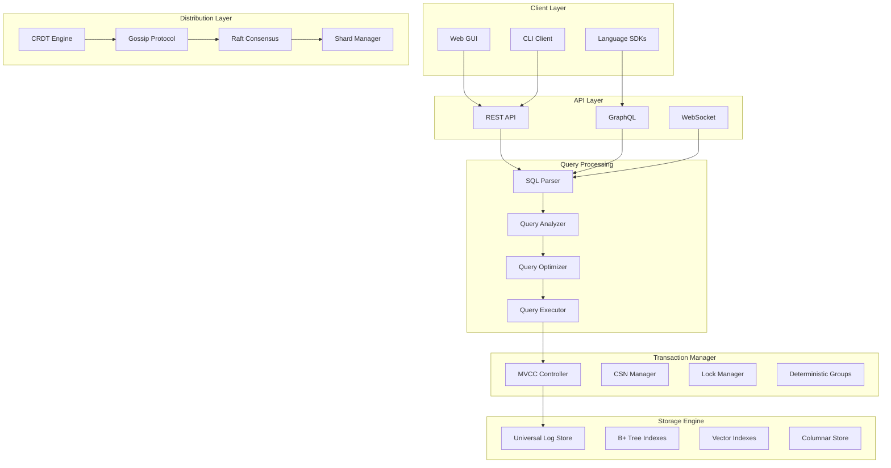
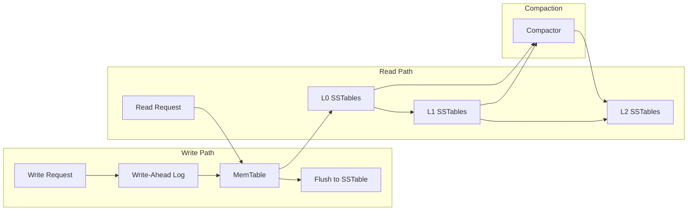
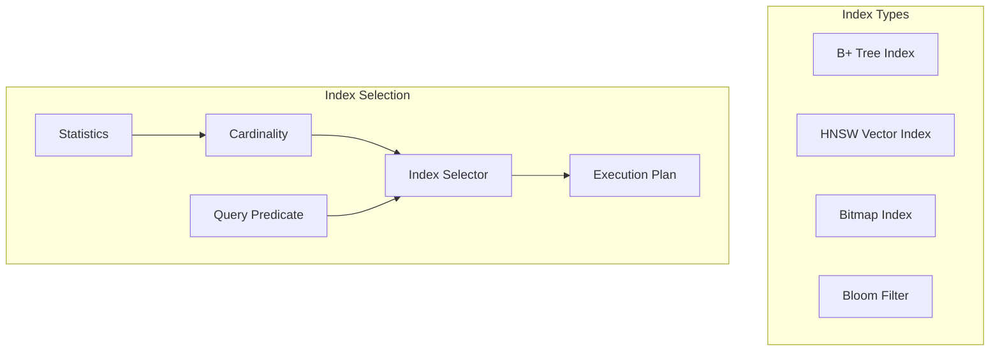
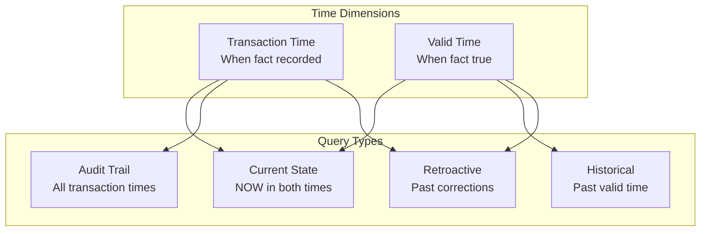
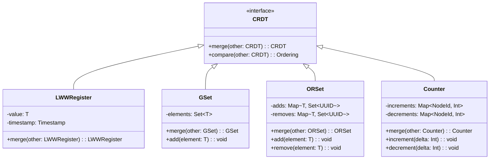
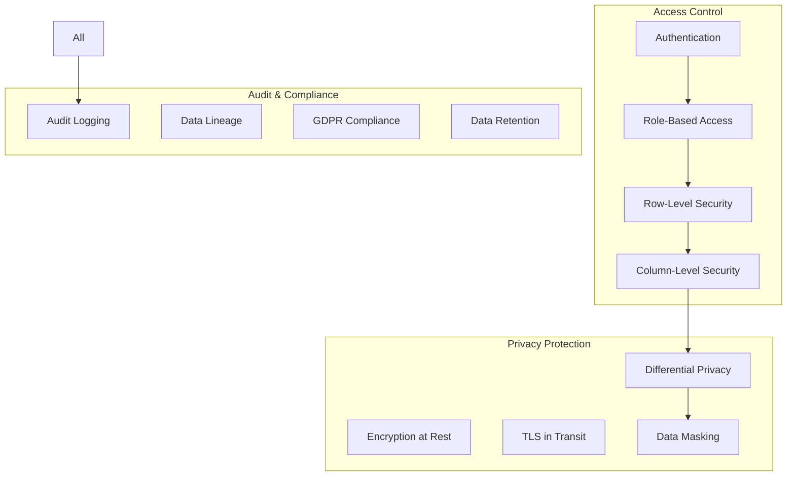
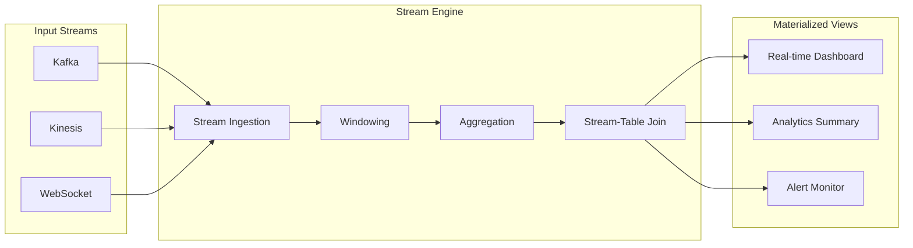
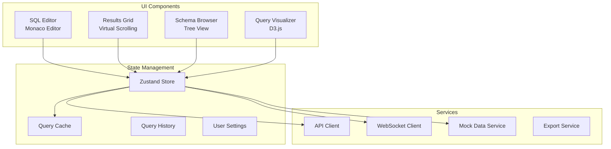
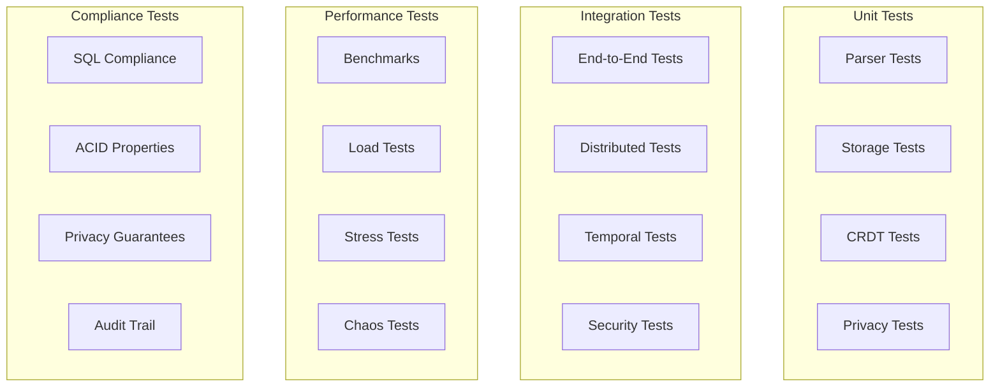

# LatticeDB Design Document

## Table of Contents
1. [Executive Summary](#executive-summary)
2. [Design Philosophy](#design-philosophy)
3. [System Architecture](#system-architecture)
4. [Core Components](#core-components)
5. [Storage Engine Design](#storage-engine-design)
6. [Query Processing Pipeline](#query-processing-pipeline)
7. [Temporal Architecture](#temporal-architecture)
8. [CRDT & Merge Semantics](#crdt--merge-semantics)
9. [Security & Privacy Design](#security--privacy-design)
10. [Streaming & Real-time Processing](#streaming--real-time-processing)
11. [GUI Architecture](#gui-architecture)
12. [Performance Considerations](#performance-considerations)
13. [Testing Strategy](#testing-strategy)
14. [Future Enhancements](#future-enhancements)

## Executive Summary

LatticeDB is a next-generation distributed relational database that natively integrates:
- **Bitemporal data management** with transaction and valid time
- **CRDT-based merge semantics** for distributed conflict resolution
- **Differential privacy** with epsilon budget management
- **Row and column-level security** with policy-based access control
- **Vector similarity search** for AI/ML workloads
- **Streaming materialized views** with windowing operations
- **Deterministic transaction groups** for cross-shard consistency

## Design Philosophy

### Core Principles

1. **Mergeability First**: Every data type can define custom merge semantics
2. **Time as First-Class**: All data is bitemporal by default
3. **Privacy by Design**: Differential privacy integrated at query level
4. **Conflict-Free by Default**: CRDT semantics prevent distributed conflicts
5. **SQL Compatibility**: Extensions maintain SQL standard compatibility

### Design Trade-offs

| Decision | Benefit | Cost |
|----------|---------|------|
| CRDT everywhere | No conflicts in distributed systems | Storage overhead for metadata |
| Bitemporal by default | Complete audit trail | 2x storage for time dimensions |
| MVCC + CSN | Lock-free reads | Version chain maintenance |
| Differential privacy | Mathematical privacy guarantees | Query result accuracy loss |

## System Architecture



## Core Components

### 1. Parser & Analyzer
```typescript
// src/parser/sql_parser.ts
interface ParseResult {
    ast: ASTNode;
    temporalClauses: TemporalClause[];
    mergePolicies: MergePolicy[];
    privacyBudget: EpsilonBudget;
}

// Extends SQL:2011 with:
// - FOR SYSTEM_TIME AS OF
// - VALID PERIOD predicates
// - ON CONFLICT MERGE clauses
// - WITH DP(epsilon => x)
```

### 2. Query Optimizer
```typescript
// src/optimizer/query_optimizer.ts
class QueryOptimizer {
    // Cost-based optimization with:
    // - Temporal pruning
    // - Vector index selection
    // - Merge operator pushdown
    // - Privacy budget allocation

    optimizationRules = [
        temporalPartitionPruning,
        vectorSimilarityPushdown,
        mergeSemanticsOptimization,
        differentialPrivacyRewrite
    ];
}
```

### 3. Executor Engine
```typescript
// src/executor/query_executor.ts
interface ExecutorContext {
    transactionTime: CSN;
    validTime: TimeRange;
    epsilonBudget: number;
    mergeResolver: MergeFunction;
    isolationLevel: IsolationLevel;
}
```

## Storage Engine Design

### Universal Log Store (ULS)



### Storage Format
```rust
// Physical tuple layout
struct PhysicalTuple {
    header: TupleHeader {
        csn_min: u64,        // Transaction time start
        csn_max: u64,        // Transaction time end
        valid_from: i64,     // Valid time start
        valid_to: i64,       // Valid time end
        flags: u16,          // MVCC flags
        merge_clock: VectorClock,
    },
    data: Vec<Value>,
}
```

### Index Architecture



## Query Processing Pipeline

### 1. Parse Phase
```sql
-- Input SQL with extensions
SELECT u.name, COUNT(*) as cnt
FROM users u
FOR SYSTEM_TIME AS OF '2024-01-01'
WHERE u.created_at IN VALID_PERIOD ['2023-01-01', '2024-01-01')
GROUP BY u.name
WITH DP(epsilon => 1.0);
```

### 2. Logical Plan
```
Project(name, cnt)
  └── DifferentialPrivacy(epsilon=1.0)
      └── Aggregate(group=[name], agg=[COUNT(*)])
          └── TemporalFilter(tx_time='2024-01-01', valid=['2023-01-01', '2024-01-01'))
              └── TableScan(users)
```

### 3. Physical Plan
```
ProjectExec(name, cnt)
  └── LaplaceMechanismExec(epsilon=1.0, sensitivity=1)
      └── HashAggregateExec(group=[name], agg=[COUNT])
          └── TemporalScanExec(
                table=users,
                csn=12345,
                valid_range=[2023-01-01, 2024-01-01),
                index=btree_created_at
              )
```

## Temporal Architecture

### Bitemporal Model



### Temporal Operations
```typescript
interface TemporalOperations {
    // Point-in-time queries
    asOf(txTime: Timestamp, validTime: Timestamp): QueryResult;

    // Range queries
    between(txRange: TimeRange, validRange: TimeRange): QueryResult;

    // Temporal joins
    temporalJoin(left: Relation, right: Relation,
                 overlap: OverlapType): QueryResult;

    // Time travel
    timeTravel(to: Timestamp): void;
}
```

## CRDT & Merge Semantics

### CRDT Type Hierarchy



### Merge Resolution Pipeline

```typescript
// src/crdt/merge_engine.ts
class MergeEngine {
    resolveMerge<T extends CRDT>(
        local: T,
        remote: T,
        policy: MergePolicy
    ): T {
        // 1. Check vector clocks for causality
        const ordering = compareVectorClocks(local.clock, remote.clock);

        if (ordering === Ordering.Concurrent) {
            // 2. Apply merge semantics
            switch (policy.type) {
                case 'lww':
                    return local.timestamp > remote.timestamp ? local : remote;
                case 'mww':
                    return policy.resolver(local, remote);
                case 'union':
                    return local.union(remote);
                case 'custom':
                    return policy.customMerge(local, remote);
            }
        }

        // 3. Return causally later version
        return ordering === Ordering.Before ? remote : local;
    }
}
```

## Security & Privacy Design

### Multi-Layer Security Model



### Differential Privacy Implementation

```typescript
// src/privacy/differential_privacy.ts
class DifferentialPrivacy {
    private globalBudget: EpsilonBudget;
    private consumedBudget: Map<UserId, number>;

    applyMechanism(
        result: QueryResult,
        epsilon: number,
        mechanism: DPMechanism
    ): QueryResult {
        // Check budget
        if (!this.checkBudget(epsilon)) {
            throw new PrivacyBudgetExceeded();
        }

        // Apply mechanism
        switch (mechanism) {
            case 'laplace':
                return this.laplaceMechanism(result, epsilon);
            case 'gaussian':
                return this.gaussianMechanism(result, epsilon);
            case 'exponential':
                return this.exponentialMechanism(result, epsilon);
        }

        // Consume budget
        this.consumeBudget(epsilon);
        return result;
    }

    private laplaceMechanism(
        result: QueryResult,
        epsilon: number
    ): QueryResult {
        const sensitivity = this.calculateSensitivity(result);
        const scale = sensitivity / epsilon;

        return result.map(value => {
            if (typeof value === 'number') {
                return value + this.sampleLaplace(scale);
            }
            return value;
        });
    }
}
```

### Policy Engine

```typescript
// src/security/policy_engine.ts
interface SecurityPolicy {
    type: 'row' | 'column' | 'cell';
    predicate: (context: SecurityContext) => boolean;
    enforcement: 'deny' | 'mask' | 'redact';
}

class PolicyEngine {
    evaluatePolicies(
        data: ResultSet,
        policies: SecurityPolicy[],
        context: SecurityContext
    ): ResultSet {
        return data.filter(row => {
            // Row-level policies
            const rowPolicies = policies.filter(p => p.type === 'row');
            if (!this.evaluateRowPolicies(row, rowPolicies, context)) {
                return false;
            }

            // Column-level policies
            const colPolicies = policies.filter(p => p.type === 'column');
            row = this.applyColumnPolicies(row, colPolicies, context);

            return row;
        });
    }
}
```

## Streaming & Real-time Processing

### Stream Processing Architecture



### Window Operations

```typescript
// src/streaming/windows.ts
abstract class Window<T> {
    abstract addElement(element: T, timestamp: Timestamp): void;
    abstract getResult(): WindowResult<T>;
    abstract advanceWatermark(watermark: Timestamp): void;
}

class TumblingWindow<T> extends Window<T> {
    constructor(private duration: Duration) {}

    addElement(element: T, timestamp: Timestamp): void {
        const windowStart = this.getWindowStart(timestamp);
        const windowEnd = windowStart + this.duration;
        this.windows.get(windowStart).add(element);
    }
}

class HoppingWindow<T> extends Window<T> {
    constructor(
        private windowSize: Duration,
        private hopSize: Duration
    ) {}

    addElement(element: T, timestamp: Timestamp): void {
        // Element belongs to multiple overlapping windows
        const windows = this.getOverlappingWindows(timestamp);
        windows.forEach(w => w.add(element));
    }
}

class SessionWindow<T> extends Window<T> {
    constructor(private gap: Duration) {}

    addElement(element: T, timestamp: Timestamp): void {
        // Extend session or create new one based on gap
        const session = this.findOrCreateSession(timestamp);
        session.add(element);
    }
}
```

## GUI Architecture

### Frontend Stack



### Component Architecture


```typescript
// gui/src/components/QueryEditor.tsx
const QueryEditor: React.FC = () => {
  const { currentQuery, executeQuery } = useStore();

  return (
    <MonacoEditor
      language="sql"
      theme={darkMode ? 'vs-dark' : 'light'}
      value={currentQuery}
      options={{
        minimap: { enabled: false },
        formatOnPaste: true,
        formatOnType: true,
        autoClosingBrackets: 'always',
        suggestOnTriggerCharacters: true
      }}
      onChange={handleChange}
    />
  );
};
```


## Performance Considerations

### Query Optimization Strategies

1. **Temporal Partition Pruning**
   - Skip partitions outside temporal predicates
   - Maintain min/max CSN per partition
   - Bloom filters for valid time ranges

2. **Vector Index Selection**
   - Cost model for ANN vs exact search
   - Hybrid search with pre-filtering
   - Index parameter auto-tuning

3. **Merge Operator Pushdown**
   - Apply merge early in pipeline
   - Combine mergeable operations
   - Cache merge results

4. **Privacy Budget Management**
   - Track cumulative epsilon consumption
   - Batch queries to minimize noise
   - Smart budget allocation

### Storage Optimizations

```typescript
// Compression strategies
enum CompressionType {
    NONE,
    SNAPPY,      // Fast, moderate compression
    ZSTD,        // Balanced
    LZ4,         // Very fast, light compression
    DICTIONARY   // Column-specific dictionaries
}

// Tiered storage
interface StorageTier {
    hot: {
        media: 'SSD',
        retention: '7 days',
        compression: CompressionType.LZ4
    },
    warm: {
        media: 'HDD',
        retention: '30 days',
        compression: CompressionType.ZSTD
    },
    cold: {
        media: 'S3',
        retention: 'unlimited',
        compression: CompressionType.DICTIONARY
    }
}
```

## Testing Strategy

### Test Categories



### Test Implementation

```typescript
// tests/crdt/merge_test.ts
describe('CRDT Merge Semantics', () => {
    test('LWW Register convergence', () => {
        const reg1 = new LWWRegister('value1', timestamp1);
        const reg2 = new LWWRegister('value2', timestamp2);

        const merged1 = reg1.merge(reg2);
        const merged2 = reg2.merge(reg1);

        expect(merged1).toEqual(merged2); // Commutative
        expect(merged1.merge(merged1)).toEqual(merged1); // Idempotent
    });

    test('OR-Set add/remove semantics', () => {
        const set1 = new ORSet<string>();
        const set2 = new ORSet<string>();

        set1.add('apple');
        set2.add('banana');
        set1.remove('apple');

        const merged = set1.merge(set2);
        expect(merged.contains('banana')).toBe(true);
        expect(merged.contains('apple')).toBe(false);
    });
});

// tests/privacy/differential_privacy_test.ts
describe('Differential Privacy', () => {
    test('Laplace mechanism accuracy', () => {
        const result = 100;
        const epsilon = 1.0;
        const sensitivity = 1;

        const noised = applyLaplace(result, epsilon, sensitivity);
        const error = Math.abs(noised - result);

        // 95% confidence interval
        const bound = 3 * (sensitivity / epsilon);
        expect(error).toBeLessThan(bound);
    });
});
```

## Future Enhancements

### Phase 1: Foundation (Completed ✅)
- Core MVCC engine
- Basic CRDT types
- Temporal queries
- Row-level security
- Web GUI

### Phase 2: Advanced Features (In Progress 🚧)
- Geo-distributed replication
- Advanced vector operations
- Learned indexes
- Query federation
- Streaming analytics

### Phase 3: Enterprise Features (Planned 📋)
- Multi-tenancy
- Encryption key management
- Advanced workload management
- ML-powered optimization
- Compliance automation

### Research Directions

1. **Learned Components**
   - Learned cardinality estimation
   - Learned index structures
   - Learned query optimization
   - Learned compression

2. **Advanced Privacy**
   - Local differential privacy
   - Secure multi-party computation
   - Homomorphic encryption
   - Zero-knowledge proofs

3. **Novel Indexes**
   - Learned bloom filters
   - Adaptive radix trees
   - Cache-conscious B-trees
   - GPU-accelerated indexes

## Conclusion

LatticeDB represents a fundamental rethinking of relational database architecture for the modern distributed, privacy-conscious, temporal-aware computing environment. By making mergeability, temporality, and privacy first-class citizens rather than bolt-on features, we enable new classes of applications while maintaining SQL compatibility and ACID guarantees.

The design prioritizes:
- **Correctness** through formal CRDT semantics
- **Privacy** through differential privacy integration
- **Auditability** through bitemporal architecture
- **Performance** through adaptive optimization
- **Usability** through SQL extensions and GUI tools

This architecture positions LatticeDB as the foundation for next-generation data applications requiring strong consistency, privacy guarantees, and temporal reasoning in distributed environments.
