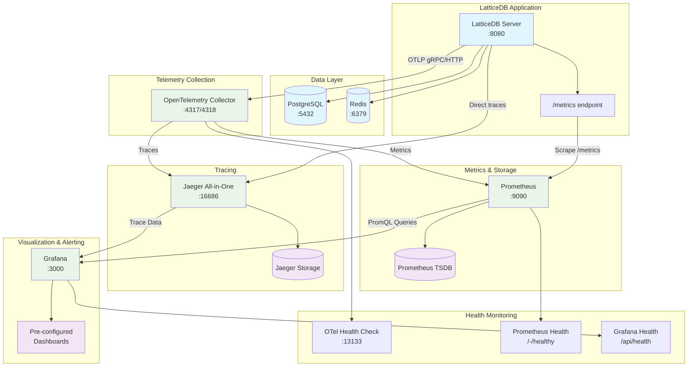
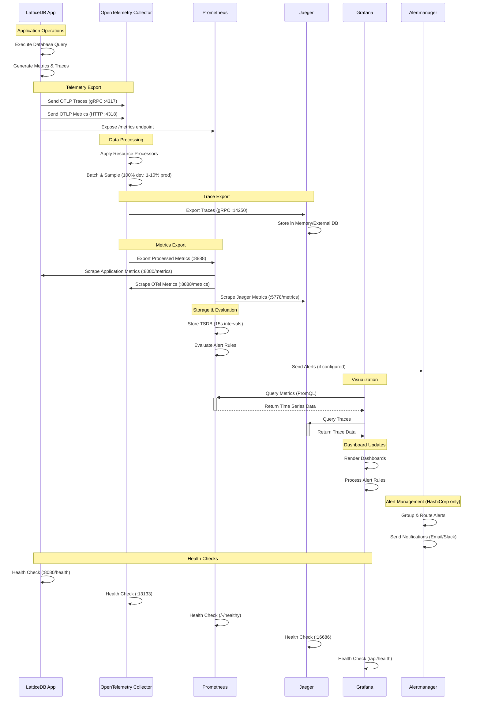

# LatticeDB Monitoring Stack

LatticeDB includes a comprehensive monitoring and observability stack that combines metrics, logs, and distributed tracing. This document describes the monitoring architecture and how to use it.

## Architecture Overview

The monitoring stack consists of four main components:

1. **Prometheus** - Metrics collection and storage
2. **Grafana** - Visualization and dashboards
3. **Jaeger** - Distributed tracing
4. **OpenTelemetry** - Telemetry data collection and processing

## Architecture Diagrams

### 1. Monitoring Stack Architecture



### 2. Multi-Cloud Deployment Architecture

```mermaid
graph TB
    subgraph "AWS Deployment"
        subgraph "AWS ECS Fargate"
            AWS_LATTICE[LatticeDB Container]
            AWS_PROMETHEUS[Prometheus Container]
            AWS_GRAFANA[Grafana Container]
        end

        subgraph "AWS Storage"
            AWS_EFS[EFS for Config/Data]
            AWS_LOGS[CloudWatch Logs]
        end

        subgraph "AWS Networking"
            AWS_ALB[Application Load Balancer]
            AWS_SG[Security Groups]
            AWS_VPC[VPC with Private Subnets]
        end

        AWS_ALB --> AWS_GRAFANA
        AWS_PROMETHEUS --> AWS_EFS
        AWS_GRAFANA --> AWS_EFS
        AWS_LATTICE --> AWS_LOGS
        AWS_SG --> AWS_VPC
    end

    subgraph "Azure Deployment"
        subgraph "Azure Container Apps"
            AZURE_LATTICE[LatticeDB Container]
            AZURE_PROMETHEUS[Prometheus Container]
            AZURE_GRAFANA[Grafana Container]
        end

        subgraph "Azure Storage"
            AZURE_FILES[Azure Files Shares]
            AZURE_INSIGHTS[Application Insights]
        end

        subgraph "Azure Monitoring"
            AZURE_ALERTS[Monitor Metric Alerts]
            AZURE_ACTIONS[Action Groups]
        end

        AZURE_PROMETHEUS --> AZURE_FILES
        AZURE_GRAFANA --> AZURE_FILES
        AZURE_LATTICE --> AZURE_INSIGHTS
        AZURE_ALERTS --> AZURE_ACTIONS
    end

    subgraph "GCP Deployment"
        subgraph "Google Cloud Run"
            GCP_LATTICE[LatticeDB Service]
            GCP_PROMETHEUS[Prometheus Service]
            GCP_GRAFANA[Grafana Service]
        end

        subgraph "GCP Storage"
            GCP_SECRETS[Secret Manager]
            GCP_STORAGE[Cloud Storage]
        end

        subgraph "GCP Monitoring"
            GCP_MONITORING[Cloud Monitoring]
            GCP_ALERTS[Alert Policies]
            GCP_UPTIME[Uptime Checks]
        end

        GCP_PROMETHEUS --> GCP_SECRETS
        GCP_GRAFANA --> GCP_SECRETS
        GCP_LATTICE --> GCP_MONITORING
        GCP_ALERTS --> GCP_UPTIME
    end

    subgraph "HashiCorp Stack"
        subgraph "Nomad Cluster"
            NOMAD_PROMETHEUS[Prometheus Job]
            NOMAD_GRAFANA[Grafana Job]
            NOMAD_ALERTMGR[Alertmanager Job]
            NOMAD_EXPORTERS[Node/cAdvisor Exporters]
        end

        subgraph "Service Discovery"
            CONSUL[Consul Service Discovery]
            CONSUL_CONNECT[Consul Connect]
        end

        subgraph "Secrets & Storage"
            VAULT[Vault Secrets]
            CSI_VOLUMES[CSI Volumes]
        end

        NOMAD_PROMETHEUS --> CONSUL
        NOMAD_GRAFANA --> CONSUL_CONNECT
        VAULT --> CSI_VOLUMES
    end

    classDef aws fill:#ff9900,color:#fff
    classDef azure fill:#0078d4,color:#fff
    classDef gcp fill:#4285f4,color:#fff
    classDef hashicorp fill:#7c3aed,color:#fff

    class AWS_LATTICE,AWS_PROMETHEUS,AWS_GRAFANA,AWS_EFS,AWS_LOGS,AWS_ALB aws
    class AZURE_LATTICE,AZURE_PROMETHEUS,AZURE_GRAFANA,AZURE_FILES,AZURE_INSIGHTS,AZURE_ALERTS azure
    class GCP_LATTICE,GCP_PROMETHEUS,GCP_GRAFANA,GCP_SECRETS,GCP_MONITORING gcp
    class NOMAD_PROMETHEUS,NOMAD_GRAFANA,NOMAD_ALERTMGR,CONSUL,VAULT hashicorp
```



### 3. Telemetry Data Flow



## Components

### Prometheus (Metrics)
- **URL**: http://localhost:9090
- **Purpose**: Collects and stores time-series metrics
- **Configuration**: `environments/dev/prometheus.yml`
- **Scraped Endpoints**:
  - LatticeDB application metrics (`/metrics`)
  - PostgreSQL metrics (with exporter)
  - Redis metrics (with exporter)
  - OpenTelemetry Collector metrics
  - Jaeger metrics

### Grafana (Visualization)
- **URL**: http://localhost:3000
- **Credentials**: admin/admin
- **Purpose**: Dashboards and alerts for metrics and traces
- **Configuration**: `environments/dev/grafana/`
- **Datasources**:
  - Prometheus (metrics)
  - Jaeger (traces)

### Jaeger (Tracing)
- **URL**: http://localhost:16686
- **Purpose**: Distributed tracing and request flow analysis
- **Configuration**: Built-in all-in-one deployment
- **Storage**: In-memory (development) / External store (production)

### OpenTelemetry Collector
- **Purpose**: Receives, processes, and exports telemetry data
- **Configuration**: `environments/dev/otel-collector.yml`
- **Receives**: OTLP traces and metrics from application
- **Exports**: Traces to Jaeger, Metrics to Prometheus

## Application Integration

### C++ Telemetry Integration

The LatticeDB application includes OpenTelemetry integration through:

```cpp
#include "telemetry/telemetry_manager.h"
#include "telemetry/tracer.h"
#include "telemetry/metrics_collector.h"
```

#### Environment Variables

Configure telemetry through environment variables:

```bash
TELEMETRY_ENABLED=true
JAEGER_ENDPOINT=http://jaeger:14268/api/traces
PROMETHEUS_ENDPOINT=prometheus:9090
OTLP_ENDPOINT=http://jaeger:4318/v1/traces
```

#### Tracing Example

```cpp
// Start a trace span
TRACE_OPERATION("database_query");
TRACE_ADD_ATTRIBUTE("query_type", "SELECT");
TRACE_ADD_ATTRIBUTE("table", "users");

try {
    // Your database operation here
    auto result = executeQuery(query);
    TRACE_SET_SUCCESS();
    return result;
} catch (const std::exception& e) {
    TRACE_RECORD_EXCEPTION(e);
    throw;
}
```

#### Metrics Example

```cpp
// Record query latency
auto start = std::chrono::high_resolution_clock::now();
// ... execute query ...
auto end = std::chrono::high_resolution_clock::now();
auto latency = std::chrono::duration_cast<std::chrono::milliseconds>(end - start).count();

RECORD_QUERY_LATENCY("SELECT", latency);
INCREMENT_QUERY_COUNT("SELECT");
```

### Build Configuration

OpenTelemetry support is controlled by CMake options:

```bash
# Enable telemetry (default: ON)
cmake -DENABLE_TELEMETRY=ON ..

# The build will automatically detect OpenTelemetry libraries
# and link them if available
```

## Getting Started

### 1. Start the Development Environment

```bash
cd environments/dev
docker-compose up -d
```

This will start:
- LatticeDB application with telemetry enabled
- PostgreSQL and Redis databases
- Prometheus metrics collection
- Grafana dashboards
- Jaeger tracing
- OpenTelemetry Collector

### 2. Access the UIs

- **LatticeDB**: http://localhost:8080
- **Grafana**: http://localhost:3000 (admin/admin)
- **Prometheus**: http://localhost:9090
- **Jaeger**: http://localhost:16686

### 3. Generate Some Data

Execute some database operations to generate traces and metrics:

```bash
# Connect to LatticeDB and run queries
./latticedb_cli
> CREATE TABLE test (id INT, name VARCHAR(50));
> INSERT INTO test VALUES (1, 'Hello World');
> SELECT * FROM test;
```

### 4. View Traces in Jaeger

1. Open http://localhost:16686
2. Select "latticedb" service
3. Click "Find Traces"
4. Explore the trace details

### 5. View Metrics in Grafana

1. Open http://localhost:3000
2. Login with admin/admin
3. Explore the pre-configured dashboards
4. Create custom dashboards using Prometheus datasource

## Available Metrics

### Application Metrics

- `latticedb_queries_total` - Total number of queries by type
- `latticedb_query_duration_milliseconds` - Query execution time
- `latticedb_transactions_total` - Total transactions by status
- `latticedb_transaction_duration_milliseconds` - Transaction time
- `latticedb_errors_total` - Total errors by type
- `latticedb_connections_active` - Active database connections
- `latticedb_memory_usage_bytes` - Memory usage
- `latticedb_disk_usage_bytes` - Disk usage
- `latticedb_buffer_pool_hit_rate` - Buffer pool hit rate percentage

### System Metrics

- `up` - Service availability
- `process_cpu_seconds_total` - CPU usage
- `process_memory_resident_bytes` - Memory usage
- `process_open_fds` - Open file descriptors

## Production Considerations

### Performance Impact

- Tracing: ~5-10% overhead with 100% sampling
- Metrics: <1% overhead
- Recommended sampling: 1-10% in production

### Configuration Changes for Production

1. **Reduce Sampling Rate**:
   ```yaml
   # otel-collector.yml
   processors:
     probabilistic_sampler:
       sampling_percentage: 1  # Sample 1% in production
   ```

2. **Use External Storage**:
   - Configure Jaeger with Elasticsearch/Cassandra
   - Use external Prometheus with persistent storage

3. **Enable Authentication**:
   - Secure Grafana with proper authentication
   - Use TLS for all connections

4. **Resource Limits**:
   ```yaml
   # docker-compose.yml
   services:
     jaeger:
       deploy:
         resources:
           limits:
             memory: 512M
           reservations:
             memory: 256M
   ```

## Troubleshooting

### Common Issues

1. **No traces appearing in Jaeger**:
   - Check if telemetry is enabled: `TELEMETRY_ENABLED=true`
   - Verify Jaeger endpoint: `JAEGER_ENDPOINT=http://jaeger:14268/api/traces`
   - Check OpenTelemetry Collector logs: `docker-compose logs otel-collector`

2. **Missing metrics in Prometheus**:
   - Verify application exposes `/metrics` endpoint
   - Check Prometheus targets: http://localhost:9090/targets
   - Review Prometheus configuration

3. **Grafana datasource connection issues**:
   - Verify datasource URLs in Grafana
   - Check network connectivity between containers
   - Review Grafana logs: `docker-compose logs grafana`

### Debug Commands

```bash
# Check if metrics endpoint is working
curl http://localhost:8080/metrics

# Verify Jaeger is receiving traces
curl http://localhost:16686/api/services

# Check OpenTelemetry Collector health
curl http://localhost:13133

# View container logs
docker-compose logs -f latticedb
docker-compose logs -f jaeger
docker-compose logs -f otel-collector
```

## Advanced Usage

### Custom Dashboards

Create custom Grafana dashboards using PromQL queries:

```promql
# Query rate by operation
rate(latticedb_queries_total[5m])

# Average query latency
rate(latticedb_query_duration_milliseconds_sum[5m])
/ rate(latticedb_query_duration_milliseconds_count[5m])

# Error rate
rate(latticedb_errors_total[5m])
/ rate(latticedb_queries_total[5m]) * 100
```

### Trace Correlation

Correlate traces with logs and metrics using trace IDs:
- Traces contain span IDs and trace IDs
- Log entries can include trace context
- Metrics can be filtered by trace attributes

### Alerting

Configure Grafana alerts for:
- High error rates
- Slow query performance
- Memory/CPU usage
- Service availability

This monitoring stack provides comprehensive observability for LatticeDB, enabling you to monitor performance, debug issues, and optimize your database operations.
