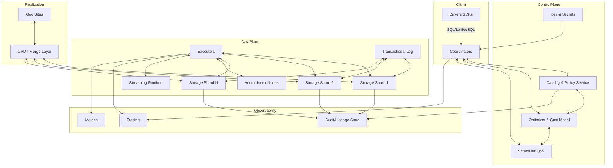
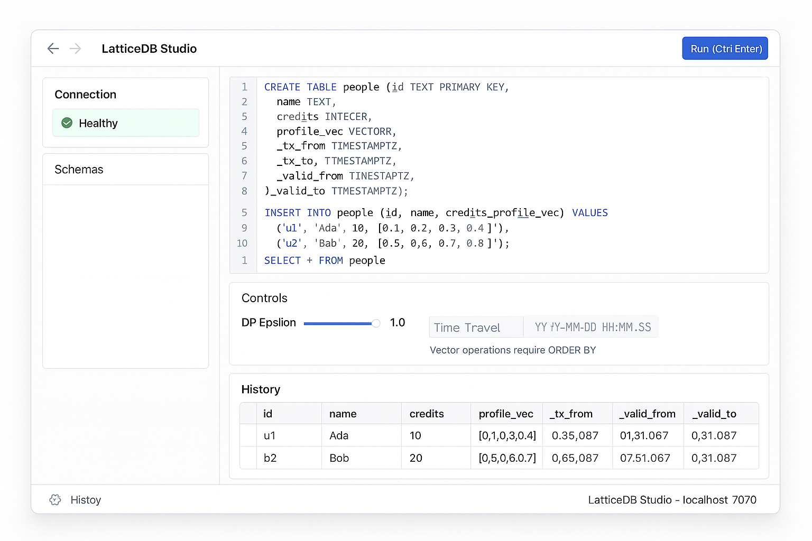
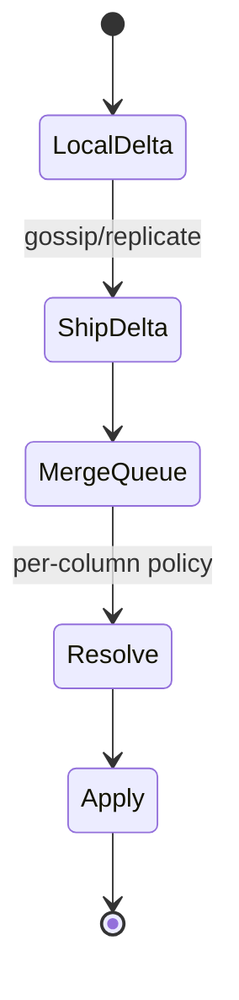
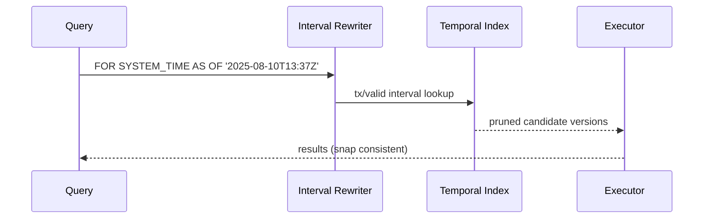
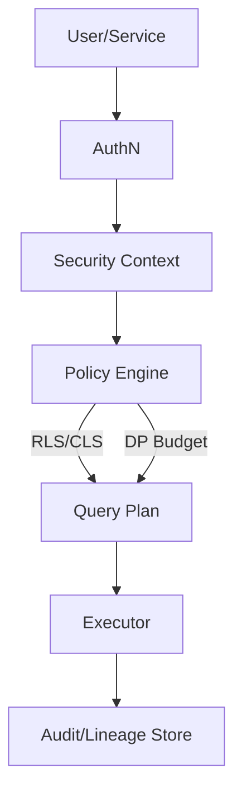
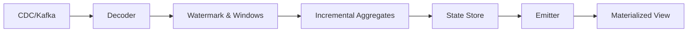
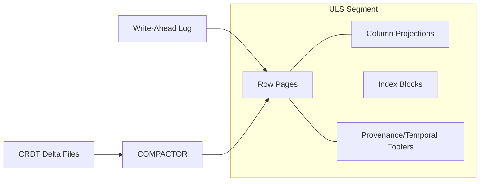
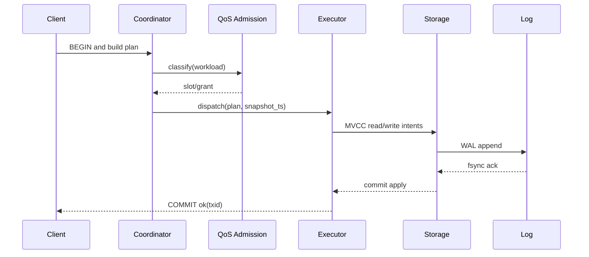
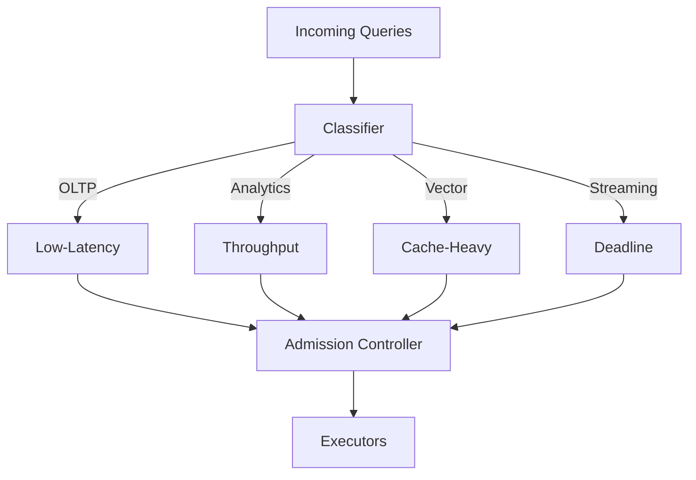
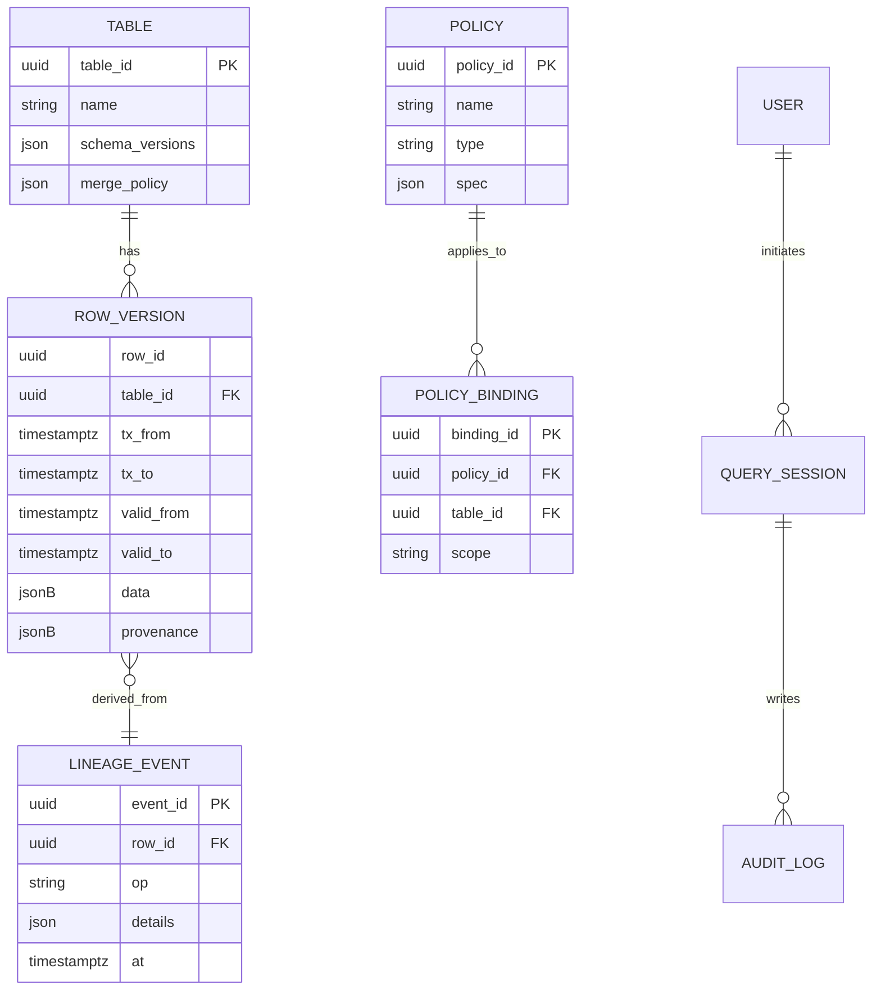

# LatticeDB - The Next-Gen, Mergeable Temporal Relational Database 🗂️

*A next-generation, mergeable, temporal, policy-aware relational DBMS.*

> [!IMPORTANT]
> **Mission**: Make conflict-free multi-master, time-travel, privacy-preserving analytics, streaming, and vector search **first-class** in a relational DB—without bolted-on sidecars.

<p align="center">
  
</p>

[](https://isocpp.org/)
[](https://www.gnu.org/software/bash/)
[](https://www.python.org/)
[](https://cmake.org/)
[](https://ninja-build.org/)
[](https://gcc.gnu.org/)
[](https://llvm.org/)
[](https://github.com/features/actions)
[](https://codeql.github.com/)
[](https://github.com/dependabot)
[](https://clang.llvm.org/docs/AddressSanitizer.html)
[](https://clang.llvm.org/docs/UndefinedBehaviorSanitizer.html)
[](https://clang.llvm.org/docs/ClangFormat.html)
[](http://cppcheck.sourceforge.net/)
[](https://www.docker.com/)
[](https://ubuntu.com/)
[](https://www.apple.com/macos/)
[](https://learn.microsoft.com/windows/wsl/)
[](https://mermaid.js.org/)
[](https://editorconfig.org/)
[](https://vitejs.dev/)
[](https://tanstack.com/query/latest)
[](https://vercel.com/)
[](https://react.dev/)
[](https://www.typescriptlang.org/)
[](https://tailwindcss.com/)
[](LICENSE)

## Table of Contents

* [Why LatticeDB](#why-latticedb)
* [Feature Matrix & How It’s Different](#feature-matrix--how-its-different)
* [Architecture Overview](#architecture-overview)
* [Quick Start](#quick-start)
* [Start with GUI](#start-with-gui)
* [Core Concepts & Examples](#core-concepts--examples)

  * [Mergeable Relational Tables (MRT)](#mergeable-relational-tables-mrt)
  * [Bitemporal Time Travel & Lineage](#bitemporal-time-travel--lineage)
  * [Policy-as-Data & Differential Privacy](#policy-as-data--differential-privacy)
  * [Vectors & Semantic Joins](#vectors--semantic-joins)
  * [Streaming Materialized Views](#streaming-materialized-views)
* [Storage, Transactions & Replication](#storage-transactions--replication)
* [SQL: LatticeSQL Extensions](#sql-latticesql-extensions)
* [Operations & Observability](#operations--observability)
* [Roadmap](#roadmap)
* [Limitations](#limitations)
* [Contributing](#contributing)
* [License](#license)

## Why LatticeDB

LatticeDB is designed from the ground up to make **conflict-free multi-master**, **bitemporal**, **policy-aware**, **privacy-preserving**, **real-time analytics**, **streaming**, and **vector search** first-class citizens in a relational database—without bolting on sidecars, plugins, or external services.

1. **Mergeable Relational Tables (MRT)**: Per-column **CRDT** semantics for conflict-free **active-active** replication and **offline-first** applications. Choose `lww`, `sum_bounded`, `gset`, or custom resolvers.
2. **Bitemporal by default**: Every row has **transaction time** *and* **valid time** plus provenance—no retrofitting needed. Query **as of** a timestamp and ask *why* with lineage.
3. **Policy-as-data**: Row/column masking, role attributes, retention, and **differential privacy** budgets are declared and versioned in the catalog, enforced **inside** the engine.
4. **Unified storage surfaces**: OLTP row pages, OLAP columnar projections, **stream tails**, and **vector indexes** co-exist and are chosen by the optimizer.
5. **WASM extensibility**: Deterministic, capability-scoped WebAssembly UDF/UDTF/UDA, custom codecs, and merge resolvers with fuel/memory limits.
6. **Hybrid concurrency**: MVCC by default; **deterministic lane** for hot-key contention; optional **causal+ snapshots** with bounded staleness hints per query.
7. **Zero-downtime schema evolution**: Versioned schemas, online backfills, and cross-version query rewrite.
8. **Streaming MVs**: Exactly-once, incremental materialized views that can consume internal CDC or external logs.

## Feature Matrix & How It’s Different

LatticeDB focuses on features that major RDBMS generally **don’t provide natively out-of-the-box all together**:

| Capability                                                  | LatticeDB               |                       Typical in PostgreSQL |                   Typical in MySQL |                                                 Typical in SQL Server |
| ----------------------------------------------------------- | ----------------------- | ------------------------------------------: | ---------------------------------: | --------------------------------------------------------------------: |
| **Mergeable tables (CRDTs) for conflict-free multi-master** | **Built-in** per column |           Via external systems/custom logic |  Via external systems/custom logic |                                     Via external systems/custom logic |
| **Bitemporal (valid + transaction time) by default**        | **Built-in**            |              Emulatable via schema/patterns |     Emulatable via schema/patterns | System-versioned temporal tables exist; **valid-time** needs modeling |
| **Policy-as-data (RLS/CLS/DP budgets) in engine**           | **Built-in**            |  RLS exists; DP requires extensions/tooling | RLS via views/plugins; DP external |                                               RLS exists; DP external |
| **Vector search integrated**                                | **Built-in**            |                     Commonly via extensions |      Commonly via plugins/editions |                                             Varies by edition/service |
| **WASM UDF sandbox**                                        | **Built-in**            | Not built-in (extensions/native C required) |                       Not built-in |                                                          Not built-in |
| **Exactly-once streaming MVs**                              | **Built-in**            |               Logical decoding + extensions |          Binlog + external engines |                                                CDC + external engines |
| **Offline-first & causal+ snapshots**                       | **Built-in**            |          External tooling/replication modes |                   External tooling |                                                      External tooling |

> [!IMPORTANT]
> *Notes*: These comparisons refer to **native**, unified features in a single engine. Many incumbents can achieve parts of this via **extensions**, **editions**, or **external services**, but not as a cohesive, first-class design as in LatticeDB.

## Architecture Overview



## Quick Start

### Prerequisites

* C++17 toolchain (clang++/g++)
* CMake ≥ 3.15
* Linux/macOS/WSL2 (for now)
* Optional: Python 3.x to run simple workload scripts

### Build from Source

```bash
git clone https://example.com/latticedb.git
cd latticedb
cmake -S . -B build
cmake --build build -j
./build/latticedb  # launches a simple REPL
```

### Hello World (REPL)

```sql
-- Create a mergeable, bitemporal table with vectors
CREATE TABLE people (
  id TEXT PRIMARY KEY,
  name TEXT MERGE lww,
  tags SET<TEXT> MERGE gset,
  credits INT MERGE sum_bounded(0, 1000000),
  profile_vec VECTOR<4>
);

INSERT INTO people (id, name, tags, credits, profile_vec) VALUES
('u1','Ada', {'engineer','math'}, 10, [0.1,0.2,0.3,0.4]),
('u2','Grace', {'engineer'}, 20, [0.4,0.3,0.2,0.1]);

-- Conflict-free merge on upsert
INSERT INTO people (id, credits, tags, name) VALUES
('u1', 15, {'leader'}, 'Ada Lovelace') ON CONFLICT MERGE;

-- Time travel (transaction time)
SELECT * FROM people FOR SYSTEM_TIME AS OF TX 1;

-- Vector similarity filter (brute-force demo)
SELECT id, name FROM people
WHERE DISTANCE(profile_vec, [0.1,0.2,0.29,0.41]) < 0.1;

-- Differential privacy (noisy aggregates)
SET DP_EPSILON = 0.4;
SELECT DP_COUNT(*) FROM people WHERE credits >= 10;

SAVE DATABASE 'snapshot.ldb';
EXIT;
```

> [!NOTE]
> The REPL demonstrates the core LatticeDB concepts end-to-end in a single process. For distributed mode, use the coordinator + shard binaries (see `/cmd`).

## Start with GUI

You can also try LatticeDB with a simple GUI: (optional)

```angular2html
# HOW TO RUN (server + GUI)
# 1) Build the HTTP bridge:
#    cmake -S . -B build && cmake --build build -j
#    ./build/latticedb_server
#
# 2) Start the GUI:
#    cd gui
#    npm install
#    npm run dev
#
# Open http://localhost:5173
#
# Example query:
# CREATE TABLE people (id TEXT PRIMARY KEY, name TEXT MERGE lww, credits INT MERGE sum_bounded(0,1000000), profile_vec VECTOR<4>);
# INSERT INTO people (id,name,credits,profile_vec) VALUES ('u1','Ada',10,[0.1,0.2,0.3,0.4]);
# SELECT * FROM people;
```

Then open your browser to [http://localhost:5173](http://localhost:5173). Feel free to modify and run the example queries above.

_How the GUI looks..._

<p align="center">
  
</p>

## Core Concepts & Examples

### Mergeable Relational Tables (MRT)

* Per-column merge policies: `lww`, `sum_bounded(min,max)`, `gset`, and **custom WASM resolvers**.
* Ideal for **active-active** replication and **edge/offline** writes.



**Example**

```sql
-- Add a custom WASM resolver for notes (pseudo)
CREATE MERGE RESOLVER rev_note LANGUAGE wasm
AS 'wasm://org.example.merges/resolve_rev_note@1.0';

ALTER TABLE tickets
  ALTER COLUMN note SET MERGE USING rev_note;
```

### Bitemporal Time Travel & Lineage

* Every row carries `tx_from/tx_to` and `valid_from/valid_to`.
* Ask: “What did we believe on Aug 10?” vs “What was valid on Aug 10?”



**Example**

```sql
-- Snapshot by transaction time
SELECT * FROM orders FOR SYSTEM_TIME AS OF '2025-08-10T13:37:00Z' WHERE id=42;

-- Correct valid time retroactively
UPDATE orders VALID PERIOD ['2025-07-01','2025-07-31') SET status='canceled' WHERE id=42;

-- Why did it change?
SELECT lineage_explain(orders, 42, '2025-08-10T13:37:00Z');
```

### Policy-as-Data & Differential Privacy

* Declarative policies stored in the catalog; enforced in the planner and executor.
* **RLS/CLS**, masking, retention, and **ε-budgeted** differentially private aggregates.



**Example**

```sql
CREATE POLICY ssn_mask
ON people AS COLUMN (ssn)
USING MASK WITH (expr => 'CASE WHEN has_role(''auditor'') THEN ssn ELSE sha2(ssn) END');

CREATE POLICY dp_count_sales
ON sales AS DP USING (epsilon => 0.5, sensitivity => 1);

SET DP_EPSILON = 0.5;
SELECT DP_COUNT(*) FROM sales WHERE region='NA';
```

### Vectors & Semantic Joins

* Built-in `VECTOR<D>` columns and ANN indexes (HNSW/IVF plugins).
* Optimizer uses vector distance prefilters before relational joins.

```sql
CREATE TABLE items(
  id UUID PRIMARY KEY,
  title TEXT,
  embedding VECTOR<768> INDEX HNSW (M=32, ef_search=64)
);

SELECT o.id, i.title
FROM orders o
JOIN ANN items ON distance(o.query_vec, items.embedding) < 0.25
WHERE o.status = 'open';
```

### Streaming Materialized Views

* Exactly-once incremental MVs consuming table CDC or external logs (Kafka/Pulsar).
* Backfill and catch-up integrate with temporal indexes.



**Example**

```sql
CREATE MATERIALIZED VIEW revenue_daily
WITH (refresh='continuous', watermark = INTERVAL '1 minute')
AS
SELECT DATE_TRUNC('day', ts) d, SUM(amount) amt
FROM STREAM OF payments
GROUP BY d;

CALL mv.backfill('revenue_daily', source => 'payments_archive', from => '2025-01-01');
```

## Storage, Transactions & Replication

LatticeDB uses a **Unified Log-Structured Storage (ULS)**:

* Append-friendly **row pages** (OLTP), **columnar projections** (OLAP).
* **Temporal pruning** with min/max and validity intervals.
* B+Tree/ART for point/range, inverted indexes for JSON, ANN for vectors.
* **WAL**, checksums, compression, and envelope encryption.



**Transactions & Consistency**

* MVCC with serializable option.
* **Deterministic lane** batches high-conflict transactions (Calvin-style).
* **Causal+ snapshots** with bounded staleness hints.



## SQL: LatticeSQL Extensions

* `MERGE` policies in column definitions (`MERGE lww`, `MERGE sum_bounded(a,b)`, `MERGE gset`).
* `FOR SYSTEM_TIME AS OF` for time travel; `VALID PERIOD [from,to)`.
* `DP_COUNT(*)` and other DP aggregates (with `SET DP_EPSILON`).
* `VECTOR<D>` with `DISTANCE(vec, [..])` predicates.
* Streaming `STREAM OF` sources in `CREATE MATERIALIZED VIEW`.

> [!NOTE]
> LatticeSQL is a strict superset of a familiar ANSI subset—with new **temporal**, **merge**, **vector**, **DP**, and **streaming** constructs.

## Operations & Observability

* **Resource groups** with workload classes (OLTP/Analytics/Vector/Streaming).
* Admission control, plan shaping, and graceful degradation under pressure.
* End-to-end **tracing**, metrics, and **lineage/audit** explorer.



## Roadmap

* **Phase 1**: MVCC, ULS storage, temporal/lineage, RLS/CLS, streaming MVs.
* **Phase 2**: MRT CRDT layer + geo multi-master, DP framework, vector indexes.
* **Phase 3**: TEE policy execution, learned index plugin GA, advanced QoS.

## Limitations

* LatticeDB is young. While the architecture targets production, expect:

  * Smaller SQL surface than full SQL:2016 in early builds (expanding quickly).
  * Query optimizer still learning (hybrid rule/cost + runtime feedback).
  * Streaming integrations (Kafka/Pulsar) and vector plugins mature over time.
* **Benchmarks**: Any numbers are **targets**, not guarantees, and vary by workload/hardware.

## Contributing

We ❤️ contributions! Ways to help:

* Tackle issues labeled `good-first-issue` or `help-wanted`.
* Add merge resolvers and UDFs in WASM.
* Extend the optimizer (cardinality models, join ordering, vector pushdowns).
* Improve docs—especially temporal/lineage tutorials.

**Dev setup**

```bash
git clone https://example.com/latticedb.git
cd latticedb
cmake -S . -B build/debug -DCMAKE_BUILD_TYPE=Debug
cmake --build build/debug -j
ctest --test-dir build/debug  # if tests are present
```

Please run `clang-format` (or `scripts/format.sh`) before submitting PRs.

## License

Unless stated otherwise in the repository, LatticeDB is released under the **MIT License**. See `LICENSE` for details.

---

## Appendix: Glossary

* **MRT** — Mergeable Relational Table (CRDT-backed).
* **Bitemporal** — Tracks both **transaction time** (what the DB believed) and **valid time** (what was true in the domain).
* **Causal+** — Causal consistency with convergence guarantees.
* **TEE** — Trusted Execution Environment (SGX/SEV-SNP).

### Bonus: ER Model for Governance & Provenance



### Why LatticeDB vs. “Big Three”

LatticeDB **natively** combines **CRDT mergeability**, **bitemporal & lineage**, **policy-as-data with differential privacy**, **streaming MVs**, **vector search**, and **WASM extensibility** into the **core** engine—so you can build **offline-tolerant, audited, privacy-preserving, real-time** apps **without stitching together** sidecars, plugins, and external services.

--- 

Thank you for exploring LatticeDB! We’re excited about the future of databases and would love to hear your feedback and contributions.
