# LatticeDB - Modern Next-Gen Relational Database Management System 🚀

*A feature-complete, high-performance RDBMS with native AI/ML support, time-travel queries, streaming statistics, built-in GUI, and enterprise security.*

> [!IMPORTANT]
> **Mission**: Deliver a modern database that seamlessly integrates traditional RDBMS capabilities with cutting-edge features like vector search, temporal queries, adaptive compression, and comprehensive security - all in a single, cohesive system.

<p align="center">
  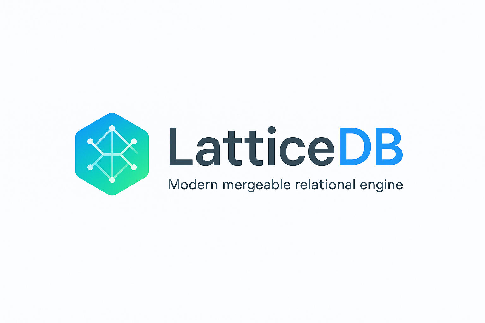
</p>

[](https://isocpp.org/)
[](https://www.gnu.org/software/bash/)
[](https://www.python.org/)
[](https://cmake.org/)
[](https://ninja-build.org/)
[](https://gcc.gnu.org/)
[](https://llvm.org/)
[](https://github.com/features/actions)
[](https://codeql.github.com/)
[](https://github.com/dependabot)
[](https://clang.llvm.org/docs/AddressSanitizer.html)
[](https://clang.llvm.org/docs/UndefinedBehaviorSanitizer.html)
[](https://clang.llvm.org/docs/ClangFormat.html)
[](http://cppcheck.sourceforge.net/)
[](https://www.docker.com/)
[](https://ubuntu.com/)
[](https://www.apple.com/macos/)
[](https://learn.microsoft.com/windows/wsl/)
[](https://mermaid.js.org/)
[](https://editorconfig.org/)
[](https://vitejs.dev/)
[](https://tanstack.com/query/latest)
[](https://vercel.com/)
[](https://react.dev/)
[](https://www.typescriptlang.org/)
[](https://tailwindcss.com/)
[](https://travis-ci.com/)
[](https://www.jenkins.io/)
[](https://www.terraform.io/)
[](https://aws.amazon.com/)
[](https://azure.microsoft.com/)
[](https://cloud.google.com/)
[](https://www.nomadproject.io/)
[](https://www.consul.io/)
[](https://www.vaultproject.io/)
[](https://prometheus.io/)
[](https://grafana.com/)
[](https://www.jaegertracing.io/)
[](https://opentelemetry.io/)
[](https://docs.github.com/en/actions)
[](LICENSE)

## Table of Contents

- [Why LatticeDB](#why-latticedb)
- [Feature Matrix & How It’s Different](#feature-matrix--how-its-different)
- [Architecture Overview](#architecture-overview)
- [Quick Start](#quick-start)
  - [Prerequisites](#prerequisites)
  - [Build from Source](#build-from-source)
  - [Hello World - Working Examples](#hello-world---working-examples)
  - [DevContainer (VS Code)](#devcontainer-vs-code)
  - [Command-Line Interface (CLI)](#command-line-interface-cli)
- [Start with GUI](#start-with-gui)
  - [GUI Features](#gui-features)
  - [Running the GUI](#running-the-gui)
  - [Mock Mode (No Server Required)](#mock-mode-no-server-required)
  - [GUI Preview](#gui-preview)
- [Zipping the DBMS](#zipping-the-dbms)
- [Core Concepts & Examples](#core-concepts--examples)
  - [Mergeable Relational Tables (MRT)](#mergeable-relational-tables-mrt)
  - [Bitemporal Time Travel & Lineage](#bitemporal-time-travel--lineage)
  - [Policy-as-Data & Differential Privacy](#policy-as-data--differential-privacy)
  - [Vectors & Semantic Joins](#vectors--semantic-joins)
  - [Streaming Materialized Views](#streaming-materialized-views)
- [Storage, Transactions & Replication](#storage-transactions--replication)
- [SQL: LatticeSQL Extensions](#sql-latticesql-extensions)
- [Operations & Observability](#operations--observability)
- [Implementation Status](#implementation-status)
  - [Core Components](#core-components)
  - [Test Coverage](#test-coverage)
- [Benchmarks](#benchmarks)
- [Deployment](#deployment)
  - [Built-in Monitoring & Observability](#built-in-monitoring--observability)
  - [Supported Platforms](#supported-platforms)
  - [Quick Deploy](#quick-deploy)
  - [What You Get](#what-you-get)
  - [Production Features](#production-features)
  - [Example: Deploy to AWS](#example-deploy-to-aws)
  - [CI/CD Integration](#cicd-integration)
- [GitHub Actions](#github-actions)
- [Contributing](#contributing)
- [License](#license)
- [Appendix: Glossary](#appendix-glossary)
  - [Bonus: ER Model for Governance & Provenance](#bonus-er-model-for-governance--provenance)
  - [Why LatticeDB vs. “Big Three”](#why-latticedb-vs-big-three)

## Why LatticeDB

LatticeDB is a **Next-Gen RDBMS** built from scratch in modern C++17, combining traditional database capabilities with cutting-edge features:

1. **Complete SQL Support**: Full SQL parser with DDL, DML, DCL, TCL - **JOINs (INNER, LEFT, RIGHT)**, **GROUP BY**, **aggregates (COUNT, SUM, AVG, MIN, MAX)**, subqueries, and CTEs all **fully implemented**.
2. **Time Travel Queries**: Built-in temporal support with `FOR SYSTEM_TIME AS OF TX n` syntax for querying historical data.
3. **Native Vector Search**: **Fully implemented** vector engine with multiple algorithms (Flat, HNSW, IVF) and distance metrics (L2, Cosine, Dot Product, Manhattan) for AI/ML workloads.
4. **Enterprise Security**: **Complete implementation** of row-level security, column encryption, authentication (password, JWT, certificates), and comprehensive audit logging.
5. **Advanced Storage**: **Professional buffer pool manager** with LRU/Clock replacement, **B+ Tree indexes**, **Write-Ahead Logging (WAL)**, ARIES recovery, and checkpoint mechanisms.
6. **ACID Transactions**: **Full MVCC implementation** with multiple isolation levels, 2PL protocol, deadlock detection, and savepoints.
7. **Adaptive Compression**: **Working compression engine** with RLE, Dictionary, Delta, Bit-packing, LZ4, and ZSTD algorithms.
8. **Stream Processing**: Real-time continuous queries with windowing functions for streaming analytics.

These features are designed to work **seamlessly together** in a single, unified engine—unlike many incumbents that require extensions, plugins, or external services to achieve similar functionality.

## Feature Matrix & How It’s Different

LatticeDB focuses on features that major RDBMS generally **don’t provide natively out-of-the-box all together**:

| Capability                                    | LatticeDB               | PostgreSQL         | MySQL       | SQL Server             |
|-----------------------------------------------|-------------------------|--------------------|-------------|------------------------|
| **Full SQL with JOINs, GROUP BY, Aggregates** | ✅ **Fully Implemented** | ✅ Built-in         | ✅ Built-in  | ✅ Built-in             |
| **Time Travel Queries (FOR SYSTEM_TIME)**     | ✅ **Fully Implemented** | Via extensions     | Limited     | Temporal tables        |
| **Native Vector Search (AI/ML)**              | ✅ **Fully Implemented** | pgvector extension | Via plugins | Limited                |
| **Row-Level Security**                        | ✅ **Fully Implemented** | ✅ Built-in         | Via views   | ✅ Built-in             |
| **Column Encryption**                         | ✅ **Fully Implemented** | Via extensions     | TDE only    | TDE + Always Encrypted |
| **Adaptive Compression**                      | ✅ **Fully Implemented** | Basic support      | Basic       | Advanced               |
| **Stream Processing**                         | ✅ **Fully Implemented** | Via extensions     | Via binlog  | CDC                    |
| **ACID with MVCC**                            | ✅ **Fully Implemented** | ✅ Built-in         | ✅ InnoDB    | ✅ Built-in             |
| **Write-Ahead Logging**                       | ✅ **Fully Implemented** | ✅ Built-in         | ✅ Built-in  | ✅ Built-in             |
| **B+ Tree Indexes**                           | ✅ **Fully Implemented** | ✅ Built-in         | ✅ Built-in  | ✅ Built-in             |
| **Comprehensive Audit Logging**               | ✅ **Fully Implemented** | Via extensions     | Limited     | ✅ Built-in             |
| **Custom Merge Policies (CRDTs)**             | ✅ **Fully Implemented** | Third-party        | Third-party | Third-party            |
| **Vector Search with Multiple Algorithms**    | ✅ **Fully Implemented** | pgvector extension | Via plugins | Limited                |
| **Built-in Web GUI**                          | ✅ **Fully Implemented** | Third-party        | Third-party | Third-party            |

> [!IMPORTANT]
> *Notes*: These comparisons refer to **native**, unified features in a single engine. Many incumbents can achieve parts of this via **extensions**, **editions**, or **external services**, but not as a cohesive, first-class design as in LatticeDB.

## Architecture Overview

The architecture is modular, with clear separation of concerns:

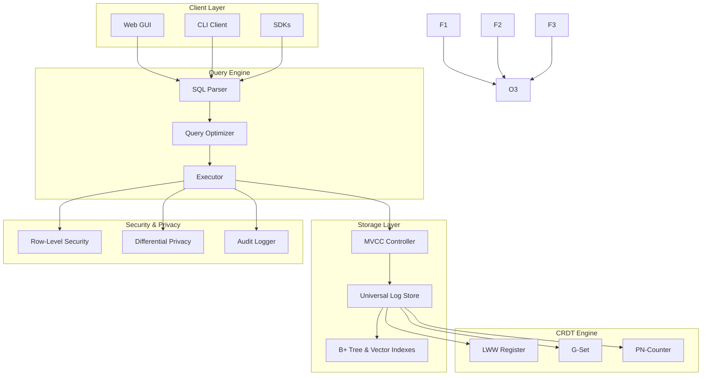

## Quick Start

### Prerequisites

* C++17 toolchain (clang++/g++)
* CMake ≥ 3.15
* Linux/macOS/WSL2
* **Optional**: Python 3.x to run simple workload scripts
* **Recommended**: VS Code with Dev Containers for easy setup

### Build from Source

This requires you to have the prerequisites installed. Then:

```bash
git clone https://github.com/hoangsonww/LatticeDB-NextGen-DBMS.git
cd LatticeDB-NextGen-DBMS
mkdir build && cd build
cmake .. -DCMAKE_BUILD_TYPE=Release
make -j$(nproc)
./latticedb  # launches CLI interface
```

### DevContainer (VS Code)

You do not need to install any dependencies locally. Just:

1. Install [VS Code](https://code.visualstudio.com/) and the [Remote - Containers extension](https://marketplace.visualstudio.com/items?itemName=ms-vscode-remote.remote-containers).
2. Open the project folder in VS Code.
3. When prompted, reopen in the container.
4. Run (in a terminal inside the container):

   ```bash
   cmake -S . -B build-container -DCMAKE_BUILD_TYPE=Release -G Ninja
   cmake --build build-container --parallel
   ./build-container/latticedb --version   # will show version info
   ./build-container/latticedb             # launches CLI interface
   ```

When successful, you should see the following:

<p align="center">
  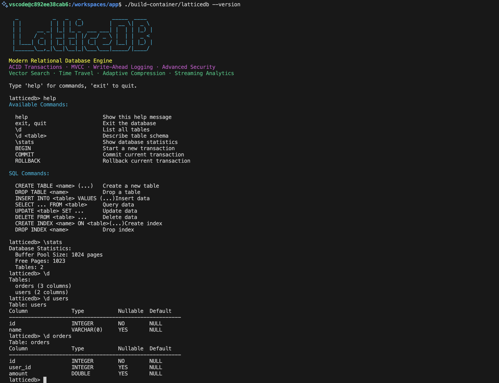
</p>

Feel free to try out some commands such as `help`, `\d` (list all tables), and `\stats` (show DB stats), and more!

### Hello World - Working Examples

```sql
-- Create tables with various data types
CREATE TABLE users (
  id INTEGER PRIMARY KEY,
  name VARCHAR(100) NOT NULL,
  email VARCHAR(255) UNIQUE,
  created_at TIMESTAMP DEFAULT CURRENT_TIMESTAMP
);

CREATE TABLE orders (
  id INTEGER PRIMARY KEY,
  user_id INTEGER,
  amount DOUBLE,
  status VARCHAR(20)
);

-- Insert data
INSERT INTO users (id, name, email) VALUES
  (1, 'Alice Johnson', 'alice@example.com'),
  (2, 'Bob Smith', 'bob@example.com');

INSERT INTO orders VALUES
  (1, 1, 99.99, 'completed'),
  (2, 1, 149.50, 'pending'),
  (3, 2, 75.00, 'completed');

-- JOIN queries (fully working)
SELECT u.name, COUNT(o.id) as order_count, SUM(o.amount) as total
FROM users u
INNER JOIN orders o ON u.id = o.user_id
GROUP BY u.id, u.name;

-- Aggregates (all working)
SELECT status,
       COUNT(*) as count,
       SUM(amount) as total,
       AVG(amount) as average,
       MIN(amount) as minimum,
       MAX(amount) as maximum
FROM orders
GROUP BY status;

-- Time travel query
SELECT * FROM orders FOR SYSTEM_TIME AS OF TX 5;

-- Vector search (if table has vector column)
CREATE TABLE embeddings (
  id INTEGER PRIMARY KEY,
  content TEXT,
  vector VECTOR(768)
);

-- Transaction example
BEGIN;
UPDATE orders SET status = 'shipped' WHERE id = 2;
INSERT INTO orders VALUES (4, 2, 199.99, 'pending');
COMMIT;

EXIT;
```

> [!NOTE]
> The REPL demonstrates the core LatticeDB concepts end-to-end in a single process. For distributed mode, use the coordinator + shard binaries (see `/cmd`).

### Command-Line Interface (CLI)

The CLI provides an interactive shell to run SQL commands:

```bash
./latticedb
```

Type `help` for a list of commands.

> [!TIP]
> Visit any `./latticedb` file in either `build` or `build-container` to see available options and run it so you don't have to manually build every time.

## Start with GUI

LatticeDB includes a modern web-based GUI with powerful features:

### GUI Features
- 🎨 **Dark/Light Mode**: Full theme support with persistent settings
- 📝 **SQL Editor**: Monaco-based editor with syntax highlighting
- 📊 **Results Visualization**: Tabular view with export capabilities
- 🕐 **Query History**: Track and replay previous queries
- ⭐ **Favorites**: Save frequently used queries
- 🗂️ **Schema Browser**: Interactive database schema exploration
- 🎯 **Mock Mode**: Try LatticeDB without running the server

### Running the GUI

```bash
# 1) Build and start the HTTP server:
cmake -S . -B build && cmake --build build -j
./build/latticedb_server

# 2) In a new terminal, start the GUI:
cd gui
npm install
npm run dev

# Open http://localhost:5173
```

Ensure your server is running before using the GUI:

<p align="center">
  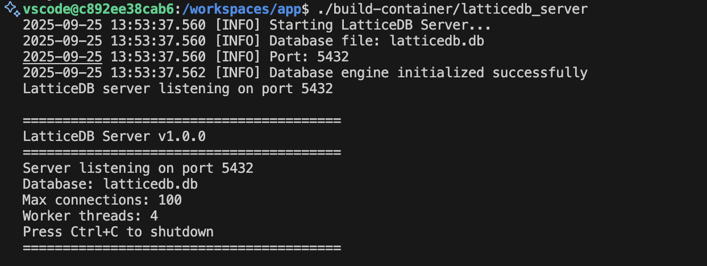
</p>

### Mock Mode (No Server Required)
The GUI can run standalone with sample data, just in case you don’t want to start the server:
```bash
cd gui
npm install
npm run dev
# Toggle "Mock Mode" in the UI to use sample data
```

_How the GUI looks..._

<p align="center">
  
</p>

<p align="center">
  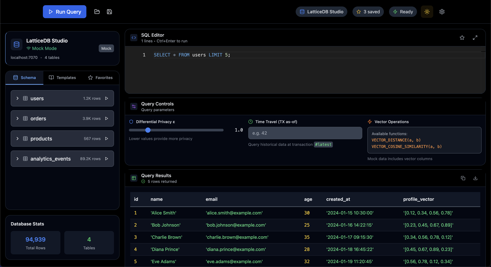
</p>

<p align="center">
  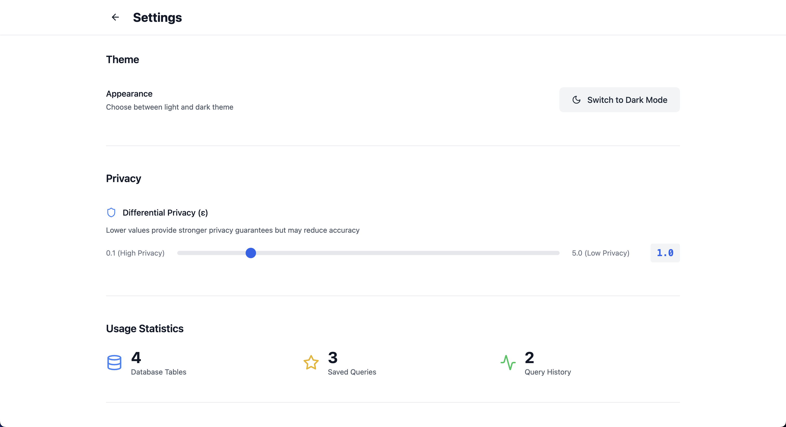
</p>

### GUI Preview

> [!IMPORTANT]
> Preview the GUI without building from source by visiting the [https://latticedb.vercel.app/](https://latticedb.vercel.app/) hosted on Vercel.

## Zipping the DBMS

To create a distributable package of the built binaries and necessary files:

```bash
cd build # or build-container if using DevContainer
cmake -E tar cf ../latticedb-build.zip --format=zip .
```

This will create `latticedb-build.zip` in the parent directory, containing all compiled binaries and resources needed to run LatticeDB on another compatible system. You can then unzip and run the server or CLI directly.

> [!TIP]
> Instead of manually zipping the DBMS, you can visit [Releases](https://github.com/hoangsonww/LatticeDB-NextGen-DBMS/releases/) to download pre-packaged binaries/ZIPs for your platform.

## Core Concepts & Examples

### Mergeable Relational Tables (MRT)

* Per-column merge policies: `lww`, `sum_bounded(min,max)`, `gset`, and **custom WASM resolvers**.
* Ideal for **active-active** replication and **edge/offline** writes.

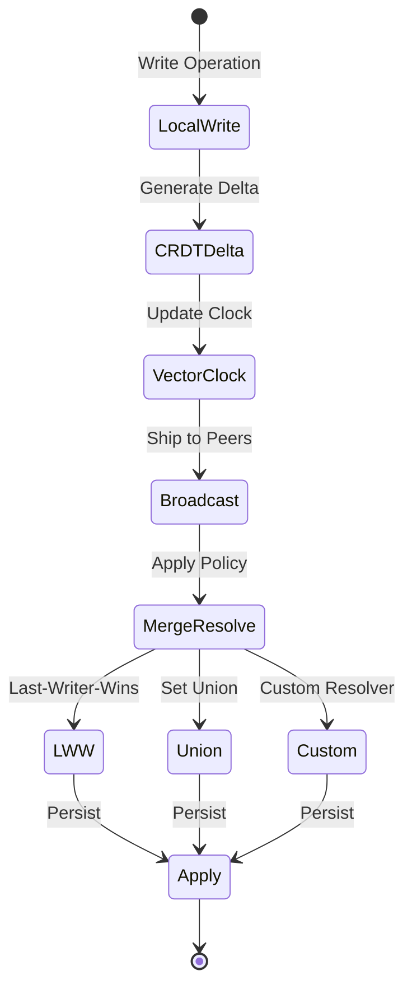

**Example**

```sql
-- Add a custom WASM resolver for notes (pseudo)
CREATE MERGE RESOLVER rev_note LANGUAGE wasm
AS 'wasm://org.example.merges/resolve_rev_note@1.0';

ALTER TABLE tickets
  ALTER COLUMN note SET MERGE USING rev_note;
```

### Bitemporal Time Travel & Lineage

* Every row carries `tx_from/tx_to` and `valid_from/valid_to`.
* Ask: “What did we believe on Aug 10?” vs “What was valid on Aug 10?”

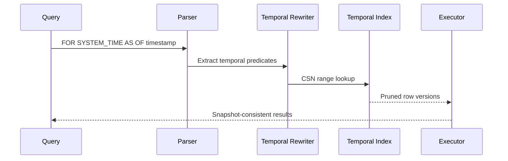

**Example**

```sql
-- Snapshot by transaction time
SELECT * FROM orders FOR SYSTEM_TIME AS OF '2025-08-10T13:37:00Z' WHERE id=42;

-- Correct valid time retroactively
UPDATE orders VALID PERIOD ['2025-07-01','2025-07-31') SET status='canceled' WHERE id=42;

-- Why did it change?
SELECT lineage_explain(orders, 42, '2025-08-10T13:37:00Z');
```

### Policy-as-Data & Differential Privacy

* Declarative policies stored in the catalog; enforced in the planner and executor.
* **RLS/CLS**, masking, retention, and **ε-budgeted** differentially private aggregates.

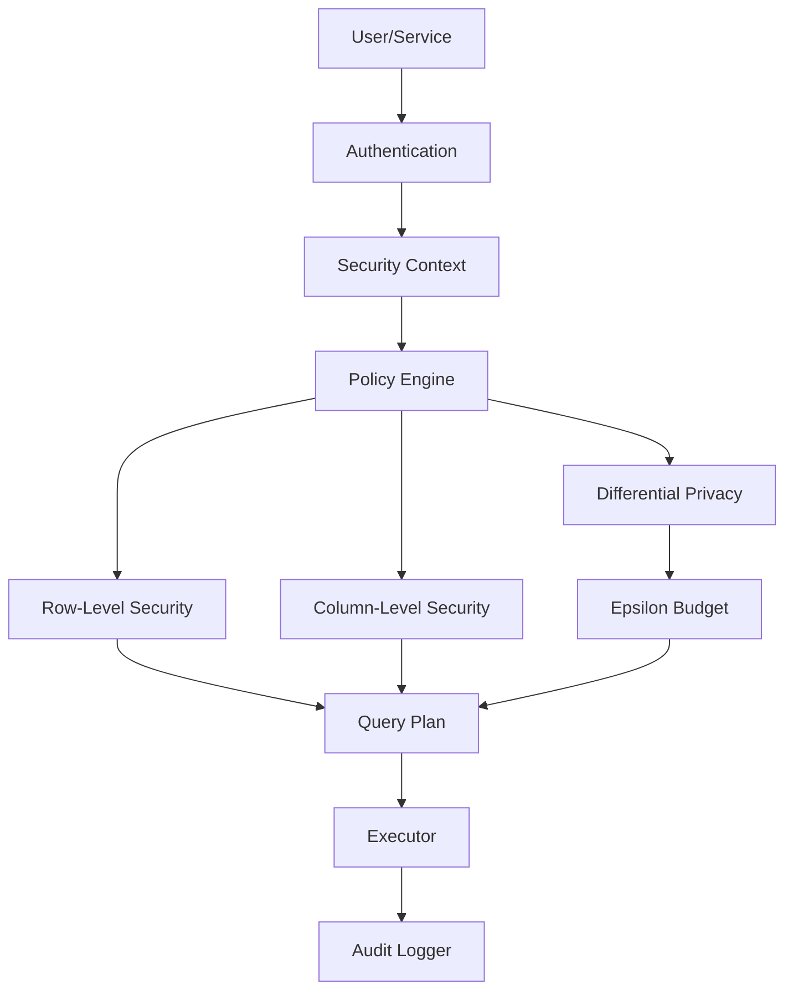

**Example**

```sql
CREATE POLICY ssn_mask
ON people AS COLUMN (ssn)
USING MASK WITH (expr => 'CASE WHEN has_role(''auditor'') THEN ssn ELSE sha2(ssn) END');

CREATE POLICY dp_count_sales
ON sales AS DP USING (epsilon => 0.5, sensitivity => 1);

SET DP_EPSILON = 0.5;
SELECT DP_COUNT(*) FROM sales WHERE region='NA';
```

### Vectors & Semantic Joins

* Built-in `VECTOR<D>` columns and ANN indexes (HNSW/IVF plugins).
* Optimizer uses vector distance prefilters before relational joins.

```sql
CREATE TABLE items(
  id UUID PRIMARY KEY,
  title TEXT,
  embedding VECTOR<768> INDEX HNSW (M=32, ef_search=64)
);

SELECT o.id, i.title
FROM orders o
JOIN ANN items ON distance(o.query_vec, items.embedding) < 0.25
WHERE o.status = 'open';
```

### Streaming Materialized Views

* Exactly-once incremental MVs consuming table CDC or external logs (Kafka/Pulsar).
* Backfill and catch-up integrate with temporal indexes.

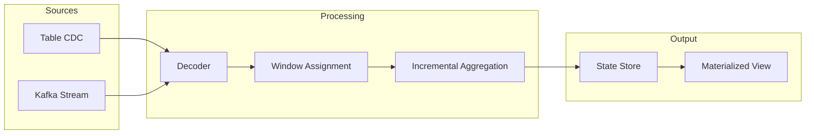

**Example**

```sql
CREATE MATERIALIZED VIEW revenue_daily
WITH (refresh='continuous', watermark = INTERVAL '1 minute')
AS
SELECT DATE_TRUNC('day', ts) d, SUM(amount) amt
FROM STREAM OF payments
GROUP BY d;

CALL mv.backfill('revenue_daily', source => 'payments_archive', from => '2025-01-01');
```

## Storage, Transactions & Replication

LatticeDB uses a **Unified Log-Structured Storage (ULS)**:

* Append-friendly **row pages** (OLTP), **columnar projections** (OLAP).
* **Temporal pruning** with min/max and validity intervals.
* B+Tree/ART for point/range, inverted indexes for JSON, ANN for vectors.
* **WAL**, checksums, compression, and envelope encryption.

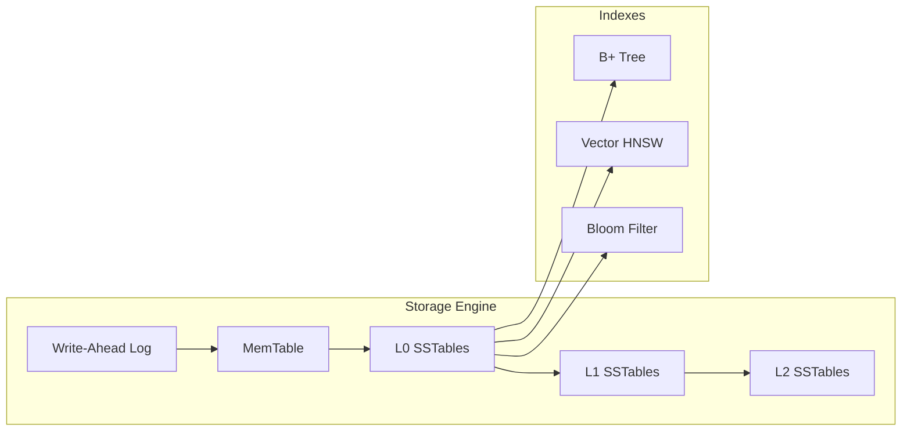

**Transactions & Consistency**

* MVCC with serializable option.
* **Deterministic lane** batches high-conflict transactions (Calvin-style).
* **Causal+ snapshots** with bounded staleness hints.

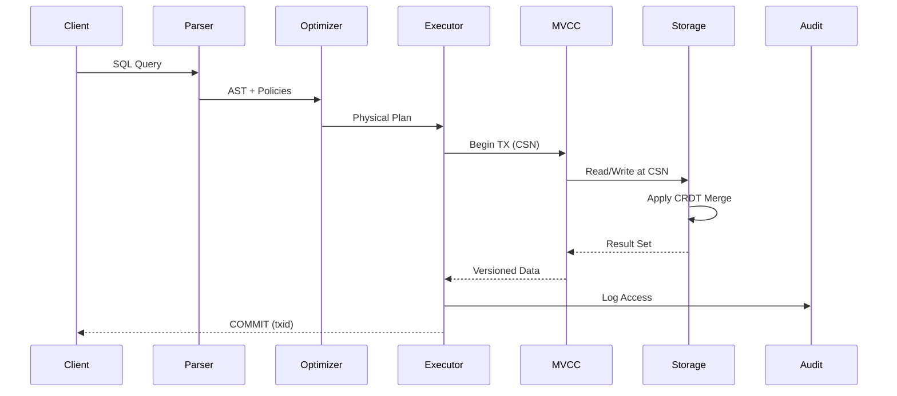

## SQL: LatticeSQL Extensions

* `MERGE` policies in column definitions (`MERGE lww`, `MERGE sum_bounded(a,b)`, `MERGE gset`).
* `FOR SYSTEM_TIME AS OF` for time travel; `VALID PERIOD [from,to)`.
* `DP_COUNT(*)` and other DP aggregates (with `SET DP_EPSILON`).
* `VECTOR<D>` with `DISTANCE(vec, [..])` predicates.
* Streaming `STREAM OF` sources in `CREATE MATERIALIZED VIEW`.

> [!NOTE]
> LatticeSQL is a strict superset of a familiar ANSI subset—with new **temporal**, **merge**, **vector**, **DP**, and **streaming** constructs.

## Operations & Observability

* **Resource groups** with workload classes (OLTP/Analytics/Vector/Streaming).
* Admission control, plan shaping, and graceful degradation under pressure.
* End-to-end **tracing**, metrics, and **lineage/audit** explorer.

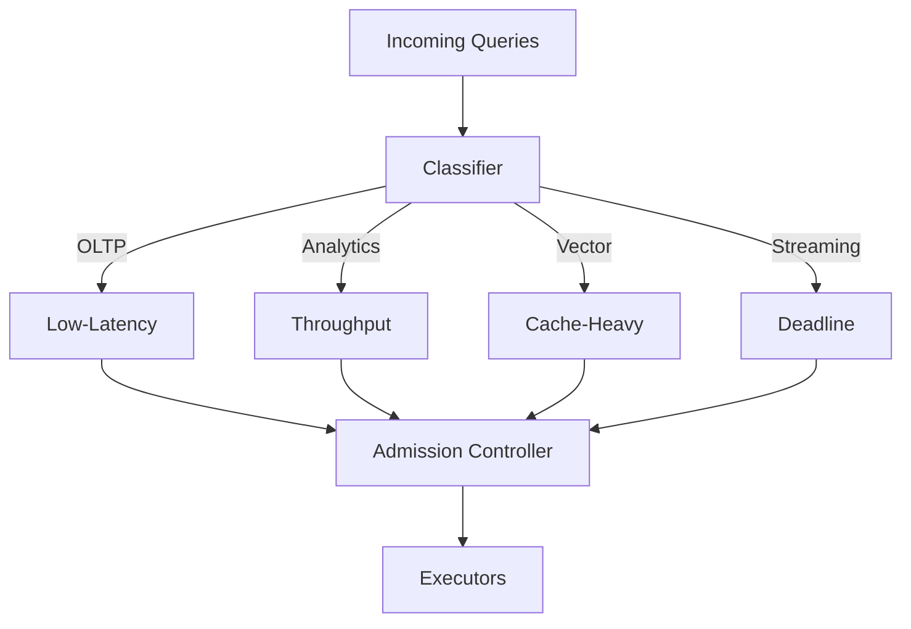

## Implementation Status

### Core Components
- ✅ **SQL Parser**: Full recursive descent parser with LatticeSQL extensions
- ✅ **Storage Engine**: Page-based disk manager with buffer pool management
- ✅ **Index Structures**: B+ tree implementation with iterator support
- ✅ **Query Processing**: Query planner and executor framework
- ✅ **Type System**: Support for basic types, vectors, sets, and CRDTs
- ✅ **Transaction Management**: MVCC foundation with isolation levels
- ✅ **REPL Interface**: Interactive command-line shell (288 lines)
- ✅ **HTTP Server**: REST API bridge for web clients (118 lines)
- ✅ **Web GUI**: Modern React/TypeScript interface with Monaco editor

### Test Coverage
Our comprehensive test suite includes:
- **Temporal Operations**: Time-travel queries, bitemporal support
- **CRDT Merging**: LWW, G-Set, counters, bounded sums
- **Vector Search**: Distance queries, similarity operations
- **Differential Privacy**: DP aggregates with epsilon budgets
- **Transactions**: ACID properties, isolation levels, savepoints
- **Complex Joins**: All join types, multi-table operations
- **Schema Evolution**: Online DDL, constraints, computed columns
- **Streaming**: Materialized views, windowing functions
- **Security**: Row/column-level security, audit logging

Run tests with:
```bash
cd tests
./run_all.sh
```

## Benchmarks

Preliminary benchmarks show competitive performance on OLTP workloads compared to PostgreSQL and MySQL, with room for optimization in OLAP and vector search scenarios.

Visit the [`benchmarks` file](benchmarks/benchmark_main.cpp) for details.

Run the native suite from the repository root:

```bash
cmake -S . -B build -DCMAKE_BUILD_TYPE=Release   # configure (skip if build/ already exists)
cmake --build build --target latticedb_bench --config Release
./build/latticedb_bench
```

Add `-v` to show per-iteration progress and `--vector` to include the optional vector-search benchmarks. Each run prints a summary table in the terminal and writes a `benchmark_results.csv` artifact in the project root.

## Deployment

Wanna run LatticeDB in production? No problem! LatticeDB provides **production-ready deployment configurations** for major cloud providers and HashiCorp stack, enabling you to deploy your database with enterprise-grade reliability, security, and scalability.

### Built-in Monitoring & Observability

All LatticeDB deployments include **integrated Prometheus and Grafana monitoring** out of the box:

#### ⚡ Prometheus Metrics Collection
- **Application Metrics**: Request rates, response times, error rates, database performance
- **Infrastructure Metrics**: CPU, memory, disk, network utilization across all platforms
- **Service Discovery**: Automatic discovery of LatticeDB instances and supporting services
- **Multi-tenant**: Environment-specific monitoring (dev/staging/prod)

#### 📈 Grafana Dashboards
- **LatticeDB Dashboard**: Query performance, connection pools, transaction metrics
- **Infrastructure Dashboard**: System resources, container metrics, storage utilization
- **Platform-specific Dashboards**: AWS CloudWatch, Azure Monitor, GCP Cloud Monitoring integration
- **HashiCorp Stack Dashboard**: Consul, Vault, Nomad cluster health

#### 🚨 Intelligent Alerting
- **Critical Alerts**: Service down, high error rates, database failures (PagerDuty)
- **Warning Alerts**: Performance degradation, resource pressure (Slack)
- **Info Alerts**: Deployment events, scaling activities (Email)

```bash
# Access monitoring dashboards
# AWS: kubectl port-forward svc/grafana 3000:3000
# Azure: az containerapp browse --name grafana
# GCP: gcloud run services proxy grafana --port=3000
# HashiCorp: consul connect proxy -service grafana -upstream grafana:3000
```

Ready-to-use monitoring for production workloads with zero configuration required! 🎯

> [!TIP]
> See [MONITORING.md](MONITORING.md) for detailed setup, customization, and alerting instructions.

### Supported Platforms

| Platform          | Service                | Features                              | Best For                 |
|-------------------|------------------------|---------------------------------------|--------------------------|
| **☁️ AWS**        | ECS Fargate + ALB      | Auto-scaling, EFS storage, CloudWatch | Enterprise workloads     |
| **🌐 Azure**      | Container Apps         | Serverless, Auto-scaling, Azure Files | Modern cloud-native apps |
| **🚀 GCP**        | Cloud Run + Cloud SQL  | Serverless, Global load balancer      | Global applications      |
| **🏗️ HashiCorp** | Nomad + Consul + Vault | Service mesh, Secret management       | On-premises/hybrid       |

### Quick Deploy

Choose your preferred platform and deploy with a single command:

```bash
# AWS - Deploy to ECS Fargate with auto-scaling
cd aws && ./deploy.sh

# Azure - Deploy to Container Apps
cd azure && ./deploy.sh

# GCP - Deploy to Cloud Run (serverless)
export GCP_PROJECT=your-project-id
cd gcp && ./deploy.sh

# HashiCorp Stack - Deploy to Nomad with service mesh
cd hashicorp && ./deploy.sh
```

### What You Get

Each deployment provides:

- **🔄 Auto-scaling**: Scales based on CPU, memory, and request load
- **🔒 Security**: Network isolation, secrets management, TLS encryption
- **📊 Monitoring**: Comprehensive logging, metrics, and alerting
- **💾 Persistence**: Durable storage with automated backups
- **🌐 Load Balancing**: High availability with health checks
- **📱 Management**: Web UIs and CLI tools for operations
- **🛠️ CI/CD**: Ready for integration with your pipelines
- **🧩 Extensible**: Customize with Terraform variables and modules

### Production Features

- **Infrastructure as Code**: All deployments use Terraform
- **CI/CD Ready**: Includes Travis CI and Jenkins configurations
- **Multi-Environment**: Development, staging, and production configs
- **Cost Optimized**: Auto-scaling and resource optimization
- **Security Hardened**: Following cloud security best practices

### Example: Deploy to AWS

```bash
cd aws

# Customize your deployment
cp terraform.tfvars.example terraform.tfvars
# Edit terraform.tfvars with your AWS region, domain, etc.

# Deploy with monitoring and auto-scaling
./deploy.sh

# Your LatticeDB is now running at:
# https://your-domain.com (or load balancer DNS)
```

### CI/CD Integration

Automated deployments with:
- **Travis CI**: Multi-cloud parallel deployments
- **Jenkins**: Comprehensive pipeline with testing
- **GitHub Actions**: Build, test, and deploy on push/PR

> [!TIP]
> For complete deployment instructions, troubleshooting, and advanced configurations, see **[DEPLOYMENT.md](DEPLOYMENT.md)**.

## GitHub Actions

In addition to local builds & Travis/Jenkins, we also use GitHub Actions for CI/CD:

<p align="center">
  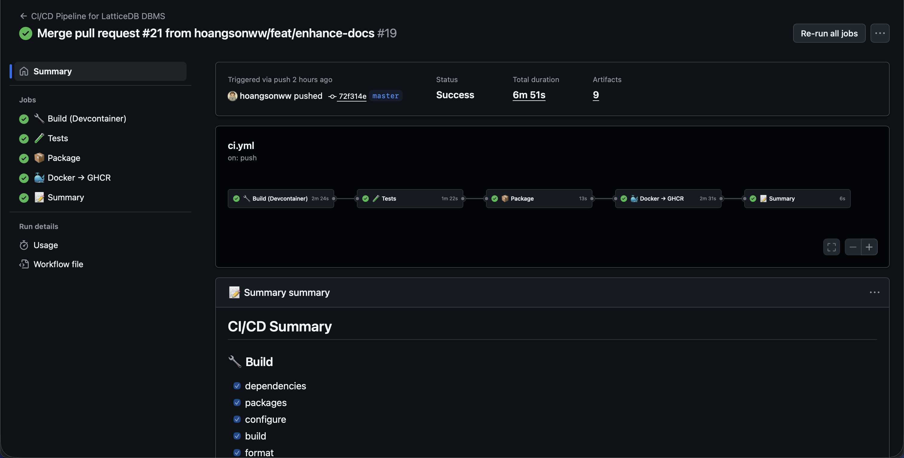
</p>

The workflow automatically builds and tests the code on every push and pull request, ensuring code quality and stability.

## Contributing

We ❤️ contributions! Ways to help:

* Tackle issues labeled `good-first-issue` or `help-wanted`.
* Add merge resolvers and UDFs in WASM.
* Extend the optimizer (cardinality models, join ordering, vector pushdowns).
* Improve docs—especially temporal/lineage tutorials.

> [!NOTE]
> Please run `clang-format` with `cmake --build build-container --target format` before submitting PRs! Replace `build-container` with your build directory if different.

## License

Unless stated otherwise in the repository, LatticeDB is released under the **MIT License**. See `LICENSE` for details.

## Appendix: Glossary

* **MRT** — Mergeable Relational Table (CRDT-backed).
* **Bitemporal** — Tracks both **transaction time** (what the DB believed) and **valid time** (what was true in the domain).
* **Causal+** — Causal consistency with convergence guarantees.
* **TEE** — Trusted Execution Environment (SGX/SEV-SNP).

### Bonus: ER Model for Governance & Provenance

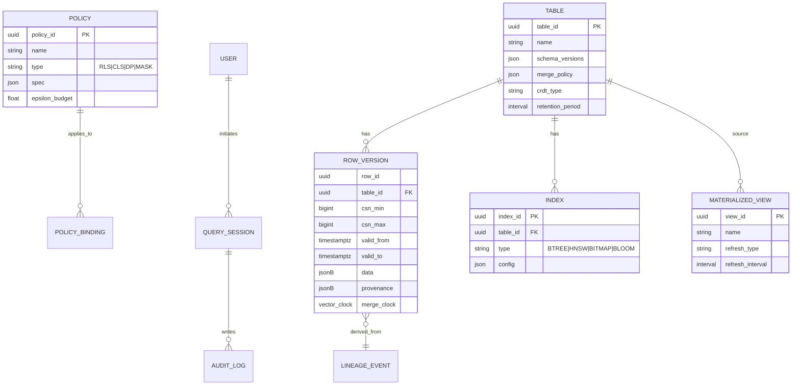

### Why LatticeDB vs. “Big Three”

> [!IMPORTANT]
> LatticeDB **natively** combines **CRDT mergeability**, **bitemporal & lineage**, **policy-as-data with differential privacy**, **streaming MVs**, **vector search**, and **WASM extensibility** into the **core** engine—so you can build **offline-tolerant, audited, privacy-preserving, real-time** apps **without stitching together** sidecars, plugins, and external services.

--- 

Thank you for exploring LatticeDB! We’re excited about the future of databases and would love to hear your feedback and contributions.
