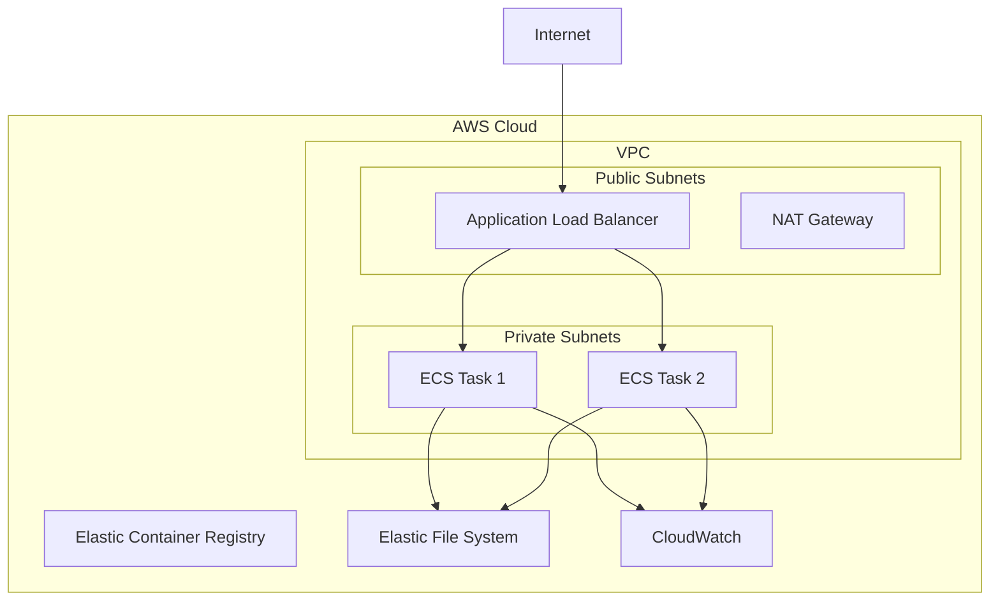

# LatticeDB AWS Deployment

Deploy LatticeDB to AWS using ECS Fargate with auto-scaling, load balancing, and persistent storage.

## Architecture



## Features

- **🚀 Serverless**: ECS Fargate - no server management required
- **📈 Auto-scaling**: Scales from 1-10 instances based on CPU/memory
- **💾 Persistent Storage**: EFS for durable data storage
- **🔒 Security**: VPC with private subnets, security groups
- **📊 Monitoring**: CloudWatch logs, metrics, and alarms
- **🌐 Load Balancing**: Application Load Balancer with health checks
- **💰 Cost Optimized**: Spot capacity and auto-scaling for cost savings

## Prerequisites

- AWS CLI configured with appropriate permissions
- Terraform >= 1.6.0
- Docker for building images

## Quick Start

```bash
# 1. Copy configuration template
cp terraform.tfvars.example terraform.tfvars

# 2. Edit configuration
vim terraform.tfvars

# 3. Deploy
./deploy.sh
```

## Configuration

### Basic Configuration

```hcl
# terraform.tfvars
aws_region = "us-west-2"
project_name = "latticedb"
environment = "production"

# Container specs
container_cpu = 1024     # 1 vCPU
container_memory = 2048  # 2GB RAM

# Scaling
desired_count = 2
min_capacity = 1
max_capacity = 10

# Storage
enable_efs = true
```

### Advanced Configuration

```hcl
# Custom domain (requires ACM certificate)
domain_name = "latticedb.example.com"
certificate_arn = "arn:aws:acm:us-west-2:123456789012:certificate/..."
route53_zone_id = "Z123456789012345678901"

# Security
allowed_cidr_blocks = ["10.0.0.0/8"]

# Monitoring
enable_monitoring = true
notification_email = "admin@example.com"

# Backup
enable_backup = true
backup_retention_days = 30
```

## Commands

### Deployment Commands

```bash
# Deploy infrastructure and application
./deploy.sh

# Update application only (faster)
./deploy.sh update

# Destroy all resources
./deploy.sh cleanup

# Show help
./deploy.sh help
```

### Management Commands

```bash
# View service status
aws ecs describe-services --cluster latticedb-production --services latticedb-production

# Scale service
aws ecs update-service \
  --cluster latticedb-production \
  --service latticedb-production \
  --desired-count 5

# View logs
aws logs tail /ecs/latticedb-production --follow

# Get service URL
terraform output application_url
```

## Monitoring

### CloudWatch Dashboard

The deployment automatically creates CloudWatch dashboards for:
- CPU and memory utilization
- Request count and latency
- Error rates and health checks
- Auto-scaling events

### Logs

```bash
# View recent logs
aws logs tail /ecs/latticedb-production --follow --format short

# Filter logs
aws logs filter-log-events \
  --log-group-name /ecs/latticedb-production \
  --start-time 1640995200000 \
  --filter-pattern "ERROR"
```

### Metrics

Key metrics monitored:
- `CPUUtilization` - Average CPU usage across tasks
- `MemoryUtilization` - Average memory usage across tasks
- `TargetResponseTime` - Response time from load balancer
- `HealthyHostCount` - Number of healthy tasks

## Storage

### EFS (Elastic File System)

- **Path**: `/var/lib/latticedb` (mounted in container)
- **Performance**: General Purpose with provisioned throughput
- **Backup**: AWS Backup with 7-day retention
- **Encryption**: Encrypted at rest and in transit

### Database Options

#### Option 1: SQLite with EFS (Default)
```bash
# Uses SQLite database stored on EFS
DATABASE_URL=sqlite:///var/lib/latticedb/lattice.db
```

#### Option 2: RDS PostgreSQL
```hcl
# Add to terraform.tfvars
enable_rds = true
database_instance_class = "db.t3.micro"
```

## Security

### Network Security
- VPC with public and private subnets
- Security groups with minimal required ports
- NAT Gateway for outbound internet access from private subnets

### Access Control
- IAM roles with least privilege access
- ECS task execution role for AWS service access
- Container registries with image scanning

### Encryption
- EFS encrypted at rest with AWS KMS
- ALB with TLS termination
- All data in transit encrypted

## Cost Optimization

### Right-sizing
```hcl
# Development environment
container_cpu = 256      # 0.25 vCPU
container_memory = 512   # 0.5GB
desired_count = 1
min_capacity = 0         # Scale to zero
```

### Spot Instances
```hcl
# Use Spot capacity for cost savings (non-production)
capacity_provider_strategy {
  capacity_provider = "FARGATE_SPOT"
  weight = 100
}
```

### Monitoring Costs
- Use AWS Cost Explorer
- Set up billing alerts
- Monitor EFS usage and optimize file lifecycle

## Troubleshooting

### Common Issues

#### 1. Task Health Check Failures
```bash
# Check task logs
aws logs tail /ecs/latticedb-production --follow

# Check health endpoint
curl -f https://your-alb-url/health
```

#### 2. Auto-scaling Issues
```bash
# Check scaling policies
aws application-autoscaling describe-scaling-policies \
  --service-namespace ecs \
  --resource-id service/latticedb-production/latticedb-production

# View scaling activities
aws application-autoscaling describe-scaling-activities \
  --service-namespace ecs \
  --resource-id service/latticedb-production/latticedb-production
```

#### 3. EFS Mount Issues
```bash
# Check EFS mount targets
aws efs describe-mount-targets --file-system-id fs-12345678

# Verify security groups allow NFS (port 2049)
```

### Getting Help

1. Check CloudWatch logs for application errors
2. Review AWS service quotas and limits
3. Verify IAM permissions and roles
4. Test connectivity from ECS tasks to dependencies

## Advanced Features

### Blue/Green Deployments
```bash
# Deploy new version with zero downtime
IMAGE_TAG=v2.0.0 ./deploy.sh update
```

### Custom Metrics
```bash
# Publish custom metrics to CloudWatch
aws cloudwatch put-metric-data \
  --namespace LatticeDB \
  --metric-data MetricName=CustomMetric,Value=123
```

### SSL/TLS Configuration
```bash
# Request ACM certificate
aws acm request-certificate \
  --domain-name latticedb.example.com \
  --validation-method DNS

# Update Route53 records for validation
```

## Environment Variables

The following environment variables are available in the container:

| Variable | Description | Default |
|----------|-------------|---------|
| `LATTICEDB_ENV` | Environment name | `production` |
| `LATTICEDB_LOG_LEVEL` | Log level | `info` |
| `PORT` | HTTP port | `8080` |
| `DATABASE_URL` | Database connection | SQLite path |

## References

- [AWS ECS Documentation](https://docs.aws.amazon.com/ecs/)
- [Terraform AWS Provider](https://registry.terraform.io/providers/hashicorp/aws/latest/docs)
- [AWS Well-Architected Framework](https://aws.amazon.com/architecture/well-architected/)
- [LatticeDB Main Documentation](../README.md)
- [Complete Deployment Guide](../DEPLOYMENT.md)