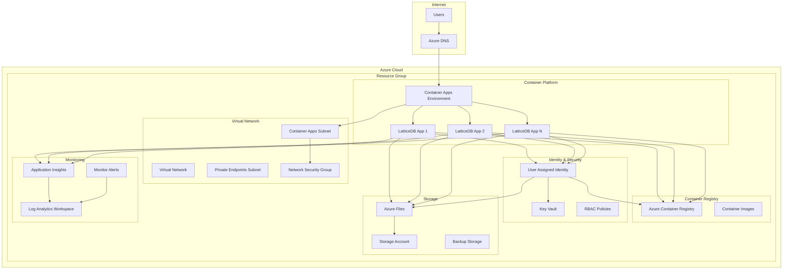
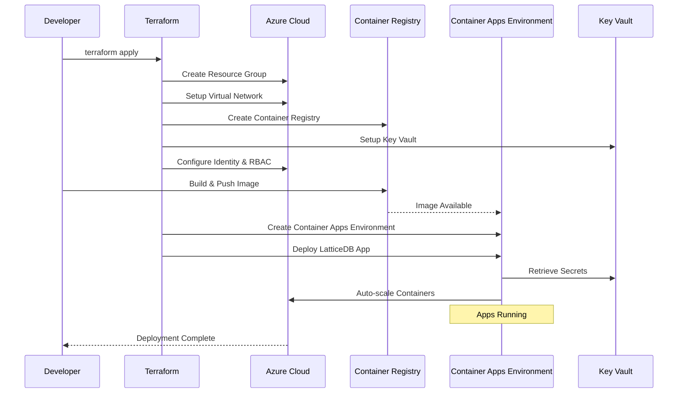
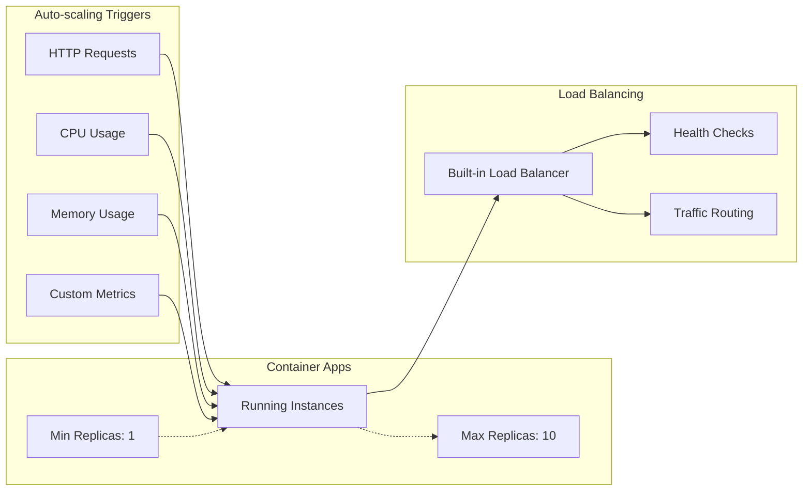

# LatticeDB Azure Deployment

Deploy LatticeDB to Azure using Container Apps with production-ready configuration.

## Architecture

This deployment uses Azure Container Apps for serverless container hosting with the following components:

- **Container Apps**: Serverless container hosting with auto-scaling
- **Azure Container Registry**: Private container image registry
- **Virtual Network**: Secure network isolation
- **Key Vault**: Secrets and certificate management
- **Log Analytics**: Centralized logging and monitoring
- **Application Insights**: Application performance monitoring
- **Azure Files**: Persistent storage (optional)

### Architecture Diagram



### Container Apps Environment Flow



### Scaling Architecture



## Prerequisites

1. **Azure CLI** - [Install Azure CLI](https://docs.microsoft.com/en-us/cli/azure/install-azure-cli)
2. **Terraform** - [Install Terraform](https://learn.hashicorp.com/tutorials/terraform/install-cli)
3. **Docker** - [Install Docker](https://docs.docker.com/get-docker/)
4. **Azure Subscription** with appropriate permissions

## Quick Start

### 1. Login to Azure

```bash
az login
```

### 2. Configure Deployment

```bash
# Copy and customize configuration
cp terraform.tfvars.example terraform.tfvars
# Edit terraform.tfvars with your settings
```

### 3. Deploy

```bash
./deploy.sh
```

## Configuration Options

### Basic Configuration

Edit `terraform.tfvars` to customize your deployment:

```hcl
# Azure Configuration
azure_location = "East US"
project_name   = "latticedb"
environment    = "production"

# Container Configuration
container_cpu    = 1.0
container_memory = "2Gi"
min_replicas     = 1
max_replicas     = 10

# Storage
enable_persistent_storage = true
```

### Advanced Configuration

```hcl
# Custom Domain (optional)
domain_name    = "latticedb.example.com"
certificate_id = "/subscriptions/.../certificates/cert-name"

# Monitoring
enable_monitoring  = true
notification_email = "admin@example.com"

# Security
allowed_ip_ranges = ["10.0.0.0/8"]
```

## Deployment Commands

### Deploy Everything

```bash
./deploy.sh deploy
```

### Update Application Only

```bash
IMAGE_TAG=v2.0.0 ./deploy.sh update
```

### Cleanup Resources

```bash
./deploy.sh cleanup
```

## Management Commands

### View Application Status

```bash
az containerapp show \
  --name latticedb-production-app \
  --resource-group latticedb-production-rg
```

### Scale Application

```bash
az containerapp update \
  --name latticedb-production-app \
  --resource-group latticedb-production-rg \
  --min-replicas 2 \
  --max-replicas 20
```

### View Logs

```bash
az containerapp logs show \
  --name latticedb-production-app \
  --resource-group latticedb-production-rg \
  --follow
```

### Update Container Image

```bash
az containerapp update \
  --name latticedb-production-app \
  --resource-group latticedb-production-rg \
  --image your-registry.azurecr.io/latticedb:v2.0.0
```

## Monitoring

### Application Insights

Monitor application performance, errors, and usage patterns:

```bash
# View application map
az monitor app-insights component show \
  --app latticedb-production-appinsights \
  --resource-group latticedb-production-rg
```

### Log Analytics

Query logs and create custom dashboards:

```bash
# Example log query
az monitor log-analytics query \
  --workspace latticedb-production-logs \
  --analytics-query "ContainerAppConsoleLogs_CL | where TimeGenerated > ago(1h)"
```

### Metrics and Alerts

View and configure monitoring alerts:

```bash
# List metric alerts
az monitor metrics alert list \
  --resource-group latticedb-production-rg
```

## Security Features

- **Network Isolation**: Private virtual network with secure subnets
- **Identity Management**: Managed identity for secure resource access
- **Secrets Management**: Azure Key Vault integration
- **Container Security**: Azure Container Registry with vulnerability scanning
- **Encryption**: Data encrypted at rest and in transit

## Cost Optimization

### Development Environment

```hcl
# Low-cost development settings
container_cpu    = 0.5
container_memory = "1Gi"
min_replicas     = 0  # Scale to zero when not used
max_replicas     = 3
acr_sku         = "Basic"
storage_replication_type = "LRS"
```

### Production Environment

```hcl
# Production-ready settings
container_cpu    = 2.0
container_memory = "4Gi"
min_replicas     = 2
max_replicas     = 20
acr_sku         = "Standard"
storage_replication_type = "GRS"
```

## Troubleshooting

### Common Issues

1. **Authentication Issues**
   ```bash
   az login --service-principal --username <app-id> --password <password> --tenant <tenant>
   ```

2. **Container App Not Starting**
   ```bash
   az containerapp logs show --name <app-name> --resource-group <rg-name>
   ```

3. **Image Pull Failures**
   ```bash
   az acr login --name <registry-name>
   ```

4. **Networking Issues**
   ```bash
   az network vnet list --resource-group <rg-name>
   ```

### Health Checks

The application includes built-in health endpoints:

- Health: `https://your-app.azurecontainerapps.io/health`
- Ready: `https://your-app.azurecontainerapps.io/ready`

## Environment Variables

The deployment supports these environment variables:

- `AZURE_LOCATION`: Azure region (default: East US)
- `ENVIRONMENT`: Environment name (default: production)
- `IMAGE_TAG`: Container image tag (default: latest)

## Backup and Recovery

### Automated Backups

The deployment includes:
- Storage account backup with point-in-time recovery
- Log Analytics data retention
- Application Insights data export

### Manual Backup

```bash
# Export application configuration
az containerapp show \
  --name latticedb-production-app \
  --resource-group latticedb-production-rg \
  --output json > app-config-backup.json
```

## Support

For issues and questions:
- Check the [main deployment guide](../DEPLOYMENT.md)
- Review Azure Container Apps documentation
- Check application logs and monitoring dashboards