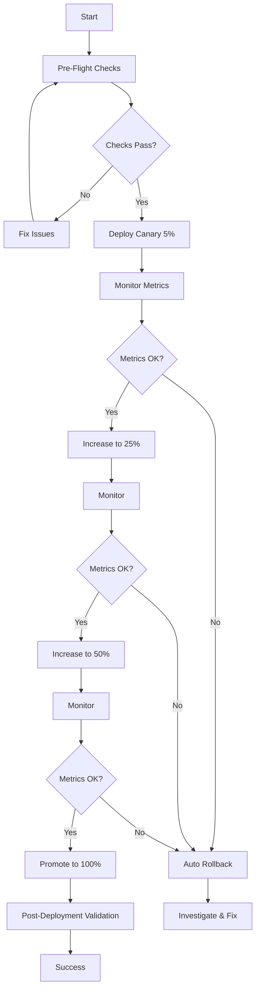

# LatticeDB DevOps & CI/CD Overview

Complete guide to the production-ready DevOps infrastructure for LatticeDB.

## Architecture Overview

```
┌─────────────────────────────────────────────────────────────┐
│                    Deployment Pipeline                      │
├─────────────────────────────────────────────────────────────┤
│                                                             │
│  Pre-Flight  →  Deploy  →  Validate  →  Monitor  →  Promote │
│                                                             │
└─────────────────────────────────────────────────────────────┘

┌─────────────────────────────────────────────────────────────┐
│                  Deployment Strategies                      │
├─────────────────────────────────────────────────────────────┤
│                                                             │
│  • Rolling: Simple, sequential updates                      │
│  • Blue/Green: Zero-downtime instant cutover                │
│  • Canary: Gradual traffic shift with validation            │
│  • Feature Flags: Progressive feature rollout               │
│                                                             │
└─────────────────────────────────────────────────────────────┘

┌─────────────────────────────────────────────────────────────┐
│                   Resilience Patterns                       │
├─────────────────────────────────────────────────────────────┤
│                                                             │
│  • Circuit Breakers: Prevent cascade failures               │
│  • Rate Limiting: Protect from overload                     │
│  • Chaos Engineering: Validate resilience                   │
│  • Automated Rollback: Quick recovery                       │
│                                                             │
└─────────────────────────────────────────────────────────────┘
```

## Key Features

### 1. Advanced Deployment Strategies

#### Blue/Green Deployments
- **Location**: `aws/scripts/blue-green-deploy.sh`
- **Features**:
  - Zero-downtime deployments
  - Instant cutover with manual approval
  - Automatic health validation
  - Quick rollback capability
  - Dual environment management

#### Canary Deployments
- **Location**: `aws/scripts/canary-deploy.sh`
- **Features**:
  - Progressive traffic shifting (5% → 100%)
  - Configurable increment intervals
  - Real-time metric validation
  - Automatic rollback on failure
  - Multi-stage health checks

#### Progressive Delivery
- **Location**: `scripts/progressive-delivery.sh`
- **Features**:
  - Orchestrates multiple strategies
  - Pre-flight validation
  - Smoke test integration
  - Metrics validation
  - Slack notifications

### 2. Validation & Testing

#### Pre-Flight Checks
- **Location**: `scripts/validation/pre-flight-checks.sh`
- **Validates**:
  - ✓ Required tools installed
  - ✓ AWS credentials valid
  - ✓ Docker image exists and scanned
  - ✓ Security vulnerabilities checked
  - ✓ Current deployment healthy
  - ✓ Resource capacity available
  - ✓ Configuration files valid
  - ✓ Deployment window appropriate
  - ✓ No active incidents
  - ✓ Rollback plan ready

#### Smoke Tests
- **Location**: `scripts/validation/smoke-tests.sh`
- **Tests**:
  - Health endpoint
  - Readiness check
  - Metrics endpoint
  - Database connectivity
  - Table operations (create, insert, select)
  - Transaction support
  - Vector operations
  - Connection pool health
  - Concurrent requests
  - Error handling
  - Rate limiting
  - SSL/TLS configuration

#### Post-Deployment Validation
- **Location**: `scripts/validation/post-deployment-checks.sh`
- **Monitors**:
  - Deployment completion
  - Task health
  - Health checks
  - Error rates
  - Performance metrics

### 3. Resilience & Production Hardening

#### Circuit Breakers
- **Configuration**: `config/resilience/circuit-breaker.yaml`
- **Protects**:
  - Database connections
  - External APIs
  - Internal services
  - File system operations
- **Features**:
  - Configurable failure thresholds
  - Automatic half-open state testing
  - Fallback strategies
  - Real-time monitoring

#### Rate Limiting
- **Configuration**: `config/resilience/rate-limiting.yaml`
- **Nginx Config**: `nginx/resilience.conf`
- **Capabilities**:
  - Per-endpoint limits
  - User tier-based quotas
  - IP-based protection
  - Distributed limiting (Redis)
  - Adaptive rate adjustment
  - Geographic restrictions

#### Chaos Engineering
- **Chaos Monkey**: `scripts/chaos/chaos-monkey.sh`
- **Experiments**: `scripts/chaos/chaos-experiments.yaml`
- **Tests**:
  - Random instance termination
  - Network latency injection
  - CPU/Memory stress
  - Disk I/O pressure
  - Network partitions
  - DNS failures
  - Database connection issues
  - Packet loss
  - Clock skew

### 4. Feature Management

#### Feature Flags
- **Configuration**: `config/feature-flags/flags.yaml`
- **Management**: `scripts/feature-flags/manage-flags.sh`
- **Capabilities**:
  - Gradual feature rollout
  - A/B testing experiments
  - User segmentation
  - Kill switches
  - Variant assignment
  - Analytics integration

### 5. Observability & Monitoring

#### Grafana Dashboards
- **Deployment Dashboard**: `config/grafana/deployment-dashboard.json`
- **Metrics**:
  - Deployment status & strategy
  - Success/failure rates
  - Blue/green traffic distribution
  - Canary traffic progression
  - Error rates during deployment
  - Latency percentiles
  - Service health
  - Circuit breaker state
  - Rate limiting status

#### Prometheus Rules
- **Location**: `config/prometheus/deployment-rules.yaml`
- **Alerts**:
  - Deployment failures
  - High error rates
  - Latency spikes
  - Service availability drops
  - Canary issues
  - Circuit breaker activations
  - Validation failures

## Directory Structure

```
LatticeDB-DBMS/
├── aws/
│   └── scripts/
│       ├── blue-green-deploy.sh      # Blue/green deployment
│       ├── canary-deploy.sh          # Canary deployment
│       └── manage-service.sh          # Service management
├── scripts/
│   ├── chaos/
│   │   ├── chaos-monkey.sh           # Chaos engineering
│   │   └── chaos-experiments.yaml    # Experiment definitions
│   ├── feature-flags/
│   │   └── manage-flags.sh           # Feature flag management
│   ├── progressive-delivery.sh       # Progressive delivery
│   └── validation/
│       ├── pre-flight-checks.sh      # Pre-deployment checks
│       ├── post-deployment-checks.sh # Post-deployment validation
│       ├── smoke-tests.sh            # Comprehensive smoke tests
│       └── deployment-validator.sh   # Deployment validator
├── config/
│   ├── resilience/
│   │   ├── circuit-breaker.yaml      # Circuit breaker config
│   │   └── rate-limiting.yaml        # Rate limiting config
│   ├── feature-flags/
│   │   └── flags.yaml                # Feature flag definitions
│   ├── grafana/
│   │   └── deployment-dashboard.json # Grafana dashboard
│   └── prometheus/
│       └── deployment-rules.yaml     # Prometheus rules
├── nginx/
│   └── resilience.conf               # Nginx resilience config
└── docs/
    ├── DEPLOYMENT_RUNBOOK.md         # Operational runbook
    ├── DEPLOYMENT_PLAYBOOKS.md       # Quick playbooks
    └── DEVOPS_OVERVIEW.md            # This file
```

## Usage Examples

### Deploy to Production (Canary)

```bash
# Full production deployment with all safety checks
./scripts/progressive-delivery.sh \
  -s canary \
  -e production \
  -i 123456789.dkr.ecr.us-east-1.amazonaws.com/latticedb:v2.0.0 \
  --notify
```

### Deploy Hotfix (Blue/Green)

```bash
# Fast deployment for critical fixes
./aws/scripts/blue-green-deploy.sh \
  -e production \
  -i $ECR_REPO:hotfix-latest \
  --no-approval
```

### Run Pre-Flight Checks

```bash
# Validate before deployment
./scripts/validation/pre-flight-checks.sh \
  -e production \
  -i $IMAGE_URI \
  --strict
```

### Execute Smoke Tests

```bash
# Test deployment health
./scripts/validation/smoke-tests.sh \
  -u https://prod.latticedb.com \
  -v \
  -o /tmp/report.json
```

### Manage Feature Flags

```bash
# Enable feature for 25% of users
./scripts/feature-flags/manage-flags.sh enable new_query_optimizer
./scripts/feature-flags/manage-flags.sh set-percentage new_query_optimizer 25
```

### Run Chaos Tests

```bash
# Test resilience in staging
./scripts/chaos/chaos-monkey.sh \
  -e staging \
  -m moderate \
  -d 600
```

## Deployment Workflow

### Standard Production Deployment



## Metrics & SLOs

### Deployment Metrics

| Metric | Target | Critical Threshold |
|--------|--------|-------------------|
| Deployment Success Rate | > 95% | < 90% |
| Deployment Duration | < 2 hours | > 4 hours |
| Rollback Rate | < 5% | > 10% |
| MTTR (Mean Time To Recovery) | < 10 min | > 30 min |

### Service Metrics During Deployment

| Metric | Target | Action Threshold |
|--------|--------|-----------------|
| Error Rate | < 1% | > 5% = Rollback |
| P95 Latency | < 500ms | > 1000ms = Rollback |
| P99 Latency | < 1s | > 2s = Warning |
| Availability | > 99.9% | < 99% = Rollback |

## Security Features

### Image Scanning
- ECR vulnerability scanning
- Critical vulnerability blocking
- High vulnerability warnings
- Scan result validation

### Access Control
- AWS IAM roles
- Least privilege principle
- MFA for production
- Audit logging

### Secrets Management
- AWS Secrets Manager
- Vault integration
- No secrets in code
- Rotation policies

## Best Practices

### Deployment Best Practices
1. ✓ Always run pre-flight checks
2. ✓ Use canary for production
3. ✓ Monitor during deployment
4. ✓ Have rollback plan ready
5. ✓ Deploy during off-peak hours
6. ✓ Communicate with stakeholders
7. ✓ Document issues and resolutions

### Feature Flag Best Practices
1. ✓ Start with small percentage
2. ✓ Monitor metrics closely
3. ✓ Use kill switches
4. ✓ Clean up old flags
5. ✓ Document flag purpose
6. ✓ Set expiration dates

### Chaos Engineering Best Practices
1. ✓ Start in non-production
2. ✓ Define blast radius
3. ✓ Have abort conditions
4. ✓ Monitor during experiments
5. ✓ Document learnings
6. ✓ Gradually increase severity

## Troubleshooting

### Common Issues

**Deployment Timeout**
```bash
# Check ECS events
aws ecs describe-services --cluster $CLUSTER --services $SERVICE \
  --query 'services[0].events[0:5]'
```

**Health Checks Failing**
```bash
# View container logs
aws logs tail /ecs/$CLUSTER-$SERVICE --follow
```

**High Error Rate**
```bash
# Immediate rollback
./aws/scripts/manage-service.sh rollback -e production
```

## Support & Resources

### Documentation
- **Runbook**: `docs/DEPLOYMENT_RUNBOOK.md`
- **Playbooks**: `docs/DEPLOYMENT_PLAYBOOKS.md`
- **Terraform Docs**: `aws/README.md`

### Monitoring
- **Grafana**: https://grafana.latticedb.com
- **CloudWatch**: AWS Console
- **Logs**: CloudWatch Logs

### Communication
- **Slack**: #deployments, #incidents
- **PagerDuty**: On-call schedule
- **Status Page**: https://status.latticedb.com

---

**Version**: 1.0
**Last Updated**: 2025-01-27
**Maintained By**: DevOps Team
**Contact**: devops@latticedb.com
