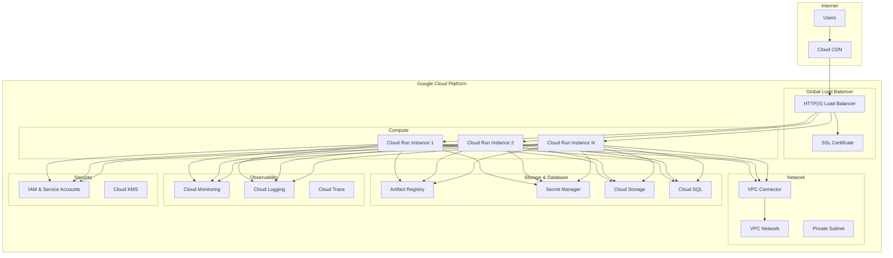
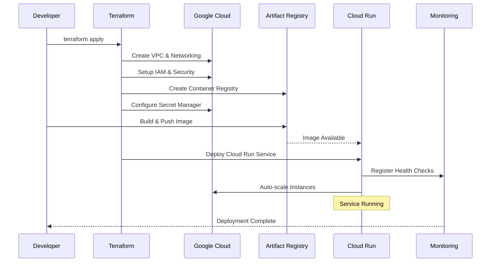

# LatticeDB GCP Deployment

Deploy LatticeDB to Google Cloud Platform using Cloud Run with production-ready configuration.

## Architecture

This deployment uses Google Cloud Run for serverless container hosting with the following components:

- **Cloud Run**: Serverless container platform with auto-scaling
- **Artifact Registry**: Private container image registry
- **VPC Network**: Secure network isolation with VPC connector
- **Secret Manager**: Secure secrets and configuration management
- **Cloud Monitoring**: Application and infrastructure monitoring
- **Cloud Logging**: Centralized logging and analysis
- **Cloud Storage**: Persistent object storage (optional)
- **Cloud SQL**: Managed PostgreSQL database (optional)
- **Global Load Balancer**: Custom domain and CDN support (optional)

### Architecture Diagram



### Deployment Flow



## Prerequisites

1. **Google Cloud SDK** - [Install gcloud](https://cloud.google.com/sdk/docs/install)
2. **Terraform** - [Install Terraform](https://learn.hashicorp.com/tutorials/terraform/install-cli)
3. **Docker** - [Install Docker](https://docs.docker.com/get-docker/)
4. **GCP Project** with billing enabled and appropriate permissions

## Quick Start

### 1. Authenticate with GCP

```bash
gcloud auth login
gcloud config set project YOUR_PROJECT_ID
```

### 2. Configure Deployment

```bash
# Copy and customize configuration
cp terraform.tfvars.example terraform.tfvars
# Edit terraform.tfvars with your settings
```

### 3. Deploy

```bash
export GCP_PROJECT=your-project-id
./deploy.sh
```

## Configuration Options

### Basic Configuration

Edit `terraform.tfvars` to customize your deployment:

```hcl
# GCP Configuration
project_id = "your-gcp-project-id"
gcp_region = "us-central1"
project_name = "latticedb"
environment = "production"

# Container Configuration
cpu_limit    = "2000m"  # 2 vCPUs
memory_limit = "2Gi"    # 2GB
min_instances = 0       # Scale to zero
max_instances = 10

# Access
allow_unauthenticated = true
```

### Advanced Configuration

```hcl
# Custom Domain and CDN
custom_domain = "latticedb.example.com"
enable_cdn    = true

# Database (optional)
enable_cloud_sql = true
cloud_sql_tier  = "db-f1-micro"

# Storage (optional)
enable_cloud_storage = true

# Monitoring
enable_monitoring = true
notification_channels = ["projects/your-project/notificationChannels/your-channel"]
```

## Deployment Commands

### Deploy Everything

```bash
./deploy.sh deploy
```

### Update Application Only

```bash
IMAGE_TAG=v2.0.0 ./deploy.sh update
```

### Cleanup Resources

```bash
./deploy.sh cleanup
```

## Management Commands

### View Service Status

```bash
gcloud run services describe latticedb-production-service \
  --region=us-central1
```

### Scale Service

```bash
gcloud run services update latticedb-production-service \
  --region=us-central1 \
  --min-instances=2 \
  --max-instances=20
```

### View Logs

```bash
gcloud logging read 'resource.type=cloud_run_revision resource.labels.service_name=latticedb-production-service' \
  --limit=50 \
  --format="table(timestamp,textPayload)"
```

### Update Service

```bash
gcloud run services update latticedb-production-service \
  --image=us-central1-docker.pkg.dev/project/repo/latticedb:v2.0.0 \
  --region=us-central1
```

### Deploy New Revision

```bash
gcloud run deploy latticedb-production-service \
  --image=us-central1-docker.pkg.dev/project/repo/latticedb:latest \
  --region=us-central1 \
  --platform=managed
```

## Monitoring and Observability

### Cloud Monitoring Dashboard

Access the pre-configured dashboard:
```bash
# Get dashboard URL
gcloud monitoring dashboards list --filter="displayName:latticedb"
```

### Custom Metrics

Query metrics using Cloud Monitoring:

```bash
# Request count
gcloud logging read 'resource.type=cloud_run_revision' --format="csv(timestamp,severity,textPayload)"

# Error rate
gcloud monitoring metrics list --filter="metric.type:run.googleapis.com/request_count"
```

### Alerting

Configure custom alert policies:

```bash
# List existing alerts
gcloud alpha monitoring policies list

# Create custom alert
gcloud alpha monitoring policies create --policy-from-file=alert-policy.yaml
```

### Log Analysis

Advanced log queries:

```bash
# Error logs only
gcloud logging read 'resource.type=cloud_run_revision severity>=ERROR' --limit=50

# Filter by time range
gcloud logging read 'resource.type=cloud_run_revision timestamp>="2024-01-01T00:00:00Z"' --limit=100
```

## Database Management (Cloud SQL)

### Connect to Database

```bash
# Get connection info
gcloud sql instances describe latticedb-production-db

# Connect using proxy
gcloud sql connect latticedb-production-db --user=latticedb
```

### Backup and Restore

```bash
# Create backup
gcloud sql backups create --instance=latticedb-production-db

# List backups
gcloud sql backups list --instance=latticedb-production-db

# Restore from backup
gcloud sql backups restore BACKUP_ID --restore-instance=latticedb-production-db
```

### Database Operations

```bash
# View database logs
gcloud logging read 'resource.type=cloudsql_database'

# Export database
gcloud sql export sql latticedb-production-db gs://your-bucket/backup.sql --database=latticedb
```

## Storage Management (Cloud Storage)

### Access Storage Bucket

```bash
# List files
gsutil ls gs://your-project-latticedb-production-data/

# Upload file
gsutil cp local-file.txt gs://your-project-latticedb-production-data/

# Download file
gsutil cp gs://your-project-latticedb-production-data/file.txt ./
```

### Backup Storage

```bash
# Sync entire bucket
gsutil -m rsync -r gs://source-bucket gs://backup-bucket

# Create lifecycle policy
gsutil lifecycle set lifecycle.json gs://your-bucket
```

## Security Features

- **IAM Service Accounts**: Dedicated service account with minimal permissions
- **VPC Network**: Private network with VPC connector for secure communication
- **Secret Manager**: Secure storage for database passwords and API keys
- **SSL/TLS**: Automatic HTTPS with managed SSL certificates
- **Private Container Registry**: Artifact Registry with vulnerability scanning
- **Network Security**: Firewall rules and private IP addresses

## Cost Optimization

### Development Environment

```hcl
# Low-cost settings for development
cpu_limit = "1000m"
memory_limit = "1Gi"
min_instances = 0  # Scale to zero when not used
max_instances = 3
enable_cloud_sql = false  # Use SQLite for development
enable_cloud_storage = false
```

### Production Environment

```hcl
# Production-ready settings
cpu_limit = "4000m"
memory_limit = "4Gi"
min_instances = 2
max_instances = 100
enable_cloud_sql = true
cloud_sql_tier = "db-standard-2"
enable_point_in_time_recovery = true
```

### Cost Monitoring

```bash
# View billing information
gcloud billing accounts list

# Set up budget alerts
gcloud billing budgets create --billing-account=ACCOUNT_ID --display-name="LatticeDB Budget"

# Monitor costs
gcloud billing budgets list --billing-account=ACCOUNT_ID
```

## Troubleshooting

### Common Issues

1. **Authentication Errors**
   ```bash
   gcloud auth application-default login
   gcloud config set project YOUR_PROJECT_ID
   ```

2. **API Not Enabled**
   ```bash
   gcloud services enable run.googleapis.com
   gcloud services enable cloudbuild.googleapis.com
   ```

3. **Permission Denied**
   ```bash
   # Check IAM permissions
   gcloud projects get-iam-policy PROJECT_ID

   # Add required roles
   gcloud projects add-iam-policy-binding PROJECT_ID \
     --member="user:your-email@domain.com" \
     --role="roles/run.admin"
   ```

4. **Container Build Failures**
   ```bash
   # Check build logs
   gcloud builds log BUILD_ID

   # Manual build and push
   gcloud builds submit --tag gcr.io/PROJECT_ID/latticedb:latest
   ```

### Health Checks

Test application endpoints:

```bash
# Health check
curl -f https://your-service-url/health

# Ready check
curl -f https://your-service-url/ready

# Metrics
curl https://your-service-url/metrics
```

### Performance Testing

```bash
# Load testing with Apache Bench
ab -n 1000 -c 10 https://your-service-url/

# Monitor during testing
watch -n 5 'gcloud run services describe SERVICE_NAME --region=REGION --format="value(status.traffic[0].percent)"'
```

## Environment Variables

The deployment supports these environment variables:

- `GCP_PROJECT`: GCP project ID (required)
- `GCP_REGION`: GCP region (default: us-central1)
- `ENVIRONMENT`: Environment name (default: production)
- `IMAGE_TAG`: Container image tag (default: latest)

## Backup and Disaster Recovery

### Automated Backups

The deployment includes:
- Cloud SQL automated backups with point-in-time recovery
- Cloud Storage versioning and lifecycle management
- Application configuration backup in Terraform state

### Manual Recovery

```bash
# Restore from backup
gcloud sql backups restore BACKUP_ID \
  --restore-instance=latticedb-production-db

# Redeploy service
gcloud run services replace service.yaml --region=us-central1
```

### Cross-Region Replication

```hcl
# Configure multi-region setup
gcp_region = "us-central1"
backup_region = "us-east1"
enable_cross_region_backup = true
```

## Integration with CI/CD

### Cloud Build

Create `cloudbuild.yaml`:

```yaml
steps:
- name: 'gcr.io/cloud-builders/docker'
  args: ['build', '-t', 'gcr.io/$PROJECT_ID/latticedb:$BUILD_ID', '.']
- name: 'gcr.io/cloud-builders/docker'
  args: ['push', 'gcr.io/$PROJECT_ID/latticedb:$BUILD_ID']
- name: 'gcr.io/cloud-builders/gcloud'
  args: ['run', 'deploy', 'latticedb-$_ENVIRONMENT-service',
         '--image', 'gcr.io/$PROJECT_ID/latticedb:$BUILD_ID',
         '--region', '$_REGION']
```

### GitHub Actions

Example workflow in `.github/workflows/gcp-deploy.yml`:

```yaml
name: Deploy to GCP
on:
  push:
    branches: [main]

jobs:
  deploy:
    runs-on: ubuntu-latest
    steps:
    - uses: actions/checkout@v3
    - uses: google-github-actions/auth@v1
      with:
        credentials_json: ${{ secrets.GCP_SA_KEY }}
    - run: ./gcp/deploy.sh
```

## Support

For issues and questions:
- Check the [main deployment guide](../DEPLOYMENT.md)
- Review Google Cloud Run documentation
- Check application logs and monitoring dashboards
- Use GCP support channels for infrastructure issues
