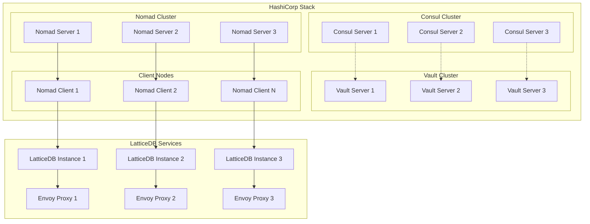
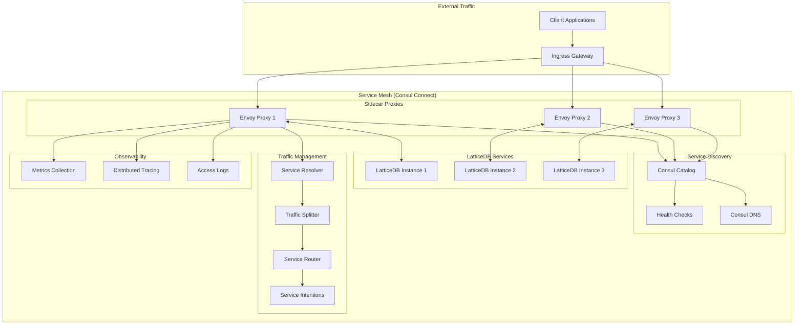
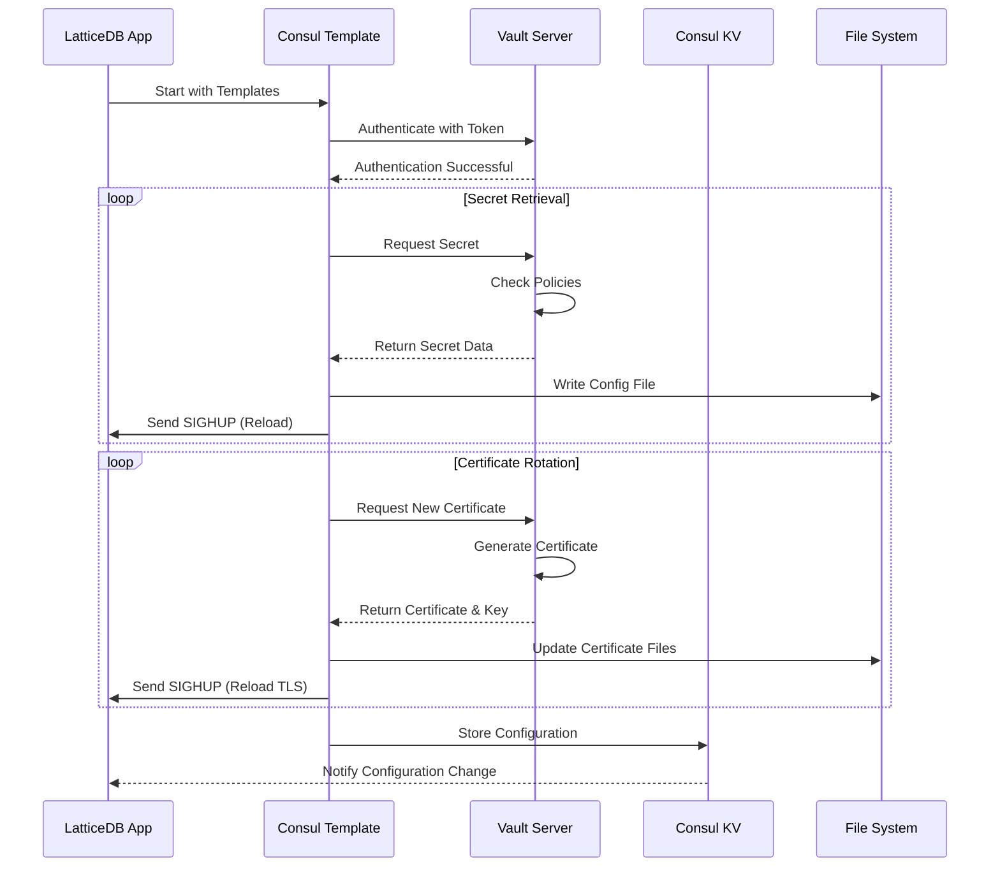
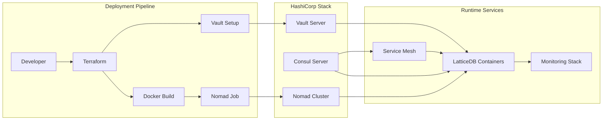

# LatticeDB HashiCorp Stack Deployment

Deploy LatticeDB using the HashiCorp stack (Consul, Vault, Nomad) with production-ready configuration for on-premises, hybrid, and multi-cloud environments.

## Architecture

This deployment leverages the full HashiCorp stack for a comprehensive platform solution:

- **Nomad**: Container orchestration and job scheduling
- **Consul**: Service discovery, health checking, and service mesh
- **Vault**: Secrets management, PKI, and dynamic credentials
- **Consul Connect**: Service mesh with mTLS encryption
- **Terraform**: Infrastructure as Code for the entire stack

### Architecture Diagram



### Service Mesh Architecture



### Secrets Management Flow



### Deployment Orchestration



## Prerequisites

### HashiCorp Stack Requirements

1. **Consul Cluster** (3+ servers recommended)
   - Version 1.16+ with Connect enabled
   - ACLs configured for security
   - TLS encryption enabled

2. **Vault Cluster** (3+ servers recommended)
   - Version 1.14+ unsealed and accessible
   - PKI secrets engine enabled
   - Database secrets engine for dynamic credentials

3. **Nomad Cluster** (3+ servers recommended)
   - Version 1.6+ with CSI support
   - ACLs configured for security
   - Host volumes or CSI plugins for storage

### Client Tools

```bash
# Install HashiCorp tools
curl -fsSL https://apt.releases.hashicorp.com/gpg | sudo apt-key add -
sudo apt-add-repository "deb [arch=amd64] https://apt.releases.hashicorp.com $(lsb_release -cs) main"
sudo apt-get update && sudo apt-get install consul vault nomad terraform

# Install Docker
curl -fsSL https://get.docker.com -o get-docker.sh
sh get-docker.sh

# Install jq for JSON processing
sudo apt-get install jq
```

## Quick Start

### 1. Environment Setup

```bash
# Set HashiCorp stack addresses
export CONSUL_HTTP_ADDR="http://consul.example.com:8500"
export VAULT_ADDR="https://vault.example.com:8200"
export NOMAD_ADDR="http://nomad.example.com:4646"

# Set authentication tokens
export VAULT_TOKEN="your-vault-token"
export CONSUL_HTTP_TOKEN="your-consul-token"  # If ACLs enabled
export NOMAD_TOKEN="your-nomad-token"        # If ACLs enabled
```

### 2. Configure Deployment

```bash
cd hashicorp/terraform
cp terraform.tfvars.example terraform.tfvars
# Edit terraform.tfvars with your configuration
```

### 3. Deploy

```bash
# One-command deployment
./deploy.sh

# Or step-by-step
./deploy.sh vault-setup     # Setup Vault secrets and policies
./deploy.sh consul-config   # Configure Consul services
./deploy.sh deploy          # Deploy with Terraform and Nomad
```

## Configuration Guide

### Basic Configuration

Edit `terraform/terraform.tfvars`:

```hcl
# HashiCorp Stack
consul_address    = "http://consul.local:8500"
vault_address     = "https://vault.local:8200"
nomad_address     = "http://nomad.local:4646"
consul_datacenter = "dc1"

# Application
project_name   = "latticedb"
environment    = "production"
instance_count = 3
cpu_limit      = 1000  # MHz
memory_limit   = 2048  # MB

# Security
enable_tls            = true
enable_consul_acl     = true
enable_consul_connect = true
enable_vault_pki      = true
```

### Advanced Configuration

```hcl
# Service Mesh
mesh_gateway_mode = "local"
enable_service_mesh_observability = true

# High Availability
enable_anti_affinity   = true
enable_leader_election = true
cluster_join_method    = "consul"

# Storage
enable_persistent_storage = true
csi_plugin_id            = "ceph-csi"
storage_size_min         = 10   # GiB
storage_size_max         = 100  # GiB

# Deployment Strategy
update_strategy          = "rolling"
enable_canary_deployments = true
canary_weight            = 10
auto_revert              = true

# Monitoring
enable_monitoring = true
enable_tracing    = true
jaeger_endpoint   = "http://jaeger:14268/api/traces"
```

## Deployment Architecture

### Nomad Job Specification

The deployment creates a comprehensive Nomad job with:

- **Multi-instance deployment** with anti-affinity constraints
- **Service mesh integration** with Consul Connect
- **Dynamic secrets** from Vault with automatic rotation
- **Health checks** and service registration
- **Persistent storage** via CSI volumes
- **Log forwarding** with structured logging
- **Graceful deployments** with canary and blue-green strategies

### Consul Integration

- **Service Discovery**: Automatic service registration and DNS
- **Health Checking**: HTTP, TCP, and script-based health checks
- **Load Balancing**: Intelligent routing with multiple algorithms
- **Service Mesh**: mTLS encryption and traffic management
- **Configuration**: KV store for dynamic configuration

### Vault Integration

- **Secrets Management**: Secure storage and retrieval of sensitive data
- **PKI Integration**: Automatic certificate generation and rotation
- **Dynamic Database Credentials**: Short-lived database access
- **Transit Encryption**: Application-level encryption services
- **Policy-based Access**: Fine-grained permission control

## Management Commands

### Deployment Operations

```bash
# Deploy LatticeDB
./deploy.sh deploy

# Update application
IMAGE_TAG=v2.0.0 ./deploy.sh update

# Check deployment status
./deploy.sh status

# Health check
./scripts/check-health.sh

# Cleanup resources
./deploy.sh cleanup
```

### Nomad Operations

```bash
# Job management
nomad job status latticedb
nomad job logs latticedb
nomad job scale latticedb 5
nomad job stop latticedb

# Allocation management
nomad alloc status <alloc-id>
nomad alloc logs <alloc-id>
nomad alloc exec <alloc-id> /bin/bash

# Node management
nomad node status
nomad node drain <node-id>
```

### Consul Operations

```bash
# Service discovery
consul catalog services
consul catalog service latticedb
consul health service latticedb

# Service mesh
consul connect proxy -service latticedb
consul intention create web latticedb

# Configuration
consul kv put latticedb/config/replicas 5
consul kv get -recurse latticedb/

# ACL management
consul acl policy list
consul acl token create -policy-name latticedb-policy
```

### Vault Operations

```bash
# Secrets management
vault kv put secret/latticedb/production/config key=value
vault kv get secret/latticedb/production/config

# PKI operations
vault write pki_int/issue/latticedb common_name=latticedb.service.consul
vault list pki_int/certs

# Dynamic database credentials
vault read database/creds/latticedb-role

# Transit encryption
vault write transit/encrypt/latticedb plaintext=$(base64 <<< "sensitive data")
vault write transit/decrypt/latticedb ciphertext=<encrypted-data>
```

## Service Mesh Configuration

### Consul Connect Setup

The deployment automatically configures Consul Connect with:

- **Automatic mTLS**: All service-to-service communication encrypted
- **Intention-based Security**: Explicit allow/deny rules
- **Traffic Management**: Load balancing, retries, and timeouts
- **Observability**: Metrics collection and distributed tracing

### Service Intentions

```bash
# Allow web services to access LatticeDB
consul intention create web latticedb

# Allow monitoring to scrape metrics
consul intention create monitoring latticedb

# Deny all other access
consul intention create -deny "*" latticedb
```

### Traffic Routing

```hcl
# Service resolver for load balancing
Kind = "service-resolver"
Name = "latticedb"
LoadBalancer = {
  Policy = "least_request"
}

# Service splitter for canary deployments
Kind = "service-splitter"
Name = "latticedb"
Splits = [
  {
    Weight = 90
    ServiceSubset = "v1"
  },
  {
    Weight = 10
    ServiceSubset = "canary"
  }
]
```

## Storage Configuration

### CSI Volume Management

```bash
# Create persistent volume
nomad volume create volume.hcl

# List volumes
nomad volume status

# Volume specification
id        = "latticedb-data"
name      = "latticedb-data"
type      = "csi"
plugin_id = "ceph-csi"

capability {
  access_mode     = "multi-node-multi-writer"
  attachment_mode = "file-system"
}

mount_options {
  fs_type = "ext4"
}
```

### Backup Strategy

```bash
# Nomad job for automated backups
job "latticedb-backup" {
  type = "batch"

  periodic {
    cron             = "0 2 * * *"  # Daily at 2 AM
    prohibit_overlap = true
  }

  group "backup" {
    task "backup" {
      driver = "docker"

      config {
        image = "latticedb/backup:latest"
        args  = ["backup", "--target", "s3://backups/latticedb"]
      }
    }
  }
}
```

## Monitoring and Observability

### Metrics Collection

- **Consul Metrics**: Service health and performance metrics
- **Nomad Metrics**: Job and allocation statistics
- **Vault Metrics**: Secret access and authentication metrics
- **Application Metrics**: LatticeDB-specific performance data

### Distributed Tracing

```hcl
# Jaeger configuration
connect {
  sidecar_service {
    proxy {
      config {
        envoy_tracing_json = jsonencode({
          http = {
            name = "envoy.tracers.jaeger"
            typed_config = {
              "@type" = "type.googleapis.com/envoy.config.trace.v3.JaegerConfig"
              collector_cluster = "jaeger_cluster"
            }
          }
        })
      }
    }
  }
}
```

### Log Aggregation

The deployment includes automatic log forwarding:

- **Structured Logging**: JSON format with correlation IDs
- **Centralized Collection**: Fluent Bit sidecar containers
- **Index and Search**: Integration with Elasticsearch/Loki
- **Alerting**: Automated alerts on error patterns

## Security Features

### Multi-layered Security

1. **Network Security**
   - Service mesh with mTLS encryption
   - Network policies and segmentation
   - Zero-trust networking model

2. **Secrets Management**
   - Vault integration for all sensitive data
   - Dynamic credential generation
   - Automatic secret rotation

3. **Access Control**
   - Consul ACL for service access
   - Vault policies for secret access
   - Nomad ACL for job management

4. **Audit and Compliance**
   - Comprehensive audit logging
   - Policy enforcement and validation
   - Compliance reporting and monitoring

### Certificate Management

```bash
# Automatic certificate rotation
vault write pki_int/config/crl_config expiry="72h"

# Certificate monitoring
consul-template \
  -template="cert.pem.tpl:cert.pem:service consul reload" \
  -template="key.pem.tpl:key.pem:service consul reload"
```

## High Availability Setup

### Multi-Datacenter Configuration

```hcl
# Cross-datacenter service resolution
Kind = "service-resolver"
Name = "latticedb"
Redirect = {
  Datacenter = "dc2"
}

# Mesh gateway for cross-DC communication
Kind = "mesh-gateway"
Name = "mesh-gateway"
Mode = "local"
```

### Failure Scenarios

The deployment handles various failure scenarios:

- **Node Failures**: Automatic rescheduling to healthy nodes
- **Service Failures**: Circuit breakers and retry logic
- **Network Partitions**: Consul's distributed consensus
- **Storage Failures**: CSI volume replication and snapshots

## Troubleshooting Guide

### Common Issues

1. **Vault Sealed**
   ```bash
   vault operator unseal
   vault auth -method=token token=$VAULT_TOKEN
   ```

2. **Consul Leader Election Issues**
   ```bash
   consul operator raft list-peers
   consul operator raft remove-peer -address=<failed-server>
   ```

3. **Nomad Job Allocation Failures**
   ```bash
   nomad job status latticedb
   nomad alloc status <failed-alloc-id>
   nomad logs <alloc-id> latticedb
   ```

4. **Service Mesh Connectivity**
   ```bash
   consul connect proxy -service latticedb -upstream database:9999
   consul intention check web latticedb
   ```

### Health Check Script

```bash
# Comprehensive health check
./scripts/check-health.sh

# Component-specific checks
./scripts/check-health.sh consul
./scripts/check-health.sh vault
./scripts/check-health.sh nomad
./scripts/check-health.sh app
```

### Debugging Commands

```bash
# Debug Nomad job
nomad job inspect latticedb
nomad job validate latticedb.nomad.hcl

# Debug Consul service mesh
consul connect envoy -service latticedb -admin-bind localhost:19000
curl localhost:19000/stats

# Debug Vault integration
vault audit enable file file_path=/tmp/vault_audit.log
vault read auth/token/lookup-self
```

## Performance Tuning

### Resource Optimization

```hcl
# CPU and memory optimization
resources {
  cpu    = 2000  # 2 CPU cores
  memory = 4096  # 4GB RAM

  device "nvidia/gpu" {
    count = 1
  }
}

# Network optimization
network {
  port "http" {
    static = 8080
    to     = 8080
  }

  mode = "cni"
  cni {
    name = "mynet"
  }
}
```

### Scaling Configuration

```hcl
# Horizontal auto-scaling
scaling {
  enabled = true
  min     = 2
  max     = 20

  policy {
    cooldown            = "5m"
    evaluation_interval = "10s"

    check "cpu" {
      source = "prometheus"
      query  = "cpu_percentile_95"

      strategy "target-value" {
        target = 70
      }
    }
  }
}
```

## Migration Guide

### From Cloud Providers

Migrating from AWS/Azure/GCP to HashiCorp stack:

1. **Data Migration**
   ```bash
   # Export from cloud database
   pg_dump -h cloud-db.amazonaws.com -U user database > backup.sql

   # Import to HashiCorp deployment
   psql -h latticedb.service.consul -U user database < backup.sql
   ```

2. **Configuration Migration**
   ```bash
   # Extract secrets from cloud provider
   aws ssm get-parameters --names "/latticedb/config/*"

   # Import to Vault
   vault kv put secret/latticedb/production/config @config.json
   ```

### Rolling Updates

Zero-downtime updates using Nomad's deployment strategies:

```hcl
update {
  max_parallel     = 1
  health_check     = "checks"
  min_healthy_time = "10s"
  healthy_deadline = "3m"
  auto_revert      = true
  canary           = 1
}
```

## Cost Optimization

### Resource Efficiency

- **Bin Packing**: Efficient resource utilization across nodes
- **Spot Instances**: Use preemptible instances for non-critical workloads
- **Auto-scaling**: Scale down during low usage periods
- **Resource Constraints**: Set appropriate CPU and memory limits

### Operational Efficiency

- **Infrastructure as Code**: Automated provisioning and management
- **Self-healing**: Automatic recovery from failures
- **Monitoring**: Proactive issue detection and resolution
- **Multi-tenancy**: Shared infrastructure across environments

## Support and Community

### Documentation Links

- [Nomad Documentation](https://www.nomadproject.io/docs)
- [Consul Documentation](https://www.consul.io/docs)
- [Vault Documentation](https://www.vaultproject.io/docs)
- [Terraform Documentation](https://www.terraform.io/docs)

### Community Resources

- [HashiCorp Forum](https://discuss.hashicorp.com/)
- [GitHub Issues](https://github.com/your-org/LatticeDB-DBMS/issues)
- [Discord Community](https://discord.gg/hashicorp)

### Professional Support

For enterprise deployments, consider HashiCorp's commercial offerings:
- Consul Enterprise
- Vault Enterprise
- Nomad Enterprise
- Terraform Enterprise

---

This deployment provides a production-ready, highly available, and secure platform for running LatticeDB using the complete HashiCorp stack. The configuration is designed for scalability, observability, and operational excellence in enterprise environments.